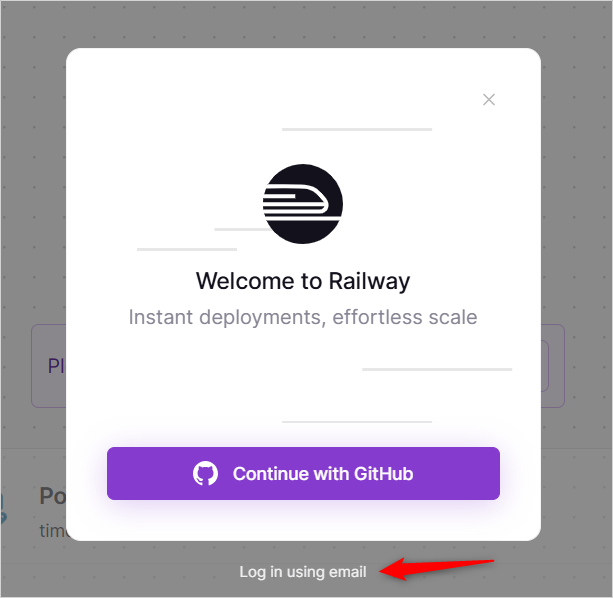

# Poznote - Cloud Deployment Guide

This guide will help you deploy Poznote on cloud platforms without managing your own infrastructure.

## Table of Contents

- [Introduction](#introduction)
- [Option 1: Railway (Recommended)](#option-1-railway-recommended)
  - [Railway Prerequisites](#railway-prerequisites)
  - [Railway Installation](#railway-installation)
  - [Railway Access](#railway-access)
  - [Railway Settings](#railway-settings)
  - [Railway Password Recovery](#railway-password-recovery)
  - [Railway Updates](#railway-updates)
- [Option 2: Other Cloud Providers](#option-2-other-cloud-providers)
  - [Supported Platforms](#supported-platforms)
  - [Generic Docker Deployment](#generic-docker-deployment)
  - [Key Considerations](#key-considerations)

## Introduction

Cloud deployment allows you to run Poznote without managing servers or infrastructure. Benefits include:
- No server maintenance
- Automatic HTTPS and domain management
- Easy scaling and updates
- Access from anywhere
- Built-in monitoring and logging

## Option 1: Railway (Recommended)

Railway.com offers the easiest way to deploy Poznote in the cloud. The platform provides:
- Automated deployments from GitHub
- Automatic HTTPS
- Easy scaling
- No infrastructure management

### Railway Prerequisites

Create a Railway account at [Railway.com](https://railway.com):

**Option A: Sign up with GitHub (Recommended)**
- Get **one month of free usage**
- Seamless integration with the deployment template

**Option B: Sign up with Email**
- Choose the **$5/month plan**



### Railway Installation

#### One-Click Deployment (Recommended)

For a **ready-to-use setup**, use the official Poznote template on Railway.

**Step 1: Deploy with One Click**

Click the button below to start the deployment:

[](https://railway.com/deploy/poznote)

**Step 2: Follow the Video Tutorial**

Watch this 2-minute video tutorial that guides you through the entire deployment process:

**[Watch the deployment tutorial](https://youtu.be/Q22kqv82bHQ)**

The video shows you:
- How to deploy Poznote in one click
- How to configure your environment variables
- How to get your instance URL
- How to access your Poznote instance

> 💡 **Tip:** You can export your notes anytime from the Poznote interface if you ever decide to leave Railway, switch providers, or back up your data.

### Railway Access

After deployment is complete:

**Step 1: Get Your Instance URL**

1. Go to your Railway dashboard
2. Click on your Poznote project
3. Click on the Poznote service
4. Navigate to the **Settings** tab
5. Find your public URL in the **Networking** section

Or watch the end of the [deployment tutorial video](https://youtu.be/Q22kqv82bHQ) to see how to get the URL.

**Step 2: Log In**

**Default Credentials:**
- Username: `admin`
- Password: `admin123!`

> ⚠️ **Important:** Change these default credentials after your first login!

Your instance URL will look like: `https://poznote-production-xxxx.up.railway.app` but you can change it. See the [deployment tutorial video](https://youtu.be/Q22kqv82bHQ) to see how to. 

### Railway Settings

To change your username or password on Railway:

**Video Tutorial**

Watch this video tutorial that shows you step by step how to change your settings:

**[Change Settings on Railway](https://youtu.be/_h5pP7LreZc)**

**Written Instructions**

1. Go to your [Railway dashboard](https://railway.app/dashboard)
2. Click on your Poznote project
3. Click on the Poznote service
4. Navigate to the **Variables** tab
5. Update the following variables:
   - `POZNOTE_USERNAME` - Your new username
   - `POZNOTE_PASSWORD` - Your new password
6. Click **Save**
7. Railway will automatically redeploy your instance with the new settings

> 📝 **Note:** Unlike self-hosted installations, you cannot change the port on Railway as it's managed by the platform.

### Railway Password Recovery

If you forgot your password, you can retrieve it from Railway:

**Video Tutorial**

Watch this video tutorial:

**[Retrieve Your Password on Railway](https://youtu.be/_h5pP7LreZc)**

**Written Instructions**

1. Go to your [Railway dashboard](https://railway.app/dashboard)
2. Click on your Poznote project
3. Click on the Poznote service
4. Navigate to the **Variables** tab
5. Look for the `POZNOTE_PASSWORD` variable
6. Click the eye icon to reveal your password

### Railway Updates

To update your Poznote instance to the latest version:

**Video Tutorial**

Watch this video tutorial:

**[Update Poznote on Railway](https://youtu.be/Mhpk6gitul8)**

**Written Instructions**

1. Go to your [Railway dashboard](https://railway.app/dashboard)
2. Click on your Poznote project
3. Click on the Poznote service
4. Navigate to the **Settings** tab
5. Scroll down to the **Service** section
6. Click on **Redeploy**

Railway will automatically:
- Pull the latest Poznote image
- Redeploy your instance
- Preserve all your data (notes, attachments, database)

The update process typically takes 1-2 minutes.

### Railway Cost Information

Railway pricing (as of 2024):
- **Free Tier** (with GitHub account): 1 month free, then $5/month for small workloads
- **Usage-based pricing**: Pay only for what you use
- Check [Railway pricing](https://railway.app/pricing) for current details

---

## Option 2: Other Cloud Providers

If you prefer using another cloud platform, Poznote can be deployed on any service that supports Docker containers.

### Supported Platforms

Poznote works with any Docker-compatible cloud platform, including:

- **[DigitalOcean App Platform](https://www.digitalocean.com/products/app-platform)** - Simple PaaS with Docker support
- **[Render](https://render.com)** - Easy deployment with free tier available
- **[Fly.io](https://fly.io)** - Global edge deployment
- **[Heroku](https://www.heroku.com)** - Classic PaaS platform
- **[AWS ECS/Fargate](https://aws.amazon.com/ecs/)** - Enterprise-grade AWS container service
- **[Google Cloud Run](https://cloud.google.com/run)** - Serverless container platform
- **[Azure Container Instances](https://azure.microsoft.com/en-us/services/container-instances/)** - Simple container deployment
- **And many more...**

### Generic Docker Deployment

Most cloud platforms accept standard Docker deployment configurations. Use this as a starting point:

**Docker Image:**
```
ghcr.io/timothepoznanski/poznote:latest
```

**Required Environment Variables:**
```bash
SQLITE_DATABASE=/var/www/html/data/database/poznote.db
POZNOTE_USERNAME=admin
POZNOTE_PASSWORD=admin123!
HTTP_WEB_PORT=8040
```

**Docker Run Command (for platforms that support it):**
```bash
docker run -d \
  --name poznote-webserver \
  --restart always \
  -e SQLITE_DATABASE=/var/www/html/data/database/poznote.db \
  -e POZNOTE_USERNAME=admin \
  -e POZNOTE_PASSWORD=admin123! \
  -e HTTP_WEB_PORT=8040 \
  -p 8040:80 \
  -v ./data:/var/www/html/data \
  ghcr.io/timothepoznanski/poznote:latest
```

**Docker Compose (if supported):**
```yaml
services:
  webserver:
    image: ghcr.io/timothepoznanski/poznote:latest
    restart: always
    environment:
      SQLITE_DATABASE: /var/www/html/data/database/poznote.db
      POZNOTE_USERNAME: ${POZNOTE_USERNAME}
      POZNOTE_PASSWORD: ${POZNOTE_PASSWORD}
      HTTP_WEB_PORT: ${HTTP_WEB_PORT}
    ports:
      - "${HTTP_WEB_PORT}:80"
    volumes:
      - "./data:/var/www/html/data"
```

### Key Considerations

When deploying to custom cloud providers, keep these important points in mind:

**1. Persistent Storage**
- ✅ Ensure the platform supports **persistent volumes** for the `./data` directory
- ✅ Data must persist across container restarts and redeployments
- ⚠️ Without persistent storage, you'll lose your notes on every restart

**2. Networking & Security**
- ✅ Configure firewall rules to allow HTTP/HTTPS traffic
- ✅ Set up SSL/TLS certificates for HTTPS (most platforms do this automatically)
- ✅ Consider using a custom domain name
- ✅ Ensure the platform exposes port 80 or maps to your configured port

**3. Backups**
- ✅ Set up regular backups of the `./data` directory
- ✅ Use Poznote's built-in backup feature (Settings → Backup)
- ✅ Store backups in a separate location (cloud storage, local machine)

**4. Resource Requirements**
- **Memory:** Minimum 512MB, recommended 1GB
- **CPU:** 1 vCPU is sufficient for personal use
- **Storage:** Depends on your usage (starts around 100MB)

**5. Environment Configuration**
- ✅ Always change default credentials after deployment
- ✅ Use strong passwords
- ✅ Configure environment variables securely (use platform's secret management)
