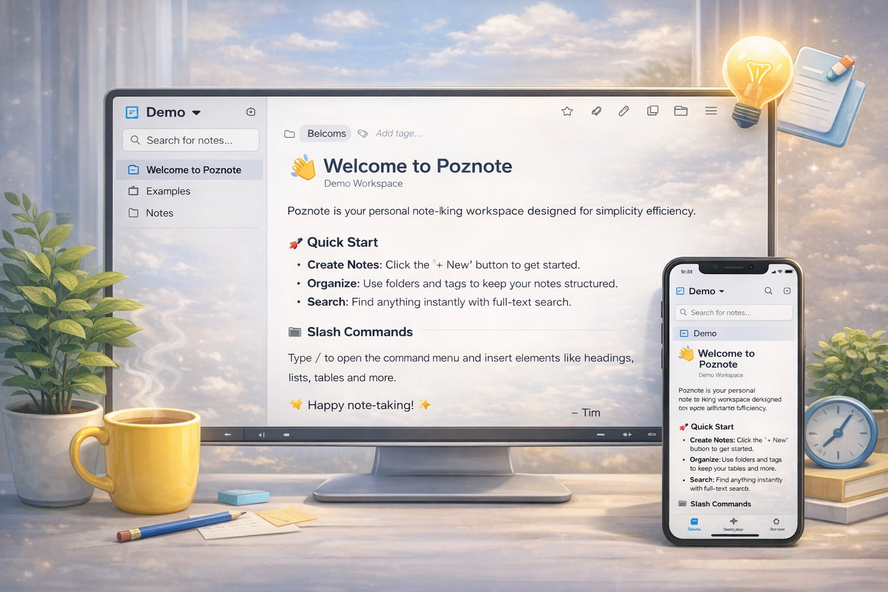
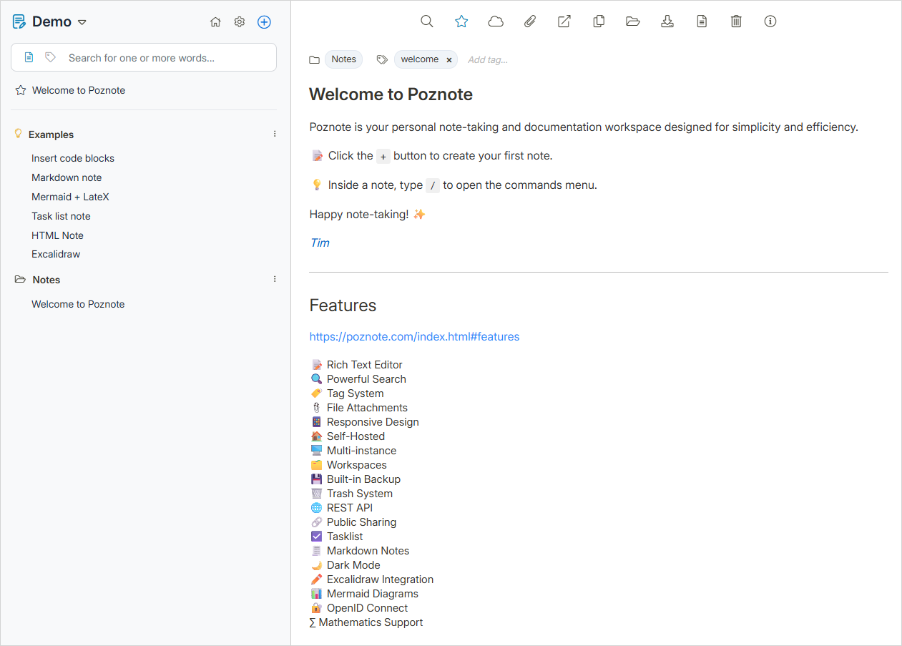
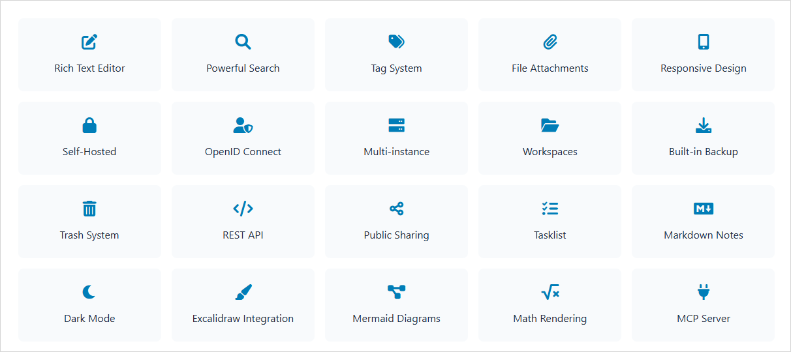
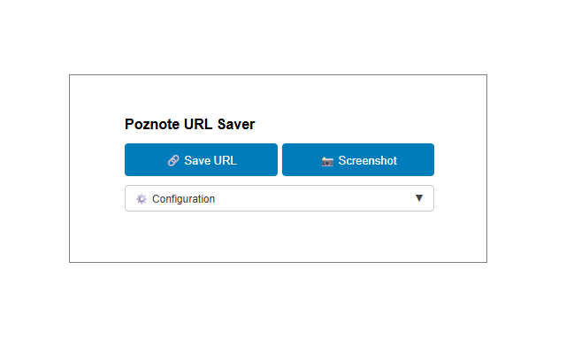
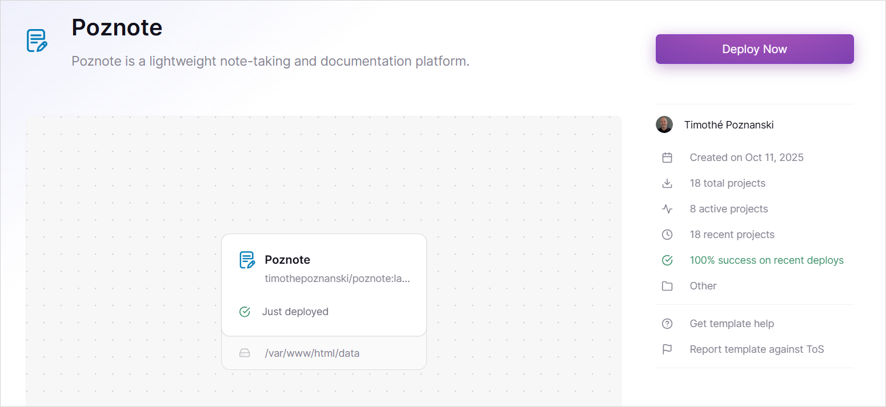

<p align="center">
  
</p>

<h1 align="center">Poznote</h1>

<div align="center">

[](https://github.com/timothepoznanski/poznote/stargazers) [](https://github.com/timothepoznanski/poznote/blob/main/LICENCE) [](https://github.com/timothepoznanski/poznote/pkgs/container/poznote) [](https://ko-fi.com/timothepoznanski)

</div>

<h3 align="center">
Poznote is a personal note-taking and documentation platform.<br><br>
</h3>

<p align="center">
  
</p>

<p align="center">
  
</p>

## Features

Discover all the [powerful features](https://poznote.com/index.html#features) that make Poznote your perfect note-taking companion!

<p align="center">
  
</p>

## Try the Poznote demo

Username: `poznote`
<br>
Password: `poznote`

[poznote-demo.up.railway.app](https://poznote-demo.up.railway.app)

## Table of content

- [Install](#install)
- [Access](#access)
- [Troubleshooting Installation](#troubleshooting-installation)
- [Change Settings](#change-settings)
- [Authentication](#authentication)
- [Update application](#update-application)
- [Multi-users](#multi-users)
- [Backup / Export](#backup--export)
- [Restore / Import](#restore--import)
- [Offline View](#offline-view)
- [Multiple Instances](#multiple-instances)
- [MCP Server](#mcp-server)
- [Poznote Extension](#poznote-extension)
- [API Documentation](#api-documentation)
- [Use Poznote in the Cloud](#use-poznote-in-the-cloud)
- [Tech Stack](#tech-stack)

## Install

> The official image is multi-arch (linux/amd64, linux/arm64) and supports Windows/macOS via Docker Desktop, as well as ARM64 devices like Raspberry Pi, NAS systems etc.

Choose your preferred installation method below:

<a id="windows"></a>
<details>
<summary><strong>🖥️ Windows</strong></summary>

#### Step 1: Prerequisite

Install and start [Docker Desktop](https://docs.docker.com/desktop/setup/install/windows-install/)

#### Step 2: Deploy Poznote

Create a new directory:

```powershell
mkdir poznote
```

Navigate to the Poznote directory:
```powershell
cd poznote
```

Create the environment file:

```powershell
curl -o .env https://raw.githubusercontent.com/timothepoznanski/poznote/main/.env.template
```

Edit the `.env` file:

```powershell
notepad .env
```

Download the Docker Compose configuration file:

```powershell
curl -o docker-compose.yml https://raw.githubusercontent.com/timothepoznanski/poznote/main/docker-compose.yml
```

Download the latest Poznote Webserver and Poznote MCP images :
```powershell
docker compose pull
```

Start Poznote container:
```powershell
docker compose up -d
```

</details>

<a id="linux"></a>
<details>
<summary><strong>🐧 Linux</strong></summary>

#### Step 1: Prerequisite

1. Install [Docker engine](https://docs.docker.com/engine/install/)
2. Install [Docker Compose](https://docs.docker.com/compose/install/linux)

#### Step 2: Install Poznote

Create a new directory:
```bash
mkdir poznote
```

Navigate to the Poznote directory:
```bash
cd poznote
```

Create the environment file:
```bash
curl -o .env https://raw.githubusercontent.com/timothepoznanski/poznote/main/.env.template
```

Edit the `.env` file:
```bash
vi .env
```

Download the Docker Compose configuration file:
```bash
curl -o docker-compose.yml https://raw.githubusercontent.com/timothepoznanski/poznote/main/docker-compose.yml
```

Download the latest Poznote Webserver and Poznote MCP images:
```bash
docker compose pull
```

Start Poznote container:
```bash
docker compose up -d
```

</details>

<a id="macos"></a>
<details>
<summary><strong>🍎 macOS</strong></summary>

#### Step 1: Prerequisite

Install and start [Docker Desktop](https://docs.docker.com/desktop/setup/install/mac-install/)

#### Step 2: Deploy Poznote

Create a new directory:
```bash
mkdir poznote
```

Navigate to the Poznote directory:
```bash
cd poznote
```

Download the environment file:
```bash
curl -o .env https://raw.githubusercontent.com/timothepoznanski/poznote/main/.env.template
```

Edit the `.env` file:
```bash
vi .env
```

Download the Docker Compose configuration file:
```bash
curl -o docker-compose.yml https://raw.githubusercontent.com/timothepoznanski/poznote/main/docker-compose.yml
```

Download the latest Poznote Webserver and Poznote MCP images:
```bash
docker compose pull
```

Start Poznote container:
```bash
docker compose up -d
```

</details>

<a id="cloud"></a>
<details>
<summary><strong>☁️ Cloud</strong></summary>
<br>

**See section [Use Poznote in the Cloud](#use-poznote-in-the-cloud)**

</details>

## Access

After installation, access Poznote in your web browser:

[http://localhost:8040](http://localhost:8040)


- Username: `admin`
- Password: `admin`
- Port: `8040`

## Troubleshooting Installation

<details>
<summary><strong>"mkdir() warnings (permission denied) or Connection failed"</strong></summary>
<br>

If you encounter errors like:
- `Warning: mkdir(): Permission denied in /var/www/html/db_connect.php`
- `Connection failed: SQLSTATE[HY000] [14] unable to open database file`
- The `database` folder is created with `root:root` instead of `www-data:www-data`

This is a known issue with Docker volume mounts in certain environments (Komodo, Portainer, etc.). The container cannot change permissions on mounted volumes in some configurations.

**Solution:** Before starting the container, set the correct permissions on your host machine:

```bash
# Navigate to your Poznote directory
cd poznote

# Create the data directory structure with correct permissions
mkdir -p data/database

# Set ownership to UID 82 (www-data in Alpine Linux)
sudo chown -R 82:82 data

# Start the container
docker compose up -d
```

</details>

<details>
<summary><strong>"Connection failed: SQLSTATE[HY000]: General error: 8 attempt to write a readonly database"</strong></summary>
<br>

First, try to stop and restart the container and wait for the database to be initialized (refresh the page).

If that didn't work, stop the container and fix ownership for the `data` folder (adapt UID/GID to your setup, example uses 1000:1000):

```bash
docker compose down
sudo chown 1000:1000 -R data
```

> 💡 **Note:** UID 82 corresponds to the `www-data` user in Alpine Linux, which is used by the Poznote Docker image.

</details>

<details>
<summary><strong>"This site can't be reached"</strong></summary>
 <br>

If you see "This site can't be reached" in your browser, you may have SELinux enabled. In this case, check the container logs:

```bash
docker logs poznote-webserver-1
# or with podman
podman logs poznote-webserver-1
```

You'll likely find:
- `chown: /var/www/html/data: Permission denied`

This occurs when Docker volumes don't have the correct SELinux context, especially when installing from `/root` directory.

**Solution:** We strongly recommend using the `:Z` suffix for Docker volumes and avoiding the `/root` directory to ensure proper functioning on all distributions.

Edit your `docker-compose.yml` to add `:Z` to volume definitions:

```yaml
volumes:
  - ./data:/var/www/html/data:Z
```

Alternatively, install Poznote in a directory outside of `/root`, such as `/opt/poznote` or `~/poznote`.

</details>

<details>
<summary><strong>"Incorrect username or password"</strong></summary>
<br>

1. Try to log with "admin" or "admin_change_me" and your password.
2. Check if the user's role (Admin vs User) matches the password you are using from the `.env` file.
3. Ensure no extra spaces were added when editing the `.env` variables.
4. If you can log in as an administrator (admin) but not as a standard user, check if the profile is marked as **active** in the User Management panel.

</details>

## Change Settings

Poznote configuration is split between two locations:

<details>
<summary><strong>System Settings (`.env` file)</strong></summary>
<br>

System settings can be modified in the `.env` file. Several categories of settings are available:

- **Authentication**
- **Web Server**
- **OIDC / SSO Authentication**
- **Import Limits**

**How to Modify System Settings**

Navigate to your Poznote directory:
```bash
cd poznote
```

Stop the running Poznote container:
```bash
docker compose down
```

Edit and modify the `.env` file with your preferred text editor.

Save the file and restart Poznote to apply changes:
```bash
docker compose up -d
```

</details>

<details>
<summary><strong>Application Settings (Settings Page)</strong></summary>
<br>

Additional settings are available through the Poznote web interface and are stored in the database.

**How to Modify Application Settings**

1. Log in to Poznote
2. Click on the **Settings** icon (⚙️) in the navigation bar
3. Modify your preferences directly in the interface

> **Note:** Settings in the web interface are stored in the database and persist across container restarts. Only `.env` file changes require container restart.

</details>

## Authentication

<details>
<summary><strong>Traditional Authentication</strong></summary>
<br>

Poznote uses a global password model. You define your administrator and standard user passwords in the `.env` file, and users log in using their database-managed usernames.

#### Authentication Model

- **Global Authentication**: Uses `POZNOTE_PASSWORD` and `POZNOTE_PASSWORD_USER` environment variables in your `.env`.
- **User Profiles**: Each user has a unique profile (username) with isolated data.
- **Automatic Profile Selection**: The system automatically selects the correct profile when you log in based on your credentials.
- **First Account**: On a new installation or migration, the first user created is always an administrator named `admin_change_me`.

```bash
# Global Administrator password
# Used for all accounts with administrator role
POZNOTE_PASSWORD=your_secure_password

# Global Standard User password (optional)
# Used for all accounts with standard user role
POZNOTE_PASSWORD_USER=your_user_password
```

#### Login Flow

1. User opens Poznote.
2. User enters their **username** and **password**.
3. System automatically selects the appropriate user profile.
4. User accesses their personal data space.

</details>

<a id="oidc"></a>
<details>
<summary><strong>OIDC / SSO Authentication (Optional)</strong></summary>
<br>

Poznote supports OpenID Connect (authorization code + PKCE) for single sign-on integration. This allows users to log in using external identity providers such as Auth0, Keycloak, Azure AD, or Google Identity.

#### How it works

1. **Pre-requisite**: An administrator must first create a user profile with a username matching the OIDC user's `preferred_username` or `email`.
2. The login page displays a "Continue with [Provider Name]" button.
3. Clicking the button redirects users to your identity provider.
4. After successful authentication, Poznote matches the OIDC identity to an existing user profile and creates a session.

#### Configuration

Add the OIDC variables to your `.env` file (see `.env.template`). If `POZNOTE_OIDC_DISABLE_NORMAL_LOGIN` is `true`, the standard login form will be hidden.

#### Access Control Example

Restrict access to specific users by email address or username:
```bash
POZNOTE_OIDC_ALLOWED_USERS=alice@example.com,bob@example.com,charlie@company.org
```

</details>

## Update application

> **📘 Docker Versioning**: Poznote supports flexible Docker image versioning. Learn about major/minor version tags in our [Docker Versioning Guide](Docs/DOCKER-VERSIONING.md).

<details>
<summary><strong>Update to the latest version</strong></summary>
<br>

Navigate to your Poznote directory:
```bash
cd poznote
```

Stop the running container before updating:
```bash
docker compose down
```

Download the latest Docker Compose configuration:
```bash
curl -o docker-compose.yml https://raw.githubusercontent.com/timothepoznanski/poznote/main/docker-compose.yml
```

Download the latest .env.template:
```bash
curl -o .env.template https://raw.githubusercontent.com/timothepoznanski/poznote/main/.env.template
```

Review `.env.template` and add any new variables to your `.env` file if needed:
```bash
sdiff .env .env.template
```

Download the latest Poznote Webserver and Poznote MCP images:
```bash
docker compose pull
```

Start the updated container:
```bash
docker compose up -d
```

Your data is preserved in the `./data` directory and will not be affected by the update.

</details>

<details>
<summary><strong>Version pinning and automatic updates</strong></summary>
<br>

Poznote supports multiple Docker image tags for different upgrade strategies:

- **Major version** (`poznote:4`): Auto-upgrade within v4.x.x, no breaking changes
- **Minor version** (`poznote:4.1`): Auto-upgrade within v4.1.x, patch updates only  
- **Exact version** (`poznote:4.1.0`): No automatic updates, complete control
- **Latest** (`poznote:latest`): Always the newest stable release

**Example: Stay on major version 4 with auto-updates**

Edit your `docker-compose.yml`:
```yaml
services:
  poznote:
    image: ghcr.io/timothepoznanski/poznote:4  # Auto-upgrade to 4.x.x
    # ... rest of config
```

Then update with:
```bash
docker compose pull && docker compose up -d
```

**⚠️ Note about Watchtower**: Automated tools like Watchtower only update Docker images, not `docker-compose.yml` or environment variables. For production, manual updates are recommended to ensure configuration compatibility.

For complete details on versioning strategies, automatic updates, and migration between major versions, see the [Docker Versioning Guide](Docs/DOCKER-VERSIONING.md).

</details>

<details>
<summary><strong>Update to Beta version</strong></summary>
<br>

Occasionally, beta versions will be published as **pre-releases** on GitHub. These versions include more features and fixes than the stable production version, but may not be fully validated yet.

**How to install a beta version:**

You can install beta versions by modifying your `docker-compose.yml` to use a specific version tag instead of `latest`:

1. Download the latest Docker Compose configuration:
   ```bash
   curl -o docker-compose.yml https://raw.githubusercontent.com/timothepoznanski/poznote/main/docker-compose.yml
   ```

2. Download the latest .env.template:
   ```bash
   curl -o .env.template https://raw.githubusercontent.com/timothepoznanski/poznote/main/.env.template
   ```

3. Review `.env.template` and add any new variables to your `.env` file if needed.
   ```bash
   sdiff .env .env.template
   ```

4. Edit your `docker-compose.yml` file and change the image line to:
   ```yaml
   image: ghcr.io/timothepoznanski/poznote:X.X.X-beta
   ```
   Replace `X.X.X-beta` with the specific beta version from the [GitHub Releases](https://github.com/timothepoznanski/poznote/releases) page.

5. Update and restart:
   ```bash
   docker compose down
   docker compose pull
   docker compose up -d
   ```

> **Note:** Beta versions are marked as "Pre-release" on GitHub and are not automatically suggested for updates in the application.

</details>

## Multi-users

Poznote features a multi-user architecture with isolated data space for each user (ideal for families, teams, or personal personas).

- **Data Isolation**: Each user has their own separate notes, workspaces, tags, folders and attachments.
- **Global Passwords**: Access is managed via role-based global passwords defined in `.env`.
- **User Management**: Administrators can manage profiles via the Settings panel.

### Architecture & Structure

Poznote uses a master database (`data/master.db`) to track profiles and global settings, and individual databases for each user.

```
data/
├── master.db                    # Master database (profiles, global settings)
└── users/
    ├── 1/                       # User ID 1 (default admin)
    │   ├── database/poznote.db  # User's notes database
    │   ├── entries/             # User's note files (HTML/MD)
    │   └── attachments/         # User's attachments
    ├── 2/                       # User ID 2
    └── ...
```

## Backup / Export

Poznote includes built-in Backup / Export functionality accessible through Settings.

<a id="complete-backup"></a>
<details>
<summary><strong>Complete Backup to Poznote zip</strong></summary>
<br>

Single ZIP containing database, all notes, and attachments for all workspaces:

  - Includes an `index.html` at the root for offline browsing
  - Notes are organized by workspace and folder
  - Attachments are accessible via clickable links

#### Per-User vs Complete Backups

Poznote provides flexible backup options:

**Via Web Interface (Settings > Backup/Export):**
- **All users** can backup and restore their own profile
- **Admins** can select which user profile to backup or restore
- Backups contain the user's database, notes, and attachments

**Via API/Script (Administrators only):**
- Automated backups using the `backup-poznote.sh` script
- Programmatic access via REST API v1
- Requires admin credentials

**Backup Scopes:**

1. **Per-User Backups**: Created from Settings or via API. Contains *only* the data belonging to a specific user (their database, notes, and attachments).
2. **Complete System Backup**: Created manually by backing up the entire `/data` directory. This is the only way to backup the master configuration and all users' data at once.

```bash
# Complete system backup via CLI
tar -czvf poznote-full-backup.tar.gz data/
```

</details>

<a id="export-individual-notes"></a>
<details>
<summary><strong>Export Individual Notes</strong></summary>
<br>

Export individual notes using the **Export** button in the note toolbar:

  - **HTML notes:** Export to HTML or PDF format
  - **Markdown notes:** Export to HTML, Markdown or PDF format

</details>

<a id="automated-backups-with-bash-script"></a>
<details>
<summary><strong>Automated Backups with Bash Script</strong></summary>
<br>

For automated scheduled backups via API, you can use the included `backup-poznote.sh` script.

**IMPORTANT:** Only administrators can create backups via the API.

**Script location:** `backup-poznote.sh` in the `tools` folder of the Poznote repository

**Administrator Usage:**

Admins can backup any user profile - **no need to know user IDs**, just the username:

```bash
# Backup your own profile
bash backup-poznote.sh 'https://poznote.example.com' 'admin' 'admin_password' 'admin' '/backups' '30'

# Backup another user's profile (Nina)
bash backup-poznote.sh 'https://poznote.example.com' 'admin' 'admin_password' 'Nina' '/backups' '30'
```

**Usage:**
```bash
bash backup-poznote.sh '<poznote_url>' '<admin_username>' '<admin_password>' '<target_username>' '<backup_directory>' '<retention_count>'
```

**Example with crontab (admin backing up Nina):**

```bash
# Add to crontab for automated backups twice daily
0 0,12 * * * bash /root/backup-poznote.sh 'https://poznote.example.com' 'admin' 'admin_password' 'Nina' '/root/backups' '30'
```

**Parameters explained:**
- `'https://poznote.example.com'` - Your Poznote instance URL
- `'admin'` - Admin username for authentication (must be an admin)
- `'admin_password'` - Admin password (POZNOTE_PASSWORD from .env)
- `'Nina'` - Target username to backup
- `'/root/backups'` - Parent directory where backups will be stored (creates `backups-poznote-<username>` folder)
- `'30'` - Number of backups to keep (older ones are automatically deleted)

**How the backup process works:**

1. The script authenticates with admin credentials
2. Automatically looks up the user ID from the username
3. Creates a backup via the API
4. Calls the Poznote REST API v1 (`POST /api/v1/backups` with `X-User-ID` header)
5. Downloads the backup ZIP locally to `backups-poznote-<username>/`
6. Automatically manages retention (keeps only the specified number of recent backups)

**Note:** Each user's backups are stored in separate folders (`backups-poznote-Nina`, `backups-poznote-Tim`, etc.)

</details>

## Restore / Import

**Via Web Interface (Settings > Restore/Import):**
- **All users** can restore backups to their own profile
- **Admins** can access additional disaster recovery tools
- Supports complete backup restoration and individual file imports

**Via API (Administrators only):**
- Restore via REST API v1 endpoint `POST /api/v1/backups/{filename}/restore`
- Requires admin credentials

<a id="complete-restore"></a>
<details>
<summary><strong>Complete Restore from Poznote zip backup</strong></summary>
<br>

Upload the complete backup ZIP to restore everything:

  - Replaces database, restores all notes, and attachments
  - Works for all workspaces at once

</details>

<details>
<summary><strong>Disaster Recovery (Reconstruct System Index)</strong></summary>
<br>

In case of system corruption or loss of the master database, Poznote can reconstruct its entire user index by scanning the data folders. This tool is accessible via Settings > Advanced > Reconstruct System Index.

</details>

<a id="import-individual-notes"></a>
<details>
<summary><strong>Import Individual files</strong></summary>
<br>

Import one or more HTML, Markdown or text notes directly:

  - Support `.html`, `.md`, `.markdown` or `.txt` files types
  - Up to 50 files can be selected at once, configurable via `POZNOTE_IMPORT_MAX_INDIVIDUAL_FILES` in your `.env`

</details>

<a id="import-zip-notes"></a>
<details>
<summary><strong>Import ZIP file</strong></summary>
<br>

Import a ZIP archive containing multiple notes:

  - Support `.html`, `.md`, `.markdown` or `.txt` files types
  - ZIP archives can contain up to 300 files, configurable via `POZNOTE_IMPORT_MAX_ZIP_FILES` in your `.env`
  - When importing a ZIP archive, Poznote automatically detects and recreates the folder structure

</details>

<a id="import-obsidian-notes"></a>
<details>
<summary><strong>Import Obsidian Notes</strong></summary>
<br>

Import a ZIP archive containing multiple notes from Obsidian:

  - ZIP archives can contain up to 300 files, configurable via `POZNOTE_IMPORT_MAX_ZIP_FILES` in your `.env`
  - Poznote automatically detects and recreates the folder structure
  - Poznote automatically detects existing tags to create
  - Poznote automatically imports images if they are at the zip file root

</details>

<a id="import-standard-notes"></a>
<details>
<summary><strong>Import from Standard Notes</strong></summary>
<br>

Convert and import your Standard Notes export to Poznote using the included conversion script:

**Script location:** `standard-notes-to-poznote.sh` in the `tools` folder of the Poznote repository

**Prerequisites:**
- `jq`, `unzip`, `zip`, and `find` utilities must be installed

**Usage:**
```bash
bash standard-notes-to-poznote.sh <standard_notes_export.zip>
```

**How it works:**

1. Export your notes from Standard Notes (this creates a ZIP file)
2. Run the conversion script with your Standard Notes export ZIP as parameter
3. The script generates a `poznote_export.zip` file compatible with Poznote
4. Import the generated ZIP into Poznote using the "Import ZIP file" feature

**What gets converted:**
- All notes are converted to Markdown format with front matter
- Note creation dates are preserved
- Tags are automatically extracted and included in the front matter
- Note content is preserved from the Standard Notes export

**Example:**
```bash
bash tools/standard-notes-to-poznote.sh my_standard_notes_backup.zip
# This creates: poznote_export.zip
```

After conversion, import the generated `poznote_export.zip` file into Poznote.

</details>

<details>
<summary><strong>Markdown Front Matter Support</strong></summary>
<br>

Markdown files can include YAML front matter to specify note metadata. The following keys are supported:

  - `title` — Override the note title (default: filename without extension)
  - `folder` — Override the target folder selection (folder must exist in the workspace)
  - `tags` — Array of tags to apply to the note. Supports both inline `[tag1, tag2]` and multi-line syntax
  - `favorite` — Mark note as favorite (`true`/`false` or `1`/`0`)
  - `created` — Set custom creation date (format: `YYYY-MM-DD HH:MM:SS`)
  - `updated` — Set custom update date (format: `YYYY-MM-DD HH:MM:SS`)

Example with inline array syntax:
```yaml
---
title: My Important Note
folder: Projects
tags: [important, work]
favorite: true
created: 2024-01-15 10:30:00
updated: 2024-01-20 15:45:00
---
```

Example with multi-line syntax:
```yaml
---
title: My Important Note
folder: Projects
tags:
  - important
  - work
favorite: true
created: 2024-01-15 10:30:00
updated: 2024-01-20 15:45:00
---
```

</details>

## Offline View

The **📦 Complete Backup** creates a standalone offline version of your notes. Simply extract the ZIP and open `index.html` in any web browser.

## Multiple Instances

You can run multiple isolated Poznote instances on the same server. Each instance has its own data, port, and credentials.

Perfect for:
- Hosting for different users on the same server, each with their own separate instance and account
- Testing new features without affecting your production instance

Simply repeat the installation steps in different directories with different ports.

### Example: Tom and Alice instances on the same server

```
Server: my-server.com
├── Poznote-Tom
│   ├── Port: 8040
│   ├── URL: http://my-server.com:8040
│   ├── Container: poznote-tom-webserver-1
│   └── Data: ./poznote-tom/data/
│
└── Poznote-Alice
  ├── Port: YOUR_POZNOTE_API_PORT
  ├── URL: http://my-server.com:YOUR_POZNOTE_API_PORT
    ├── Container: poznote-alice-webserver-1
    └── Data: ./poznote-alice/data/
```

## MCP Server

Poznote includes a Model Context Protocol (MCP) server that enables AI assistants like GitHub Copilot to interact with your notes using natural language. For example:

- "Create a new note titled 'Meeting Notes' with the content..."
- "Search for notes about 'Docker'"
- "List all notes in my Poznote workspace"
- "Update note 42 with new information"

For installation, configuration, and setup instructions, see the [MCP Server README](mcp-server/README.md).

## Poznote Extension

The **Poznote URL Saver** is a browser extension that allows you to quickly save the URL of the current page to your Poznote instance with a single click.

<p align="center">
  
</p>

1. Get the extension folder (two possibilities):
   - **Download:** [Download the repository as ZIP](https://github.com/timothepoznanski/poznote/archive/refs/heads/main.zip) and extract it
   - **Clone:** `git clone https://github.com/timothepoznanski/poznote.git`
2. Open your browser (Chrome, Edge, or any Chromium-based browser)
3. Go to the extensions page by typing `chrome://extensions/` in the address bar
4. Enable **Developer mode** using the toggle switch in the top right corner
5. Click **Load unpacked** in the top left
6. Select the `poznote-url-saver` folder from the Poznote repository
7. The extension is now installed and ready to use!

## API Documentation

Poznote provides a RESTful API v1 for programmatic access to notes, folders, workspaces, tags, and attachments.

**Base URL:** `/api/v1`

### Interactive Documentation (Swagger)

Access the **Swagger UI** directly from Poznote from `Settings > API Documentation` and browse all endpoints, view request/response schemas, and test API calls interactively.

### Multi-User Mode

Poznote supports multiple user profiles, each with their own isolated data. For API calls that access **user data** (notes, folders, etc.), you must include the `X-User-ID` header:

```bash
# Get notes for user ID 1
curl -u 'username:password' -H "X-User-ID: 1" \
  http://YOUR_SERVER/api/v1/notes
```

**Admin endpoints** (`/api/v1/admin/*`) and **public endpoints** (`/api/v1/users/profiles`) do **not** require the `X-User-ID` header.

Use `GET /api/v1/users/profiles` to list available user profiles and their IDs.

### Command Line Examples (Curl)

Ready-to-use curl commands for every API operation.

<details>
<summary><strong>📝 Notes Management</strong></summary>
<br>

**List Notes**

List all notes for a user:
```bash
curl -u 'username:password' -H "X-User-ID: 1" \
  http://YOUR_SERVER/api/v1/notes
```

Filter notes by workspace, folder, tag, or search:
```bash
curl -u 'username:password' -H "X-User-ID: 1" \
  "http://YOUR_SERVER/api/v1/notes?workspace=Personal&folder=Projects&tag=important"
```

**List Notes with Attachments**

List all notes that have file attachments:
```bash
curl -u 'username:password' -H "X-User-ID: 1" \
  http://YOUR_SERVER/api/v1/notes/with-attachments
```

**Get Note Content**

Get a specific note by ID:
```bash
curl -u 'username:password' -H "X-User-ID: 1" \
  http://YOUR_SERVER/api/v1/notes/123
```

Resolve a note by title (reference) inside a workspace:
```bash
curl -u 'username:password' -H "X-User-ID: 1" \
  "http://YOUR_SERVER/api/v1/notes/resolve?reference=My+Note&workspace=Personal"
```

**Create Note**

Create a new note with title, content, tags, folder and workspace:
```bash
curl -X POST -u 'username:password' -H "X-User-ID: 1" \
  -H "Content-Type: application/json" \
  -d '{
    "heading": "My New Note",
    "content": "This is the content of my note",
    "tags": "work,important",
    "folder_id": 12,
    "workspace": "Personal",
    "type": "markdown"
  }' \
  http://YOUR_SERVER/api/v1/notes
```

**Update Note**

Update an existing note by ID:
```bash
curl -X PATCH -u 'username:password' -H "X-User-ID: 1" \
  -H "Content-Type: application/json" \
  -d '{
    "heading": "Updated Title",
    "content": "Updated content here",
    "tags": "work,updated"
  }' \
  http://YOUR_SERVER/api/v1/notes/123
```

**Delete Note**

Move a note to trash:
```bash
curl -X DELETE -u 'username:password' -H "X-User-ID: 1" \
  http://YOUR_SERVER/api/v1/notes/123
```

Permanently delete (bypass trash):
```bash
curl -X DELETE -u 'username:password' -H "X-User-ID: 1" \
  "http://YOUR_SERVER/api/v1/notes/123?permanent=true"
```

**Restore Note**

Restore a note from trash:
```bash
curl -X POST -u 'username:password' -H "X-User-ID: 1" \
  http://YOUR_SERVER/api/v1/notes/123/restore
```

**Duplicate Note**

Create a copy of an existing note:
```bash
curl -X POST -u 'username:password' -H "X-User-ID: 1" \
  http://YOUR_SERVER/api/v1/notes/123/duplicate
```

**Convert Note Type**

Convert between markdown and HTML:
```bash
curl -X POST -u 'username:password' -H "X-User-ID: 1" \
  -H "Content-Type: application/json" \
  -d '{"target_type": "markdown"}' \
  http://YOUR_SERVER/api/v1/notes/123/convert
```

**Update Tags**

Replace all tags on a note:
```bash
curl -X PUT -u 'username:password' -H "X-User-ID: 1" \
  -H "Content-Type: application/json" \
  -d '{"tags": "work,urgent,meeting"}' \
  http://YOUR_SERVER/api/v1/notes/123/tags
```

**Toggle Favorite**

Toggle favorite status:
```bash
curl -X POST -u 'username:password' -H "X-User-ID: 1" \
  http://YOUR_SERVER/api/v1/notes/123/favorite
```

**Move Note to Folder**

Move a note to a different folder:
```bash
curl -X POST -u 'username:password' -H "X-User-ID: 1" \
  -H "Content-Type: application/json" \
  -d '{"folder_id": 45}' \
  http://YOUR_SERVER/api/v1/notes/123/folder
```

Remove from folder (move to root):
```bash
curl -X POST -u 'username:password' -H "X-User-ID: 1" \
  http://YOUR_SERVER/api/v1/notes/123/remove-folder
```

</details>

<details>
<summary><strong>🔗 Note Sharing</strong></summary>
<br>

**Get Share Status**

Check if a note is shared:
```bash
curl -u 'username:password' -H "X-User-ID: 1" \
  http://YOUR_SERVER/api/v1/notes/123/share
```

**Create Share Link**

Create a share link for a note:
```bash
curl -X POST -u 'username:password' -H "X-User-ID: 1" \
  -H "Content-Type: application/json" \
  -d '{
    "theme": "light",
    "indexable": false,
    "password": "optional-password"
  }' \
  http://YOUR_SERVER/api/v1/notes/123/share
```

**Update Share Settings**

Update share settings:
```bash
curl -X PATCH -u 'username:password' -H "X-User-ID: 1" \
  -H "Content-Type: application/json" \
  -d '{"theme": "dark", "indexable": true}' \
  http://YOUR_SERVER/api/v1/notes/123/share
```

**Revoke Share Link**

Remove sharing access:
```bash
curl -X DELETE -u 'username:password' -H "X-User-ID: 1" \
  http://YOUR_SERVER/api/v1/notes/123/share
```

**List All Shared Notes**

Get list of all shared notes:
```bash
curl -u 'username:password' -H "X-User-ID: 1" \
  http://YOUR_SERVER/api/v1/shared
```

Filter by workspace:
```bash
curl -u 'username:password' -H "X-User-ID: 1" \
  "http://YOUR_SERVER/api/v1/shared?workspace=Personal"
```

</details>

<details>
<summary><strong>📂 Folder Sharing</strong></summary>
<br>

**Get Folder Share Status**

Check if a folder is shared:
```bash
curl -u 'username:password' -H "X-User-ID: 1" \
  http://YOUR_SERVER/api/v1/folders/5/share
```

**Create Folder Share Link**

Share a folder (all notes in the folder will also be shared):
```bash
curl -X POST -u 'username:password' -H "X-User-ID: 1" \
  -H "Content-Type: application/json" \
  -d '{
    "theme": "light",
    "indexable": 0,
    "password": "optional-password"
  }' \
  http://YOUR_SERVER/api/v1/folders/5/share
```

With custom token:
```bash
curl -X POST -u 'username:password' -H "X-User-ID: 1" \
  -H "Content-Type: application/json" \
  -d '{
    "custom_token": "my-shared-folder"
  }' \
  http://YOUR_SERVER/api/v1/folders/5/share
```

**Update Folder Share Settings**

Update share settings:
```bash
curl -X PATCH -u 'username:password' -H "X-User-ID: 1" \
  -H "Content-Type: application/json" \
  -d '{"indexable": 1, "password": "new-password"}' \
  http://YOUR_SERVER/api/v1/folders/5/share
```

**Revoke Folder Share Link**

Revoke folder sharing (all notes in the folder will also be unshared):
```bash
curl -X DELETE -u 'username:password' -H "X-User-ID: 1" \
  http://YOUR_SERVER/api/v1/folders/5/share
```

</details>

<details>
<summary><strong>🗑️ Trash Management</strong></summary>
<br>

**List Trash**

Get all notes in trash:
```bash
curl -u 'username:password' -H "X-User-ID: 1" \
  http://YOUR_SERVER/api/v1/trash
```

Filter by workspace:
```bash
curl -u 'username:password' -H "X-User-ID: 1" \
  "http://YOUR_SERVER/api/v1/trash?workspace=Personal"
```

**Empty Trash**

Permanently delete all notes in trash:
```bash
curl -X DELETE -u 'username:password' -H "X-User-ID: 1" \
  http://YOUR_SERVER/api/v1/trash
```

**Permanently Delete Note**

Delete a specific note from trash:
```bash
curl -X DELETE -u 'username:password' -H "X-User-ID: 1" \
  http://YOUR_SERVER/api/v1/trash/123
```

</details>

<details>
<summary><strong>📁 Folders Management</strong></summary>
<br>

**List Folders**

List all folders in a workspace:
```bash
curl -u 'username:password' -H "X-User-ID: 1" \
  "http://YOUR_SERVER/api/v1/folders?workspace=Personal"
```

Get folder tree (nested structure):
```bash
curl -u 'username:password' -H "X-User-ID: 1" \
  "http://YOUR_SERVER/api/v1/folders?workspace=Personal&tree=true"
```

**Get Folder Counts**

Get note counts for all folders:
```bash
curl -u 'username:password' -H "X-User-ID: 1" \
  "http://YOUR_SERVER/api/v1/folders/counts?workspace=Personal"
```

**Create Folder**

Create a new folder:
```bash
curl -X POST -u 'username:password' -H "X-User-ID: 1" \
  -H "Content-Type: application/json" \
  -d '{
    "name": "My Projects",
    "workspace": "Personal"
  }' \
  http://YOUR_SERVER/api/v1/folders
```

Create a subfolder:
```bash
curl -X POST -u 'username:password' -H "X-User-ID: 1" \
  -H "Content-Type: application/json" \
  -d '{
    "name": "2024",
    "workspace": "Personal",
    "parent_id": 12
  }' \
  http://YOUR_SERVER/api/v1/folders
```

**Rename Folder**

Rename an existing folder:
```bash
curl -X PATCH -u 'username:password' -H "X-User-ID: 1" \
  -H "Content-Type: application/json" \
  -d '{"name": "New Folder Name"}' \
  http://YOUR_SERVER/api/v1/folders/12
```

**Move Folder**

Move folder to a different parent:
```bash
curl -X POST -u 'username:password' -H "X-User-ID: 1" \
  -H "Content-Type: application/json" \
  -d '{"parent_id": 56}' \
  http://YOUR_SERVER/api/v1/folders/34/move
```

Move to root (no parent):
```bash
curl -X POST -u 'username:password' -H "X-User-ID: 1" \
  -H "Content-Type: application/json" \
  -d '{"parent_id": null}' \
  http://YOUR_SERVER/api/v1/folders/34/move
```

**Update Folder Icon**

Set a custom icon:
```bash
curl -X PUT -u 'username:password' -H "X-User-ID: 1" \
  -H "Content-Type: application/json" \
  -d '{"icon": "fa-folder-open"}' \
  http://YOUR_SERVER/api/v1/folders/12/icon
```

**Empty Folder**

Move all notes in folder to trash:
```bash
curl -X POST -u 'username:password' -H "X-User-ID: 1" \
  http://YOUR_SERVER/api/v1/folders/12/empty
```

**Delete Folder**

Delete a folder:
```bash
curl -X DELETE -u 'username:password' -H "X-User-ID: 1" \
  http://YOUR_SERVER/api/v1/folders/12
```

</details>

<details>
<summary><strong>🗂️ Workspaces Management</strong></summary>
<br>

**List Workspaces**

Get all workspaces:
```bash
curl -u 'username:password' -H "X-User-ID: 1" \
  http://YOUR_SERVER/api/v1/workspaces
```

**Create Workspace**

Create a new workspace:
```bash
curl -X POST -u 'username:password' -H "X-User-ID: 1" \
  -H "Content-Type: application/json" \
  -d '{"name": "MyProject"}' \
  http://YOUR_SERVER/api/v1/workspaces
```

**Rename Workspace**

Rename an existing workspace:
```bash
curl -X PATCH -u 'username:password' -H "X-User-ID: 1" \
  -H "Content-Type: application/json" \
  -d '{"new_name": "NewName"}' \
  http://YOUR_SERVER/api/v1/workspaces/OldName
```

**Delete Workspace**

Delete a workspace:
```bash
curl -X DELETE -u 'username:password' -H "X-User-ID: 1" \
  http://YOUR_SERVER/api/v1/workspaces/OldWorkspace
```

</details>

<details>
<summary><strong>🏷️ Tags Management</strong></summary>
<br>

**List Tags**

Get all unique tags:
```bash
curl -u 'username:password' -H "X-User-ID: 1" \
  http://YOUR_SERVER/api/v1/tags
```

Filter by workspace:
```bash
curl -u 'username:password' -H "X-User-ID: 1" \
  "http://YOUR_SERVER/api/v1/tags?workspace=Personal"
```

</details>

<details>
<summary><strong>📎 Attachments Management</strong></summary>
<br>

**List Attachments**

Get all attachments for a note:
```bash
curl -u 'username:password' -H "X-User-ID: 1" \
  http://YOUR_SERVER/api/v1/notes/123/attachments
```

**Upload Attachment**

Upload a file to a note:
```bash
curl -X POST -u 'username:password' -H "X-User-ID: 1" \
  -F "file=@/path/to/file.pdf" \
  http://YOUR_SERVER/api/v1/notes/123/attachments
```

**Download Attachment**

Download a specific attachment:
```bash
curl -u 'username:password' -H "X-User-ID: 1" \
  http://YOUR_SERVER/api/v1/notes/123/attachments/456 \
  -o downloaded-file.pdf
```

**Delete Attachment**

Delete an attachment:
```bash
curl -X DELETE -u 'username:password' -H "X-User-ID: 1" \
  http://YOUR_SERVER/api/v1/notes/123/attachments/456
```

</details>

<details>
<summary><strong>💾 Backup Management</strong></summary>
<br>

**List Backups**

Get a list of all backup files:
```bash
curl -u 'username:password' -H "X-User-ID: 1" \
  http://YOUR_SERVER/api/v1/backups
```

**Create Backup**

Create a complete backup:
```bash
curl -X POST -u 'username:password' -H "X-User-ID: 1" \
  http://YOUR_SERVER/api/v1/backups
```

**Download Backup**

Download a specific backup file:
```bash
curl -u 'username:password' -H "X-User-ID: 1" \
  http://YOUR_SERVER/api/v1/backups/poznote_backup_2025-01-05_12-00-00.zip \
  -o backup.zip
```

**Delete Backup**

Delete a backup file:
```bash
curl -X DELETE -u 'username:password' -H "X-User-ID: 1" \
  http://YOUR_SERVER/api/v1/backups/poznote_backup_2025-01-05_12-00-00.zip
```

</details>

<details>
<summary><strong>📤 Export Management</strong></summary>
<br>

> Note: Export endpoints remain as legacy URLs for file downloads.

**Export Note**

Export a note as HTML or Markdown:
```bash
curl -u 'username:password' -H "X-User-ID: 1" \
  "http://YOUR_SERVER/api_export_note.php?id=123&format=html" \
  -o exported-note.html
```

**Export Folder**

Export a folder as ZIP:
```bash
curl -u 'username:password' -H "X-User-ID: 1" \
  "http://YOUR_SERVER/api_export_folder.php?folder_id=123" \
  -o folder-export.zip
```

**Export Structured Notes**

Export all notes preserving folder hierarchy:
```bash
curl -u 'username:password' -H "X-User-ID: 1" \
  "http://YOUR_SERVER/api_export_structured.php?workspace=Personal" \
  -o structured-export.zip
```

**Export All Notes**

Export all note files as ZIP:
```bash
curl -u 'username:password' -H "X-User-ID: 1" \
  http://YOUR_SERVER/api_export_entries.php \
  -o all-notes.zip
```

**Export All Attachments**

Export all attachments as ZIP:
```bash
curl -u 'username:password' -H "X-User-ID: 1" \
  http://YOUR_SERVER/api_export_attachments.php \
  -o all-attachments.zip
```

</details>

<details>
<summary><strong>⚙️ Settings</strong></summary>
<br>

**Get Setting**

Get a setting value:
```bash
curl -u 'username:password' -H "X-User-ID: 1" \
  http://YOUR_SERVER/api/v1/settings/language
```

**Update Setting**

Set a setting value:
```bash
curl -X PUT -u 'username:password' -H "X-User-ID: 1" \
  -H "Content-Type: application/json" \
  -d '{"value": "fr"}' \
  http://YOUR_SERVER/api/v1/settings/language
```

</details>

<details>
<summary><strong>ℹ️ System Information</strong></summary>
<br>

**Get Version**

Get current version and system info:
```bash
curl -u 'username:password' -H "X-User-ID: 1" \
  http://YOUR_SERVER/api/v1/system/version
```

**Check for Updates**

Check if a newer version is available:
```bash
curl -u 'username:password' -H "X-User-ID: 1" \
  http://YOUR_SERVER/api/v1/system/updates
```

**Get Translations**

Get translation strings:
```bash
curl -u 'username:password' -H "X-User-ID: 1" \
  http://YOUR_SERVER/api/v1/system/i18n
```

</details>

<details>
<summary><strong>👥 User Management (Admin Only)</strong></summary>
<br>

User management endpoints are for administrators only and do **not** require the `X-User-ID` header.

**List All User Profiles (Public)**

Get list of active user profiles (no authentication required):
```bash
curl http://YOUR_SERVER/api/v1/users/profiles
```

**List All Users with Statistics**

Get detailed list of all users with storage info (admin only):
```bash
curl -u 'username:password' \
  http://YOUR_SERVER/api/v1/admin/users
```

**Get Specific User**

Get detailed information about a user:
```bash
curl -u 'username:password' \
  http://YOUR_SERVER/api/v1/admin/users/1
```

**Create New User**

Create a new user profile:
```bash
curl -X POST -u 'username:password' \
  -H "Content-Type: application/json" \
  -d '{"username": "newuser"}' \
  http://YOUR_SERVER/api/v1/admin/users
```

**Update User**

Update user properties (username, active status, admin status):
```bash
curl -X PATCH -u 'username:password' \
  -H "Content-Type: application/json" \
  -d '{
    "username": "renameduser",
    "active": true,
    "is_admin": false
  }' \
  http://YOUR_SERVER/api/v1/admin/users/2
```

**Delete User**

Delete a user profile (without data):
```bash
curl -X DELETE -u 'username:password' \
  http://YOUR_SERVER/api/v1/admin/users/2
```

Delete a user profile and all their data:
```bash
curl -X DELETE -u 'username:password' \
  "http://YOUR_SERVER/api/v1/admin/users/2?delete_data=true"
```

**Get System Statistics**

Get aggregated statistics for all users:
```bash
curl -u 'username:password' \
  http://YOUR_SERVER/api/v1/admin/stats
```

**Repair Master Database**

Scan and rebuild the master database registry:
```bash
curl -X POST -u 'username:password' \
  http://YOUR_SERVER/api/v1/admin/repair
```

</details>

## Use Poznote in the Cloud

<p align="center">
  
</p>

If you:

- Want access from anywhere (phone, tablet, computer) with almost zero setup
- Have no experience with server management or don't want to manage server and security
- Don't know how to use command line or don't want to use command line
- Prefer one-click updates or automatic updates
- Are okay with approximately $5/month (Cloud provider fees)

**👉 [View Poznote Cloud Install and Manage Guide](Docs/POZNOTE-CLOUD.md)**

## Tech Stack

Poznote prioritizes simplicity and portability - no complex frameworks, no heavy dependencies. Just straightforward, reliable web technologies that ensure your notes remain accessible and under your control.

**Privacy-First Architecture:** Poznote operates entirely locally with no external connections required for functionality. All libraries (Excalidraw, Mermaid, KaTeX) are bundled and served from your own instance. The only outbound connection is a daily update check.

<details>
<summary>If you are interested in the tech stack on which Poznote is built, <strong>have a look here.</strong></summary>

### Backend
- **PHP 8.x** - Server-side scripting language
- **SQLite 3** - Lightweight, file-based relational database

### Frontend
- **HTML5** - Markup and structure
- **CSS3** - Styling and responsive design
- **JavaScript (Vanilla)** - Interactive features and dynamic content
- **React + Vite** - Build toolchain for Excalidraw component (bundled as IIFE)
- **AJAX** - Asynchronous data loading

### Libraries
- **Excalidraw** - Virtual whiteboard for sketching diagrams and drawings
- **Mermaid** - Client-side JavaScript library for diagram and flowchart generation from text
- **KaTeX** - Client-side JavaScript library for fast math typesetting and rendering mathematical equations
- **Sortable.js** - JavaScript library for drag-and-drop sorting
- **highlight.js** - Syntax highlighting for code blocks
- **Swagger UI** - Interactive API documentation and testing interface

### Storage
- **HTML/Markdown files** - Notes are stored as plain HTML or Markdown files in the filesystem
- **SQLite database** - Metadata, tags, relationships, and user data
- **File attachments** - Stored directly in the filesystem

### Infrastructure
- **Nginx + PHP-FPM** - High-performance web server with FastCGI Process Manager
- **Alpine Linux** - Secure, lightweight base image
- **Docker** - Containerization for easy deployment and portability
- **Python 3.12 (Alpine)** - MCP server runtime with httpx, fastmcp, and mcp libraries for AI assistant integration
</details>
