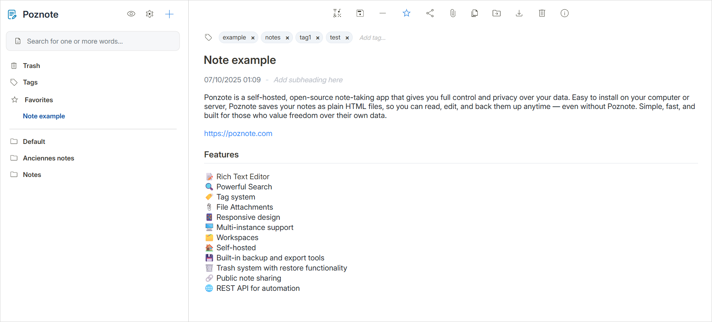

# Poznote

[](https://www.docker.com/)
[](LICENSE)
[](https://www.php.net/)
[](https://www.sqlite.org/)
[](https://developer.mozilla.org/en-US/docs/Web/JavaScript)
[](https://github.com/timothepoznanski/poznote/stargazers)

## 📖 Introduction

Poznote is a lightweight yet powerful web app for taking notes.  
Capture, organize, and access your notes while keeping full ownership of your data.

[**View all features on poznote.com**](https://poznote.com/index.html#features)



---

## 🎮 Try the Demo

A Poznote demo is available at [**poznote-demo.up.railway.app**](https://poznote-demo.up.railway.app)

- **Username:** `poznote`
- **Password:** `poznote`

---

## 🚀 Quick Start

### Installation

Choose your platform and follow the guide:

- **[Windows Installation →](../../wiki/Installation-Guide#windows)**
- **[Linux Installation →](../../wiki/Installation-Guide#linux)**
- **[macOS Installation →](../../wiki/Installation-Guide#macos)**

### Access Your Instance

After installation, access Poznote at: **[http://localhost:8040](http://localhost:8040)**

**Default Credentials:**
- Username: `admin`
- Password: `admin123!`

⚠️ **Change these credentials immediately after first login!** See [Configuration Guide](../../wiki/Configuration).

---

## 📚 Documentation

### Getting Started
- **[Installation Guide](../../wiki/Installation-Guide)** - Detailed setup for all platforms
- **[Configuration](../../wiki/Configuration)** - Settings, credentials, and customization
- **[Update Guide](../../wiki/Update-Guide)** - Keep your instance up to date

### Advanced Usage
- **[Backup and Restore](../../wiki/Backup-and-Restore)** - Protect your data with backups
- **[Multiple Instances](../../wiki/Multiple-Instances-Setup)** - Run multiple isolated instances
- **[API Documentation](../../wiki/API-Documentation)** - Complete REST API reference

### Technical Details
- **[Tech Stack](../../wiki/Tech-Stack)** - Under the hood of Poznote

**[📖 View Full Wiki →](../../wiki)**

---

## 🌟 Key Features

✅ **Self-Hosted** - Full control over your data  
✅ **Lightweight** - Fast and efficient  
✅ **Easy Installation** - One-command Docker deployment  
✅ **Offline Capable** - Export notes for offline browsing  
✅ **Multiple Workspaces** - Organize notes by context  
✅ **Rich Editor** - Markdown and HTML support  
✅ **Attachments** - Upload files to your notes  
✅ **Tags & Folders** - Flexible organization  
✅ **Full-Text Search** - Find notes instantly  
✅ **REST API** - Programmatic access  
✅ **Backup/Restore** - Built-in data protection  
✅ **Dark Mode** - Easy on the eyes  
✅ **Excalidraw Integration** - Create diagrams  

---

## 🛠️ Quick Commands

### Update to Latest Version

```bash
cd poznote
docker compose down
docker rmi ghcr.io/timothepoznanski/poznote:latest
docker compose pull
docker compose up -d
```

[**Full update guide →**](../../wiki/Update-Guide)

### Create Backup

```bash
curl -X POST -u 'username:password' http://localhost:8040/api_backup.php
```

[**Full backup guide →**](../../wiki/Backup-and-Restore)

### Change Settings

```bash
cd poznote
docker compose down
nano .env  # Edit credentials/port
docker compose up -d
```

[**Full configuration guide →**](../../wiki/Configuration)

---

## 💻 Tech Stack

- **Backend:** PHP 8.x + SQLite 3
- **Frontend:** HTML5, CSS3, Vanilla JavaScript
- **Server:** Nginx + PHP-FPM on Alpine Linux
- **Container:** Docker for easy deployment
- **Storage:** File-based notes + SQLite metadata

[**Learn more about the tech stack →**](../../wiki/Tech-Stack)

---

## 🔌 API

Poznote provides a complete REST API for programmatic access.

**Quick Example:**
```bash
# Create a note
curl -X POST -u 'admin:admin123!' \
  -H "Content-Type: application/json" \
  -d '{"heading": "My Note", "entrycontent": "<p>Hello World</p>"}' \
  http://localhost:8040/api_create_note.php

# List all notes
curl -u 'admin:admin123!' \
  http://localhost:8040/api_list_notes.php
```

**Interactive Documentation:** Settings > API Documentation (Swagger UI)

[**Full API reference →**](../../wiki/API-Documentation)

---

## 🤝 Contributing

Contributions are welcome! Whether it's:

- 🐛 Bug reports
- ✨ Feature requests
- 📖 Documentation improvements
- 💻 Code contributions

**[Open an issue](https://github.com/timothepoznanski/poznote/issues)** or **[submit a pull request](https://github.com/timothepoznanski/poznote/pulls)**!

---

## 📄 License

Poznote is open source software. See [LICENSE](LICENSE) for details.

---

## 🌐 Links

- **Website:** [poznote.com](https://poznote.com)
- **Demo:** [poznote-demo.up.railway.app](https://poznote-demo.up.railway.app)
- **Documentation:** [GitHub Wiki](../../wiki)
- **Issues:** [GitHub Issues](https://github.com/timothepoznanski/poznote/issues)
- **Releases:** [GitHub Releases](https://github.com/timothepoznanski/poznote/releases)

---

## ⭐ Support

If you find Poznote useful, please consider:

- ⭐ **Starring the repository** on GitHub
- 📢 **Sharing** with others who might benefit
- 🐛 **Reporting bugs** or suggesting features
- 💬 **Contributing** to the project

---

<p align="center">Made with ❤️ for note-takers who value simplicity and ownership</p>
