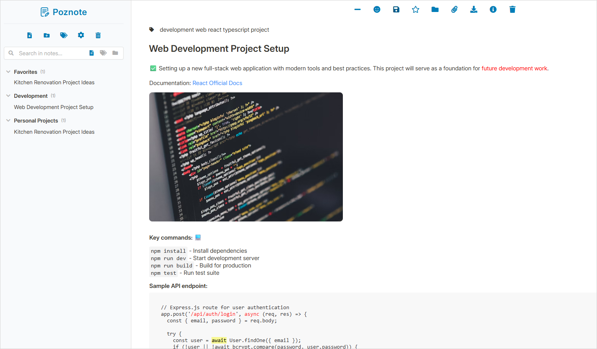
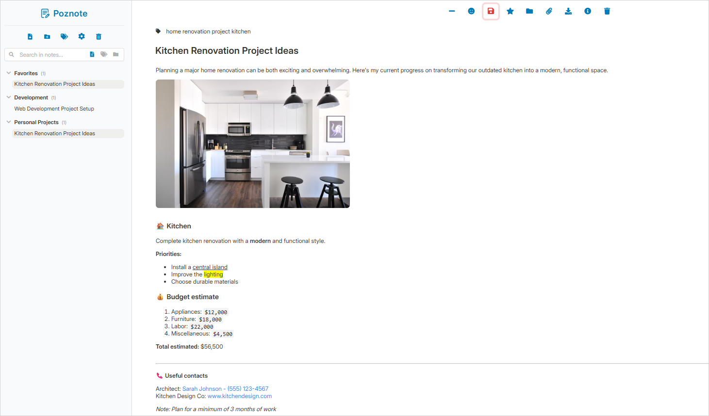

# Poznote

[](https://www.docker.com/)
[](LICENSE)
[](https://www.php.net/)
[](https://www.sqlite.org/)

A powerful note-taking application that puts you in complete control of your data. Poznote can be installed locally on your computer or on a remote server to access your notes from your phone or your computer web browser.

## Features

- 📝 Rich Text Editor
- 🔍 Powerful Search
- 🏷️ Tag system
- 📎 File Attachments
- 📱 Responsive design for all devices
- 🖥️ Multi-instance support
- 🔒 Self-hosted with secure authentication
- 💾 Built-in backup and export tools
- 🗑️ Trash system with restore functionality
- 🌐 REST API for automation

## Examples





## Table of Contents

- [Installation](#installation)
- [Access Your Instance](#access-your-instance)
- [Multiple Instances](#multiple-instances)
- [Change Settings](#change-settings)
- [Reset Password](#reset-password)
- [Update Application](#update-application)
- [Backup and Restore](#backup-and-restore)
- [Offline View](#offline-view)
- [API Documentation](#api-documentation)
- [Manual Operations](#manual-operations)

## Installation

Poznote runs in a Docker container, making it incredibly easy to deploy anywhere. You can:

- **Run locally** on your computer using Docker Desktop (Windows) or Docker Engine (Linux/macOS)
- **Deploy on a server** to access your notes from anywhere - phone, tablet, or any web browser

### Prerequisites

**Windows:**
- [Docker Desktop for Windows](https://www.docker.com/products/docker-desktop/)

**Linux/macOS:**
- [Docker Engine](https://docs.docker.com/engine/install/)
- [Docker Compose](https://docs.docker.com/compose/install/)

### Quick Start

**Windows (PowerShell):**
```powershell
$instanceName = Read-Host "Choose an instance name (poznote, poznote-work, my-notes, etc.) [poznote]"
if ([string]::IsNullOrWhiteSpace($instanceName)) { $instanceName = "poznote" }
git clone https://github.com/timothepoznanski/poznote.git $instanceName
cd $instanceName
.\setup.ps1
```

**Linux/macOS:**
```bash
read -p "Choose an instance name (poznote, poznote-work, my-notes, etc.) [poznote]: " instanceName
instanceName=${instanceName:-poznote}
git clone https://github.com/timothepoznanski/poznote.git "$instanceName"
cd "$instanceName"
chmod +x setup.sh
./setup.sh
```

## Access Your Instance

After installation, access Poznote at: `http://YOUR_SERVER:YOUR_PORT`

where YOUR_SERVER depends on your environment:

- localhost
- Your server's IP address
- Your domain name

The setup script will display the exact URL and credentials.

## Multiple Instances

You can run multiple isolated Poznote instances:

```bash
# Personal notes
git clone https://github.com/timothepoznanski/poznote.git poznote-personal
cd poznote-personal
./setup.sh  # Configure with port 8040

# Work notes  
cd ..
git clone https://github.com/timothepoznanski/poznote.git poznote-work
cd poznote-work
./setup.sh  # Configure with port 8041
```

## Change Settings

To change your username, password, port, or application name:

**Linux/macOS:**
```bash
./setup.sh
```

**Windows:**
```powershell
.\setup.ps1
```

Select option 2 (Change settings) from the menu. The script will preserve all your data.

## Reset Password

If you've forgotten your password, run the setup script and select "Change settings".

## Update Application

You can check if your application is up to date directly from the Poznote interface by using the **Settings → Check Updates** menu option.

To update Poznote to the latest version, run the setup script and select "Update application". The script will pull updates while preserving your configuration and data.

## Backup and Restore

Poznote includes built-in backup functionality accessible through Settings → "Export/Import Database".

### Backup Options

- **📝 Export Notes** - Complete ZIP with all your notes (Allows offline viewing without Poznote)
- **📎 Export Attachments** - All file attachments as ZIP
- **🗄️ Export Database** - SQLite database dump

### Restore Options

- **Complete Restore** - Requires notes + attachments + database for full functionality
- **Offline Viewing** - Exported notes work independently with included `index.html`

⚠️ **Important:** Database import completely replaces current data. The database contains metadata (titles, tags, dates) while actual note content is stored in HTML files.

### Automatic Database Backup

🔒 **Safety Feature:** Every time you import/restore a database through the web interface, Poznote automatically creates a backup of your current database before proceeding.

- **Location:** `data/database/poznote.db.backup.YYYY-MM-DD_HH-MM-SS`
- **Format:** Timestamped backup files (e.g., `poznote.db.backup.2025-08-15_14-36-19`)
- **Purpose:** Allows recovery if import fails or data needs to be rolled back

## Offline View

When you export notes using the **📝 Export Notes** option, you get a ZIP file containing all your notes in HTML format along with a special `index.html` file. This creates a completely standalone offline version of your notes that works without Poznote installed.

**Features of offline view:**
- **Search by title and tags** - Find notes quickly using the search functionality of your browser
- **No installation required** - Works in any web browser
- **Portable** - Share or archive your notes easily

Simply extract the ZIP file and open `index.html` in any web browser to access your notes offline.

## API Documentation

Poznote provides a REST API for programmatic access to notes and folders.

### Authentication

All API requests require HTTP Basic authentication:
```bash
curl -u username:password http://localhost:8040/api_endpoint.php
```

### Base URL

Access the API at your Poznote instance:
```
http://YOUR_SERVER:HTTP_WEB_PORT/
```

### Response Format

**HTTP Status Codes:**
- `200` - Success (updates, deletes)
- `201` - Created  
- `400` - Bad Request
- `401` - Unauthorized
- `404` - Not Found
- `409` - Conflict (duplicate)
- `500` - Server Error

**Success Response:**
```json
{
  "success": true,
  "message": "Operation completed",
  "data": { /* response data */ }
}
```

**Error Response:**
```json
{
  "error": "Error description",
  "details": "Additional details (optional)"
}
```

### Endpoints

#### List Notes
```bash
curl -u username:password http://localhost:8040/api_list_notes.php
```

#### Create Note
```bash
curl -X POST http://localhost:8040/api_create_note.php \
  -u username:password \
  -H "Content-Type: application/json" \
  -d '{
    "heading": "My New Note",
    "tags": "personal,important",
    "folder_name": "Projects"
  }'
```
**Required parameters:**
- `heading` (string) - The note title
**Optional parameters:**
- `tags` (string) - Comma-separated tags
- `folder_name` (string) - Folder name (defaults to "Uncategorized")

#### Create Folder
```bash
curl -X POST http://localhost:8040/api_create_folder.php \
  -u username:password \
  -H "Content-Type: application/json" \
  -d '{"folder_name": "Work Projects"}'
```
**Required parameters:**
- `folder_name` (string) - The folder name

#### Move Note
```bash
curl -X POST http://localhost:8040/api_move_note.php \
  -u username:password \
  -H "Content-Type: application/json" \
  -d '{
    "note_id": "123",
    "folder_name": "Work Projects"
  }'
```
**Required parameters:**
- `note_id` (string) - The ID of the note to move
- `folder_name` (string) - The target folder name

#### Delete Note
```bash
# Soft delete (to trash)
curl -X DELETE http://localhost:8040/api_delete_note.php \
  -u username:password \
  -H "Content-Type: application/json" \
  -d '{"note_id": "123"}'

# Permanent delete
curl -X DELETE http://localhost:8040/api_delete_note.php \
  -u username:password \
  -H "Content-Type: application/json" \
  -d '{
    "note_id": "123",
    "permanent": true
  }'
```

#### Delete Folder
```bash
curl -X DELETE http://localhost:8040/api_delete_folder.php \
  -u username:password \
  -H "Content-Type: application/json" \
  -d '{"folder_name": "Work Projects"}'
```

**Note:** The `Uncategorized` folder cannot be deleted. When a folder is deleted, all its notes are moved to `Uncategorized`.

## Manual Operations

For advanced users who prefer direct configuration:

**Change settings:**

1. Stop Poznote: `docker compose down`
2. Edit `.env` file
3. Restart Poznote: `docker compose up -d`

**Update Poznote to the latest version:** 

```bash
git pull origin main && docker compose down && docker compose up -d --build
```

**Backup:** 

Copy `./data/` directory (contains entries, attachments, database)

**Restore:** 

Replace `./data/` directory and restart container

**Password Reset:**

1. Stop Poznote: `docker compose down`
2. Edit `.env` file: `POZNOTE_PASSWORD=new_password`  
3. Restart Poznote: `docker compose up -d`
