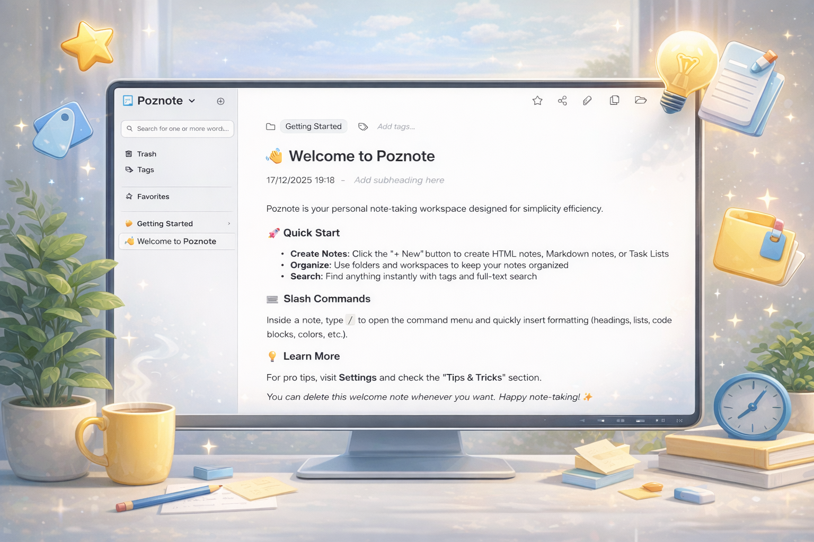

<p align="center">
  
</p>

<h1 align="center">Poznote</h1>

<div align="center">

[](https://github.com/timothepoznanski/poznote/stargazers) [](https://github.com/timothepoznanski/poznote/blob/main/LICENCE) [](https://github.com/timothepoznanski/poznote/pkgs/container/poznote) [](https://ko-fi.com/timothepoznanski)

</div>

<h3 align="center">
Poznote is a lightweight, open-source personal note-taking and documentation platform.<br><br>
</h3>

<p align="center">
  
</p>

<p align="center">
  
  &nbsp; &nbsp;
  
</p>

<p align="center">
  
  &nbsp; &nbsp;
  
</p>

<p align="center">
  
  &nbsp; &nbsp;
  
</p>

## Features

- Rich Text Editor
- Powerful Search
- Tag System
- File Attachments
- Responsive Design
- Self-Hosted
- Multi-instance
- Workspaces
- Built-in Backup
- Trash System
- REST API
- Public Sharing
- Tasklist
- Markdown Notes
- Dark Mode
- Excalidraw Integration
- Mermaid Diagrams
- OpenID Connect

## Try the Poznote demo

A live Poznote demo is available at [poznote-demo.up.railway.app](https://poznote-demo.up.railway.app)

Username: `poznote`
<br>
Password: `poznote`

## Install

> The official image on GHCR is multi-arch (linux/amd64, linux/arm64) and works on Windows/macOS via Docker Desktop (Linux containers).

Choose your preferred installation method below:

<a id="windows"></a>
<details>
<summary><strong>🖥️ Windows</strong></summary>

#### Step 1: Prerequisite

Install and start [Docker Desktop](https://docs.docker.com/desktop/setup/install/windows-install/)

#### Step 2: Deploy Poznote

Open Powershell and run the following commands.

Create a new directory for Poznote:

```powershell
mkdir poznote
```

Navigate to the Poznote directory:
```powershell
cd poznote
```

Download the environment file with default credentials and port configuration:

```powershell
curl -o .env https://raw.githubusercontent.com/timothepoznanski/poznote/main/.env.example
```

Edit the `.env` file so that it fits your needs:

```powershell
notepad .env
```

Download the Docker Compose configuration file for Poznote service:

```powershell
curl -o docker-compose.yml https://raw.githubusercontent.com/timothepoznanski/poznote/main/docker-compose.yml
```

Download the latest Poznote Docker image:
```powershell
docker compose pull
```

Start Poznote container in detached mode (runs in background):
```powershell
docker compose up -d
```

</details>

<a id="linux"></a>
<details>
<summary><strong>🐧 Linux</strong></summary>

#### Step 1: Prerequisite

1. Install [Docker engine](https://docs.docker.com/engine/install/)
2. Install [Docker Compose](https://docs.docker.com/compose/install/linux)

#### Step 2: Install Poznote

Open a Terminal and run the following commands.

Create a new directory for Poznote:
```bash
mkdir poznote
```

Navigate to the Poznote directory:
```bash
cd poznote
```

Download the environment file with default credentials and port configuration:
```bash
curl -o .env https://raw.githubusercontent.com/timothepoznanski/poznote/main/.env.example
```

Edit the `.env` file so that it fits your needs:
```bash
vim .env
```

Download the Docker Compose configuration file for Poznote service:
```bash
curl -o docker-compose.yml https://raw.githubusercontent.com/timothepoznanski/poznote/main/docker-compose.yml
```

Download the latest Poznote Docker image:
```bash
docker compose pull
```

Start Poznote container in detached mode (runs in background):
```bash
docker compose up -d
```

</details>

<a id="macos"></a>
<details>
<summary><strong>🍎 macOS</strong></summary>

#### Step 1: Prerequisite

Install and start [Docker Desktop](https://docs.docker.com/desktop/setup/install/mac-install/)

#### Step 2: Deploy Poznote

Open Terminal and run the following commands.

Create a new directory for Poznote:
```bash
mkdir poznote
```

Navigate to the Poznote directory:
```bash
cd poznote
```

Download the environment file with default credentials and port configuration:
```bash
curl -o .env https://raw.githubusercontent.com/timothepoznanski/poznote/main/.env.example
```

Edit the `.env` file so that it fits your needs:
```bash
nano .env
```

Download the Docker Compose configuration file for Poznote service:
```bash
curl -o docker-compose.yml https://raw.githubusercontent.com/timothepoznanski/poznote/main/docker-compose.yml
```

Download the latest Poznote Docker image:
```bash
docker compose pull
```

Start Poznote container in detached mode (runs in background):
```bash
docker compose up -d
```

</details>

<a id="cloud"></a>
<details>
<summary><strong>☁️ Cloud</strong></summary>
<br>

**See section [Use Poznote in the Cloud](#use-poznote-in-the-cloud)**

</details>

## Access

After installation, access Poznote in your web browser:

**URL:** [http://localhost:8040](http://localhost:8040)

**Default Credentials:**
- Username: `admin`
- Password: `admin123!`
- Port: `8040`

# Other information

- [Change Settings](#change-settings)
- [Authentication](#authentication)
- [Password Recovery](#password-recovery)
- [Update to the latest version](#update-to-the-latest-version)
- [Backup / Export and Restore / Import](#backup--export-and-restore--import)
- [Offline View](#offline-view)
- [Multiple Instances](#multiple-instances)
- [Troubleshooting](#troubleshooting)
- [Tech Stack](#tech-stack)
- [API Documentation](#api-documentation)
- [Use Poznote in the Cloud](#use-poznote-in-the-cloud)
- [Star History](#star-history)

## Change Settings

To modify your username, password, or port.

Navigate to your Poznote directory:
```bash
cd poznote
```

Stop the running Poznote container:
```bash
docker compose down
```

Edit the `.env` file with your preferred text editor and modify the values:

```
POZNOTE_USERNAME=your_new_username
POZNOTE_PASSWORD=your_new_password
HTTP_WEB_PORT=8040
```

Restart Poznote with new configuration:
```bash
docker compose up -d
```

## Authentication

Poznote supports two authentication methods:

### Traditional Authentication

By default, Poznote uses traditional username/password authentication. Configure your credentials in the `.env` file:

```bash
POZNOTE_USERNAME=your_username
POZNOTE_PASSWORD=your_secure_password
```

### OIDC / SSO Authentication (Optional)

Poznote can optionally authenticate users via OpenID Connect (authorization code + PKCE) for sign-on integration.

This allows users to log in using external identity providers such as:

- Auth0
- Keycloak
- Azure Active Directory
- Google Identity
- Okta
- And any other OIDC-compliant provider

#### Configuration

Add the following variables to your `.env` file and restart the container:

```bash
# Enable OIDC authentication
POZNOTE_OIDC_ENABLED=true

# Display name for the OIDC provider (shown on login button)
POZNOTE_OIDC_PROVIDER_NAME=YourCompany

# OIDC Provider Configuration
POZNOTE_OIDC_ISSUER=https://your-identity-provider.com
POZNOTE_OIDC_CLIENT_ID=your_client_id
POZNOTE_OIDC_CLIENT_SECRET=your_client_secret

# Optional: Custom scopes (default: "openid profile email")
# POZNOTE_OIDC_SCOPES="openid profile email"

# Optional: Override auto-discovery URL
# POZNOTE_OIDC_DISCOVERY_URL=https://your-idp.com/.well-known/openid-configuration

# Optional: Custom redirect URI (default: auto-generated)
# POZNOTE_OIDC_REDIRECT_URI=https://your-domain.com/oidc_callback.php

# Optional: Custom logout endpoint for RP-initiated logout
# POZNOTE_OIDC_END_SESSION_ENDPOINT=https://your-idp.com/logout

# Optional: Where to redirect after logout (default: login page)
# POZNOTE_OIDC_POST_LOGOUT_REDIRECT_URI=https://your-domain.com/login.php

# Optional: Disable normal login when OIDC is enabled (force SSO-only login)
# POZNOTE_OIDC_DISABLE_NORMAL_LOGIN=false

# Optional BUT VERY RECOMMANDED: Restrict access to specific users (comma-separated list of emails or usernames)
# If not set, all authenticated users from the identity provider can access the application
# Example: POZNOTE_OIDC_ALLOWED_USERS=user1@example.com,user2@example.com
# POZNOTE_OIDC_ALLOWED_USERS=
```

#### How it works

When OIDC is enabled:
1. The login page displays a "Continue with [Provider Name]" button
2. Clicking the button redirects users to your identity provider
3. After successful authentication, users are redirected back to Poznote
4. Poznote validates the OIDC tokens and creates a session

If `POZNOTE_OIDC_DISABLE_NORMAL_LOGIN` is set to `true`, the normal username/password login form will be hidden, forcing users to authenticate only through OIDC.

If `POZNOTE_OIDC_DISABLE_BASIC_AUTH` is set to `true`, HTTP Basic Auth for API requests will be disabled, rejecting API calls that use username/password credentials. This can be combined with `POZNOTE_OIDC_DISABLE_NORMAL_LOGIN` to fully enforce OIDC-only authentication across both the UI and API.

#### Security Notes

- OIDC configuration is stored in `.env` file (not in the database) to keep sensitive credentials secure
- Uses PKCE (Proof Key for Code Exchange) for enhanced security
- Supports RP-initiated logout for clean session termination
- All OIDC communication uses HTTPS
- **Access Control**: Use `POZNOTE_OIDC_ALLOWED_USERS` to restrict access to specific users. Without this setting, any user authenticated by your identity provider can access the application.

#### Access Control Example

Restrict access to specific users by email address or username:
```bash
POZNOTE_OIDC_ALLOWED_USERS=alice@example.com,bob@example.com,charlie@company.org
```

## Password Recovery

Your credentials are stored in the `.env` file in your Poznote directory.

To retrieve your password:

1. Navigate to your Poznote directory
2. Open the `.env` file
3. Look for the `POZNOTE_PASSWORD` value

## Update to the latest version

To update Poznote to the latest version.

Navigate to your Poznote directory:
```bash
cd poznote
```

Stop the running container before updating:
```bash
docker compose down
```

Download the latest Docker Compose configuration:
```bash
curl -o docker-compose.yml https://raw.githubusercontent.com/timothepoznanski/poznote/main/docker-compose.yml
```

Check if new environment variables were added:
```bash
curl -o .env.example https://raw.githubusercontent.com/timothepoznanski/poznote/main/.env.example
```

Review `.env.example` and add any new variables to your `.env` file if needed.

> **Tip for Linux users:** Use `sdiff` command to compare your current `.env` file with the latest example side-by-side and easily spot any new variables.
> ```bash
> sdiff .env .env.example
> ```

Download the latest Poznote image:
```bash
docker compose pull
```

Start the updated container:
```bash
docker compose up -d
```

Your data is preserved in the `./data` directory and will not be affected by the update.

### Beta Versions

Occasionally, beta versions will be published as **pre-releases** on GitHub. These versions include more features and fixes than the stable production version, but may not be fully validated yet.

**How to install a beta version:**

You can install beta versions by modifying your `docker-compose.yml` to use a specific version tag instead of `latest`:

1. Edit your `docker-compose.yml` file and change the image line to:
   ```yaml
   image: ghcr.io/timothepoznanski/poznote:X.X.X-beta
   ```
   Replace `X.X.X-beta` with the specific beta version from the [GitHub Releases](https://github.com/timothepoznanski/poznote/releases) page.

2. Update and restart:
   ```bash
   docker compose down
   docker compose pull
   docker compose up -d
   ```

> **Note:** Beta versions are marked as "Pre-release" on GitHub and are not automatically suggested for updates in the application.

## Backup / Export and Restore / Import

Poznote includes built-in Backup / Export and Restoration / Import functionality accessible through Settings.

<a id="complete-backup"></a>
**📦 Complete Backup**

Single ZIP containing database, all notes, and attachments for all workspaces:

  - Includes an `index.html` at the root for offline browsing
  - Notes are organized by workspace and folder
  - Attachments are accessible via clickable links

<a id="import-individual-notes"></a>
**📥 Import Individual Notes**

Import one or more HTML or Markdown notes directly, or upload a ZIP archive containing multiple notes:

  - Support `.html`, `.md`, `.markdown`, or `.zip` files types
  - ZIP archives can contain up to 300 files — configurable via `POZNOTE_IMPORT_MAX_ZIP_FILES` in your `.env` (default: 300)
  - Up to 50 files can be selected at once — configurable via `POZNOTE_IMPORT_MAX_INDIVIDUAL_FILES` in your `.env` (default: 50)
  - Choose the target workspace for imported notes
  - Optionally select a specific folder within the workspace
  - Simply drag files or ZIP archives onto the upload area

<a id="complete-restore"></a>
**🔄 Complete Restore** 

Upload the complete backup ZIP to restore everything:

  - Replaces database, restores all notes, and attachments
  - Works for all workspaces at once

<a id="automated-backups-with-bash-script"></a>
**🤖 Automated Backups with Bash Script**

For automated scheduled backups, you can use the included `backup-poznote.sh` script. This script creates complete backups via the Poznote API and automatically manages retention.

**Script location:** `backup-poznote.sh` (in the Poznote installation directory)

**Usage:**
```bash
bash backup-poznote.sh '<poznote_url>' '<username>' '<password>' '<backup_directory>' '<retention_count>'
```

**Example with crontab:**

To schedule automatic backups twice daily (at midnight and noon), add this line to your crontab:

```bash
0 0,12 * * * bash /root/backup-poznote.sh 'https://poznote.xxxxx.com' 'admin' 'xxxxx' '/root/poznote' '30'
```

**Parameters explained:**
- `'https://poznote.xxxxx.com'` - Your Poznote instance URL
- `'admin'` - Your Poznote username
- `'xxxxx'` - Your Poznote password
- `'/root/poznote'` - Parent directory where backups will be stored (the script creates a `backups-poznote` folder inside this path)
- `'30'` - Number of backups to keep (older ones are automatically deleted)

**How the backup process works:**

1. The script calls the Poznote API to create a backup at 00:00 (midnight) and 12:00 (noon) every day
2. The API generates a backup ZIP in the Poznote container: `/var/www/html/data/backups/`
3. The script downloads this backup locally to: `/root/poznote/backups-poznote/`
4. Old backups are automatically deleted from both locations to keep only the most recent ones based on retention count

## Offline View

The **📦 Complete Backup** creates a standalone offline version of your notes. Simply extract the ZIP and open `index.html` in any web browser.

## Multiple Instances

You can run multiple isolated Poznote instances on the same server. Each instance has its own data, port, and credentials.

### Why Multiple Instances?

Perfect for:
- Hosting for different users on the same server, each with their own separate instance and account
- Testing new features without affecting your production instance

### Example: Tom and Alice instances on the same server

```
Server: my-server.com
├── Poznote-Tom
│   ├── Port: 8040
│   ├── URL: http://my-server.com:8040
│   ├── Container: poznote-tom-webserver-1
│   └── Data: ./poznote-tom/data/
│
└── Poznote-Alice
    ├── Port: 8041
    ├── URL: http://my-server.com:8041
    ├── Container: poznote-alice-webserver-1
    └── Data: ./poznote-alice/data/
```

### How to Deploy Multiple Instances

Simply repeat the installation steps in different directories with different ports.

And then you will have two completely isolated instances, for example:

- Tom's Poznote: http://localhost:8040
- Alice's Poznote: http://localhost:8041

> 💡 **Tip:** Make sure each instance uses a different port number to avoid conflicts!

## Troubleshooting

### Permission denied when using Docker

If you encounter errors like:
- `Warning: mkdir(): Permission denied in /var/www/html/db_connect.php`
- `Connection failed: SQLSTATE[HY000] [14] unable to open database file`
- The `database` folder is created with `root:root` instead of `www-data:www-data`

This is a known issue with Docker volume mounts in certain environments (Komodo, Portainer, etc.). The container cannot change permissions on mounted volumes in some configurations.

**Solution:** Before starting the container, set the correct permissions on your host machine:

```bash
# Navigate to your Poznote directory
cd poznote

# Create the data directory structure with correct permissions
mkdir -p data/database

# Set ownership to UID 82 (www-data in Alpine Linux)
sudo chown -R 82:82 data

# Start the container
docker compose up -d
```

> 💡 **Note:** UID 82 corresponds to the `www-data` user in Alpine Linux, which is used by the Poznote Docker image.

## Tech Stack

Poznote prioritizes simplicity and portability - no complex frameworks, no heavy dependencies. Just straightforward, reliable web technologies that ensure your notes remain accessible and under your control.

<details>
<summary>If you are interested in the tech stack on which Poznote is built, <strong>have a look here.</strong></summary>

### Backend
- **PHP 8.x** - Server-side scripting language
- **SQLite 3** - Lightweight, file-based relational database

### Frontend
- **HTML5** - Markup and structure
- **CSS3** - Styling and responsive design
- **JavaScript (Vanilla)** - Interactive features and dynamic content
- **React + Vite** - Excalidraw drawing component (bundled as IIFE)
- **AJAX** - Asynchronous data loading

### Storage
- **HTML/Markdown files** - Notes are stored as plain HTML or Markdown files in the filesystem
- **SQLite database** - Metadata, tags, relationships, and user data
- **File attachments** - Stored directly in the filesystem

### Infrastructure
- **Nginx + PHP-FPM** - High-performance web server with FastCGI Process Manager
- **Alpine Linux** - Secure, lightweight base image
- **Docker** - Containerization for easy deployment and portability
</details>

## API Documentation

Poznote provides a REST API for programmatic access to notes, folders, workspaces, tags, and attachments.

### Interactive Documentation (Swagger)

Access the **Swagger UI** directly from Poznote from `Settings > API Documentation` and browse all endpoints, view request/response schemas, and test API calls interactively.

### 📖 Command Line Examples (Curl)

Ready-to-use curl commands for every API operation.

<details>
<summary><strong>📝 Notes Management</strong></summary>
<br>

**List Notes**

List all notes in the system:
```bash
curl -u 'username:password' \
  http://YOUR_SERVER/api_list_notes.php
```

Filter notes by specific workspace:
```bash
curl -u 'username:password' \
  "http://YOUR_SERVER/api_list_notes.php?workspace=Personal"
```

**Get Note Content**

Get the raw content of a note by ID:
```bash
curl -u 'username:password' \
  "http://YOUR_SERVER/api_note_content.php?id=123"
```

Resolve a note by title (reference) inside a workspace, then return its content:
```bash
curl -u 'username:password' \
  --get \
  --data-urlencode "reference=My Note" \
  --data-urlencode "workspace=Personal" \
  "http://YOUR_SERVER/api_note_content.php"
```

**Create Note**

Create a new note with title, content, tags, folder and workspace:
```bash
curl -X POST -u 'username:password' \
  -H "Content-Type: application/json" \
  -d '{
    "heading": "My New Note",
    "entrycontent": "This is the content of my note",
    "tags": "work,important",
    "folder_name": "Projects",
    "workspace": "Personal"
  }' \
  http://YOUR_SERVER/api_create_note.php
```

**Update Note**

Update an existing note by ID with new content:
```bash
curl -X POST -u 'username:password' \
  -H "Content-Type: application/json" \
  -d '{
    "id": 123,
    "heading": "Updated Title",
    "entrycontent": "Updated content",
    "tags": "work,updated",
    "folder": "Projects"
  }' \
  http://YOUR_SERVER/api_update_note.php
```

**Delete Note**

Move a note to trash by ID:
```bash
curl -X DELETE -u 'username:password' \
  -H "Content-Type: application/json" \
  -d '{"note_id": 123}' \
  http://YOUR_SERVER/api_delete_note.php
```

**Export Note**

Export a note as a styled HTML document (download):
```bash
curl -u 'username:password' \
  "http://YOUR_SERVER/api_export_note.php?id=123&type=note&format=html&disposition=attachment" \
  -o exported-note.html
```

Export a note for browser viewing/printing (inline):
```bash
curl -u 'username:password' \
  "http://YOUR_SERVER/api_export_note.php?id=123&type=note&format=html&disposition=inline"
```

**Move Note**

Move a note to a different folder or workspace:
```bash
curl -X POST -u 'username:password' \
  -H "Content-Type: application/json" \
  -d '{
    "note_id": 123,
    "folder_name": "Archive",
    "workspace": "Personal"
  }' \
  http://YOUR_SERVER/api_move_note.php
```

**Share Note**

Create or enable public sharing for a note (generates public link):
```bash
curl -X POST -u 'username:password' \
  -H "Content-Type: application/json" \
  -d '{"note_id": 123, "action": "create"}' \
  http://YOUR_SERVER/api_share_note.php
```

Revoke sharing for a note:
```bash
curl -X POST -u 'username:password' \
  -H "Content-Type: application/json" \
  -d '{"note_id": 123, "action": "revoke"}' \
  http://YOUR_SERVER/api_share_note.php
```

Get existing share URL:
```bash
curl -X POST -u 'username:password' \
  -H "Content-Type: application/json" \
  -d '{"note_id": 123, "action": "get"}' \
  http://YOUR_SERVER/api_share_note.php
```

</details>

<details>
<summary><strong>🗑️ Trash Management</strong></summary>
<br>

**List Trash**

Get all notes currently in the trash:
```bash
curl -u 'username:password' \
  http://YOUR_SERVER/api_list_trash.php
```

**Restore Note**

Restore a note from trash back to its original location:
```bash
curl -X POST -u 'username:password' \
  -H "Content-Type: application/json" \
  -d '{"id": 123}' \
  http://YOUR_SERVER/api_restore_note.php
```

</details>

<details>
<summary><strong>📁 Folders Management</strong></summary>
<br>

**Create Folder**

Create a new folder in the specified workspace:
```bash
curl -X POST -u 'username:password' \
  -H "Content-Type: application/json" \
  -d '{
    "folder_name": "My Projects",
    "workspace": "Personal"
  }' \
  http://YOUR_SERVER/api_create_folder.php
```

**Create Subfolder (parent/child)**

Create a subfolder by specifying a parent folder path:
```bash
curl -X POST -u 'username:password' \
  -H "Content-Type: application/json" \
  -d '{
    "folder_name": "2024",
    "parent_folder": "My Projects",
    "workspace": "Personal"
  }' \
  http://YOUR_SERVER/api_create_folder.php
```

You can also target a specific parent folder by ID:
```bash
curl -X POST -u 'username:password' \
  -H "Content-Type: application/json" \
  -d '{
    "folder_name": "Q1",
    "parent_folder_id": 12,
    "workspace": "Personal"
  }' \
  http://YOUR_SERVER/api_create_folder.php
```

**Create Nested Folders in One Call (path notation)**

Create a nested structure in one request:
```bash
curl -X POST -u 'username:password' \
  -H "Content-Type: application/json" \
  -d '{
    "folder_path": "Projects/2024/Q1",
    "workspace": "Personal",
    "create_parents": true
  }' \
  http://YOUR_SERVER/api_create_folder.php
```

**List Folders (flat or hierarchy)**

List folders (flat list with `path`):
```bash
curl -u 'username:password' \
  "http://YOUR_SERVER/api_list_folders.php?workspace=Personal"
```

List folders as a hierarchy tree (nested `children`):
```bash
curl -u 'username:password' \
  "http://YOUR_SERVER/api_list_folders.php?workspace=Personal&include_hierarchy=true"
```

**Move Folder to a Different Parent**

Move a folder by path:
```bash
curl -X POST -u 'username:password' \
  -H "Content-Type: application/json" \
  -d '{
    "folder_path": "Projects/2024/Q1",
    "new_parent_folder": "Archive/2023",
    "workspace": "Personal"
  }' \
  http://YOUR_SERVER/api_move_folder.php
```

Move a folder by ID:
```bash
curl -X POST -u 'username:password' \
  -H "Content-Type: application/json" \
  -d '{
    "folder_id": 34,
    "new_parent_folder_id": 56,
    "workspace": "Personal"
  }' \
  http://YOUR_SERVER/api_move_folder.php
```

**Delete Folder**

Delete a folder and move its contents to no folder (uncategorized):
```bash
curl -X DELETE -u 'username:password' \
  -H "Content-Type: application/json" \
  -d '{
    "folder_name": "Old Projects",
    "workspace": "Personal"
  }' \
  http://YOUR_SERVER/api_delete_folder.php
```

</details>

<details>
<summary><strong>🗂️ Workspaces Management</strong></summary>
<br>

**List Workspaces**

Get all available workspaces in your Poznote instance:
```bash
curl -u 'username:password' \
  "http://YOUR_SERVER/api_workspaces.php?action=list"
```

**Create Workspace**

Create a new workspace:
```bash
curl -X POST -u 'username:password' \
  -H "Content-Type: application/json" \
  -d '{
    "action": "create",
    "name": "MyProject"
  }' \
  http://YOUR_SERVER/api_workspaces.php
```

**Delete Workspace**

Delete a workspace (notes are moved to Poznote default workspace):
```bash
curl -X POST -u 'username:password' \
  -H "Content-Type: application/json" \
  -d '{
    "action": "delete",
    "name": "OldWorkspace"
  }' \
  http://YOUR_SERVER/api_workspaces.php
```

**Rename Workspace**

Rename an existing workspace:
```bash
curl -X POST -u 'username:password' \
  -H "Content-Type: application/json" \
  -d '{
    "action": "rename",
    "old_name": "OldName",
    "new_name": "NewName"
  }' \
  http://YOUR_SERVER/api_workspaces.php
```

</details>

<details>
<summary><strong>🏷️ Tags Management</strong></summary>
<br>

**List Tags**

Get all tags used across all notes:
```bash
curl -u 'username:password' \
  http://YOUR_SERVER/api_list_tags.php
```

**Apply Tags**

Add or update tags for a specific note (replaces existing tags).

Tags can be provided as a comma-separated string:
```bash
curl -X POST -u 'username:password' \
  -H "Content-Type: application/json" \
  -d '{
    "note_id": 123,
    "tags": "work,urgent,meeting"
  }' \
  http://YOUR_SERVER/api_apply_tags.php
```

Or as an array:
```bash
curl -X POST -u 'username:password' \
  -H "Content-Type: application/json" \
  -d '{
    "note_id": 123,
    "tags": ["work", "urgent", "meeting"]
  }' \
  http://YOUR_SERVER/api_apply_tags.php
```

</details>

<details>
<summary><strong>⭐ Favorites Management</strong></summary>
<br>

**Toggle Favorite**

Toggle favorite status for a note (add or remove):
```bash
curl -X POST -u 'username:password' \
  -H "Content-Type: application/json" \
  -d '{
    "action": "toggle_favorite",
    "note_id": 123,
    "workspace": "Personal"
  }' \
  http://YOUR_SERVER/api_favorites.php
```

</details>

<details>
<summary><strong>📎 Attachments Management</strong></summary>
<br>

**List Attachments**

Get all file attachments for a specific note:
```bash
curl -u 'username:password' \
  "http://YOUR_SERVER/api_attachments.php?action=list&note_id=123"
```

**Upload Attachment**

Upload a file and attach it to a note:
```bash
curl -X POST -u 'username:password' \
  -F "action=upload" \
  -F "note_id=123" \
  -F "file=@/path/to/file.pdf" \
  http://YOUR_SERVER/api_attachments.php
```

</details>

<details>
<summary><strong>💾 Backup Management</strong></summary>
<br>

**Create Backup**

Create a complete backup of all notes, attachments and database:
```bash
curl -X POST -u 'username:password' \
  -H "Content-Type: application/json" \
  http://YOUR_SERVER/api_backup.php
```

**List Backups**

Get a list of all available backup files:
```bash
curl -u 'username:password' \
  http://YOUR_SERVER/api_list_backups.php
```

**Download Backup**

Download a specific backup file by filename:
```bash
curl -u 'username:password' \
  "http://YOUR_SERVER/api_download_backup.php?filename=poznote_backup_2025-10-24_14-30-15.zip" \
  -o backup.zip
```

Backups are stored in the `data/backups/` directory with the naming pattern: `poznote_backup_YYYY-MM-DD_HH-MM-SS.zip`

</details>

<details>
<summary><strong>ℹ️ System Information</strong></summary>
<br>

**Check Version**

Get the current Poznote version and system information:
```bash
curl -u 'username:password' \
  http://YOUR_SERVER/api_version.php
```

</details>

## Use Poznote in the Cloud

<p align="center">
  
</p>

If you:

- Want access from anywhere (phone, tablet, computer) with almost zero setup
- Have no experience with server management or don't want to manage server and security
- Don't know how to use command line or don't want to use command line
- Prefer one-click updates or automatic updates
- Are okay with approximately $5/month (Cloud provider fees)

**👉 [View Poznote Cloud Install and Manage Guide](POZNOTE-CLOUD.md)**

## Star History

<p align="center">
  <a href="https://star-history.com/#timothepoznanski/poznote&Date">
    
  </a>
</p>
