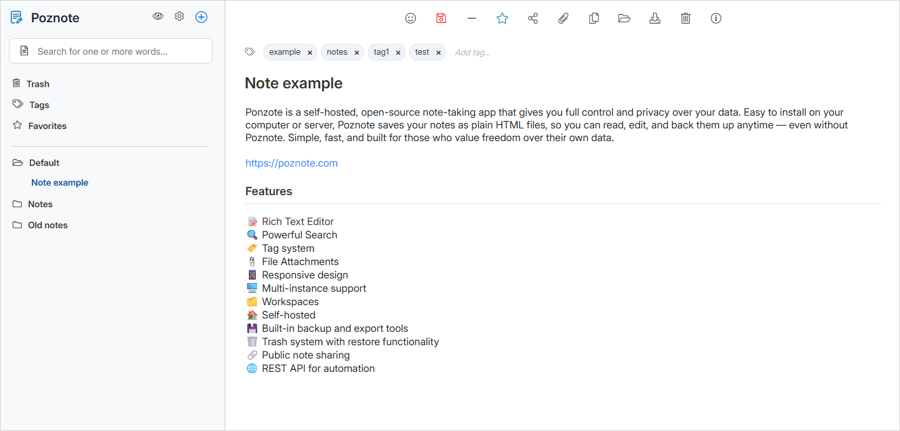

# Poznote

[](https://www.docker.com/)
[](LICENSE)
[](https://www.php.net/)
[](https://www.sqlite.org/)

## Table of Contents

- [Introduction](#introduction)
- [Features](#features)
- [Play with Poznote demo](#play-with-poznote-demo)
- [Install Poznote](#install-poznote)
- [Manage Poznote](#manage-poznote)
- [Backup and Restore](#backup-and-restore)
- [Offline View](#offline-view)
- [Tech Stack](#tech-stack)
- [API Documentation](#api-documentation)

## Introduction

Poznote is a personal, free, self-hosted, simple and intuitive note manager.<br><br>Capture and organize your notes quickly while keeping full control over your data, with zero vendor lock-in. Notes are stored as plain HTML files, accessible even without the app. Fast, clean, and fully under your control — designed for those who value efficiency above all.



## Features

- 📝 Rich Text Editor
- 🔍 Powerful Search
- 🏷️ Tag system
- 📎 File Attachments
- 📱 Responsive design
- 🖥️ Multi-instance support
- 🗂️ Workspaces
- 🏠 Self-hosted
- 💾 Built-in backup and restore tools
- 📖 Export tool for offline reading
- 🗑️ Trash system with restore functionality
- 🔗 Public note sharing
- 🌐 REST API for automation

## Play with Poznote demo

A Poznote demo is available on [poznote-demo.up.railway.app](https://poznote-demo.up.railway.app)

Username: `poznote`
<br>
Password: `poznote`

## Install Poznote

Choose your installation method:

### 💻 Choose "Local" method if you:

- Want to use Poznote only on your Windows or Linux computer
- Prefer maximum privacy (no internet exposure)
- Don't need access from other devices (your phone)
- Want it completely free
- Have no experience with server management or don't want to manage server and security
- Are ready to run a few commands (don't worry if you don't know how yet - it's not complicated!)

**👉 [View Poznote Self-Hosted Install Guide](POZNOTE-SELF-HOSTED-INSTALL.md)**
<br><br>

### 🖥️ Choose "Server" method if you:

- Want to access from anywhere (phone, tablet, computer)
- Have your own server or VPS
- Want complete control over your infrastructure
- Want to keep your notes private

**👉 [View Poznote Self-Hosted Install Guide](POZNOTE-SELF-HOSTED-INSTALL.md)**
<br><br>

### ☁️ Choose "Managed Cloud" method if you:

- Want access from anywhere (phone, tablet, computer) with almost zero setup
- Have no experience with server management or don't want to manage server and security
- Don't know how to use command line or don't want to use command line 
- Prefer one-click updates
- Are okay with approximately $5/month (Cloud provider fees)

**👉 [View Poznote Cloud Install Guide](POZNOTE-CLOUD-INSTALL.md)**


## Manage Poznote

If you need to change Poznote password, username or port, update to the latest version etc.

- You have a "Local" instance 👉 [View Poznote Self-Hosted Manage Guide](POZNOTE-SELF-HOSTED-MANAGE.md)

- You have a "Server" instance 👉 [View Poznote Self-Hosted Manage Guide](POZNOTE-SELF-HOSTED-MANAGE.md)

- You have a "Managed Cloud" instance 👉 [View Poznote Cloud Manage Guide](POZNOTE-CLOUD-MANAGE.md)

## Backup and Restore

Poznote includes built-in backup (export) and restoration (import) functionality accessible through Settings.

**Complete Backup**

Single ZIP containing database, all notes, and attachments for all workspaces:

  - Includes an `index.html` at the root for offline browsing
  - Notes are organized by workspace and folder
  - Attachments are accessible via clickable links

**Complete Restore** 

Upload the complete backup ZIP to restore everything:

  - Replaces database, restores all notes, and attachments
  - Works for all workspaces at once

⚠️ Database import completely replaces current data. The database contains metadata (titles, tags, dates) while actual note content is stored in HTML files. 

## Offline View

The **📦 Complete Backup** creates a standalone offline version of your notes. Simply extract the ZIP and open `index.html` in any web browser.

## Tech Stack

Poznote prioritizes simplicity and portability - no complex frameworks, no heavy dependencies. Just straightforward, reliable web technologies that ensure your notes remain accessible and under your control.

<details>
<summary>If you are interested in the tech stack on which Poznote is built, <strong>have a look here.</strong></summary>

### Backend
- **PHP 8.x** - Server-side scripting language
- **SQLite 3** - Lightweight, file-based relational database

### Frontend
- **HTML5** - Markup and structure
- **CSS3** - Styling and responsive design
- **JavaScript (Vanilla)** - Interactive features and dynamic content
- **AJAX** - Asynchronous data loading

### Storage
- **HTML files** - Notes are stored as plain HTML files in the filesystem
- **SQLite database** - Metadata, tags, relationships, and user data
- **File attachments** - Stored directly in the filesystem

### Infrastructure
- **Apache HTTP Server** - Web server
- **Docker** - Containerization for easy deployment and portability
</details>

## API Documentation

Poznote provides a REST API for programmatic access to notes, folders, workspaces, tags, and attachments.

### 📚 Interactive Documentation (Swagger)

Access the **Swagger UI** directly from Poznote from `Settings > API Documentation` and browse all endpoints, view request/response schemas, and test API calls interactively.

### 📖 Command Line Examples (Curl)

Ready-to-use curl commands for every API operation.

<details>
<summary><strong>📝 Notes Management</strong></summary>
<br>

**List Notes**
```bash
# List all notes
curl -u 'username:password' \
  http://YOUR_SERVER/src/api_list_notes.php

# Filter by workspace
curl -u 'username:password' \
  "http://YOUR_SERVER/src/api_list_notes.php?workspace=Personal"
```

**Create Note**
```bash
curl -X POST -u 'username:password' \
  -H "Content-Type: application/json" \
  -d '{
    "heading": "My New Note",
    "entrycontent": "This is the content of my note",
    "tags": "work,important",
    "folder_name": "Projects",
    "workspace": "Personal"
  }' \
  http://YOUR_SERVER/src/api_create_note.php
```

**Update Note**
```bash
curl -X POST -u 'username:password' \
  -H "Content-Type: application/json" \
  -d '{
    "id": 123,
    "heading": "Updated Title",
    "entrycontent": "Updated content",
    "tags": "work,updated",
    "folder": "Projects"
  }' \
  http://YOUR_SERVER/src/api_update_note.php
```

**Delete Note**
```bash
curl -X POST -u 'username:password' \
  -H "Content-Type: application/json" \
  -d '{"id": 123}' \
  http://YOUR_SERVER/src/api_delete_note.php
```

**Move Note**
```bash
curl -X POST -u 'username:password' \
  -H "Content-Type: application/json" \
  -d '{
    "note_id": 123,
    "folder_name": "Archive",
    "workspace": "Personal"
  }' \
  http://YOUR_SERVER/src/api_move_note.php
```

**Share Note**
```bash
# Enable sharing
curl -X POST -u 'username:password' \
  -H "Content-Type: application/json" \
  -d '{"id": 123, "shared": 1}' \
  http://YOUR_SERVER/src/api_share_note.php
```

</details>

<details>
<summary><strong>🗑️ Trash Management</strong></summary>
<br>

**List Trash**
```bash
curl -u 'username:password' \
  http://YOUR_SERVER/src/api_list_trash.php
```

**Restore Note**
```bash
curl -X POST -u 'username:password' \
  -H "Content-Type: application/json" \
  -d '{"id": 123}' \
  http://YOUR_SERVER/src/api_restore_note.php
```

</details>

<details>
<summary><strong>📁 Folders Management</strong></summary>
<br>

**Create Folder**
```bash
curl -X POST -u 'username:password' \
  -H "Content-Type: application/json" \
  -d '{
    "folder_name": "My Projects",
    "workspace": "Personal"
  }' \
  http://YOUR_SERVER/src/api_create_folder.php
```

**Delete Folder**
```bash
curl -X POST -u 'username:password' \
  -H "Content-Type: application/json" \
  -d '{
    "folder_name": "Old Projects",
    "workspace": "Personal"
  }' \
  http://YOUR_SERVER/src/api_delete_folder.php
```

</details>

<details>
<summary><strong>🗂️ Workspaces Management</strong></summary>
<br>

**List Workspaces**
```bash
curl -u 'username:password' \
  http://YOUR_SERVER/src/api_workspaces.php
```

</details>

<details>
<summary><strong>🏷️ Tags Management</strong></summary>
<br>

**List Tags**
```bash
curl -u 'username:password' \
  http://YOUR_SERVER/src/api_list_tags.php
```

**Apply Tags**
```bash
curl -X POST -u 'username:password' \
  -H "Content-Type: application/json" \
  -d '{
    "id": 123,
    "tags": "work,urgent,meeting"
  }' \
  http://YOUR_SERVER/src/api_apply_tags.php
```

</details>

<details>
<summary><strong>⭐ Favorites Management</strong></summary>
<br>

**Add to Favorites**
```bash
curl -X POST -u 'username:password' \
  -H "Content-Type: application/json" \
  -d '{"id": 123, "favorite": 1}' \
  http://YOUR_SERVER/src/api_favorites.php
```

**Remove from Favorites**
```bash
curl -X POST -u 'username:password' \
  -H "Content-Type: application/json" \
  -d '{"id": 123, "favorite": 0}' \
  http://YOUR_SERVER/src/api_favorites.php
```

</details>

<details>
<summary><strong>📎 Attachments Management</strong></summary>
<br>

**List Attachments**
```bash
curl -u 'username:password' \
  "http://YOUR_SERVER/src/api_attachments.php?note_id=123"
```

**Upload Attachment**
```bash
curl -X POST -u 'username:password' \
  -F "note_id=123" \
  -F "file=@/path/to/file.pdf" \
  http://YOUR_SERVER/src/api_attachments.php
```

</details>

<details>
<summary><strong>ℹ️ System Information</strong></summary>
<br>

**Check Version**
```bash
curl -u 'username:password' \
  http://YOUR_SERVER/src/api_version.php
```

</details>
