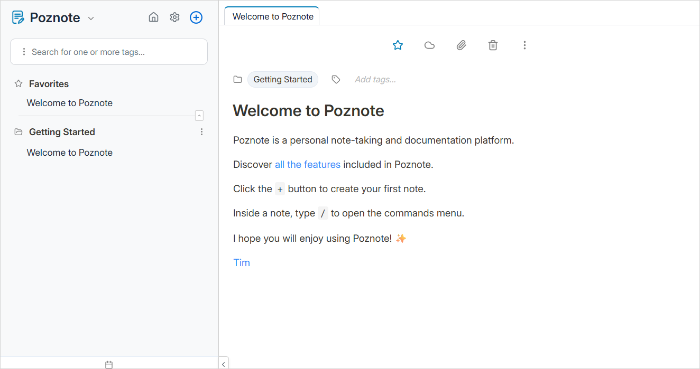
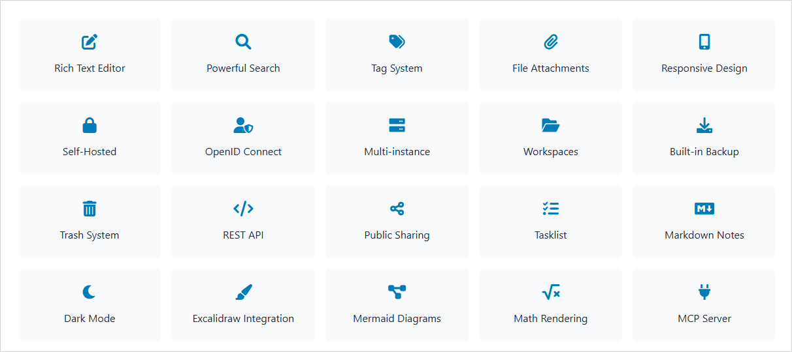
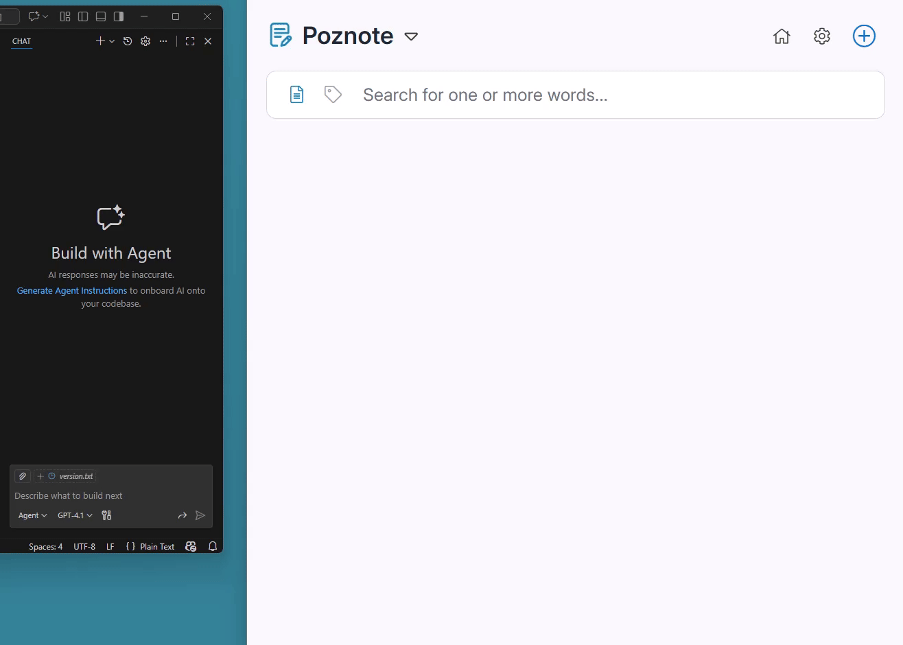
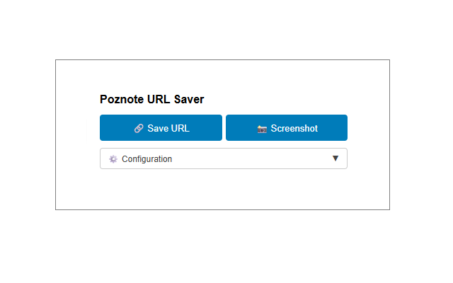

<p align="center">
  
</p>

<h1 align="center">Poznote</h1>

<div align="center">

[](https://github.com/timothepoznanski/poznote/stargazers) [](https://github.com/timothepoznanski/poznote/blob/main/LICENCE) [](https://github.com/timothepoznanski/poznote/pkgs/container/poznote)

</div>

<h3 align="center">
Poznote is a personal note-taking and documentation platform.
</h3>
This project started from a simple personal need: a practical way to write, organize, and synchronize my technical and personal notes. From the beginning, the priority has been simplicity and ease of use.<br>

<br>

<p align="center">
  <a href="https://poznote.com/about.html">Learn more about the project and its background on the Poznote About page</a>
</p>

<br>
<p align="center">
  
</p>

### Demo

**Login**: poznote<br>
**Password**: poznote

Play with Poznote at https://demo.poznote.com

### Features

Discover all the features [here](https://poznote.com/index.html#features).
Detailed documentation of advanced features is available in [docs/FEATURES.md](docs/FEATURES.md).

<p align="center">
  
</p>

## Table of content

- [Install](#install)
- [Access](#access)
- [Change Settings](#change-settings)
- [Update application](#update-application)
- [Authentication](#authentication)
- [Note types](#note-types)
- [Personalization](#personalization)
- [Multi-users](#multi-users)
- [Git Synchronization](#git-synchronization)
- [Backup / Export](#backup--export)
- [Restore / Import](#restore--import)
- [Public Sharing](#public-sharing)
- [Admin Tools](#admin-tools)
- [PWA](#pwa)
- [Offline View](#offline-view)
- [Multiple Instances](#multiple-instances)
- [MCP Server](#mcp-server)
- [Chrome Extension](#chrome-extension)
- [API Documentation](#api-documentation)
- [Tech Stack](#tech-stack)

## Install

> The official image is multi-arch (linux/amd64, linux/arm64) and supports Windows/macOS via Docker Desktop, as well as ARM64 devices like Raspberry Pi, NAS systems etc.

Choose your preferred installation method below:

<a id="windows"></a>
<details>
<summary><strong>🖥️ Windows</strong></summary>

#### Step 1: Prerequisite

Install and start [Docker Desktop](https://docs.docker.com/desktop/setup/install/windows-install/)

#### Step 2: Deploy Poznote

Create a new directory:

```powershell
mkdir poznote
```

Navigate to the Poznote directory:
```powershell
cd poznote
```

Create the environment file:

```powershell
curl -o .env https://raw.githubusercontent.com/timothepoznanski/poznote/main/.env.template
```

Edit the `.env` file:

```powershell
notepad .env
```

Download the Docker Compose configuration file:

```powershell
curl -o docker-compose.yml https://raw.githubusercontent.com/timothepoznanski/poznote/main/docker-compose.yml
```

Download the latest Poznote Webserver and Poznote MCP images :
```powershell
docker compose pull
```

Start Poznote containers:
```powershell
docker compose up -d
```

</details>

<a id="linux"></a>
<details>
<summary><strong>🐧 Linux</strong></summary>

#### Step 1: Prerequisite

1. Install [Docker engine](https://docs.docker.com/engine/install/)
2. Install [Docker Compose](https://docs.docker.com/compose/install/linux)

#### Step 2: Install Poznote

Create a new directory:
```bash
mkdir poznote
```

Navigate to the Poznote directory:
```bash
cd poznote
```

Create the environment file:
```bash
curl -o .env https://raw.githubusercontent.com/timothepoznanski/poznote/main/.env.template
```

Edit the `.env` file:
```bash
vi .env
```

Download the Docker Compose configuration file:
```bash
curl -o docker-compose.yml https://raw.githubusercontent.com/timothepoznanski/poznote/main/docker-compose.yml
```

Download the latest Poznote Webserver and Poznote MCP images:
```bash
docker compose pull
```

Start Poznote containers:
```bash
docker compose up -d
```

</details>

<a id="macos"></a>
<details>
<summary><strong>🍎 macOS</strong></summary>

#### Step 1: Prerequisite

Install and start [Docker Desktop](https://docs.docker.com/desktop/setup/install/mac-install/)

#### Step 2: Deploy Poznote

Create a new directory:
```bash
mkdir poznote
```

Navigate to the Poznote directory:
```bash
cd poznote
```

Download the environment file:
```bash
curl -o .env https://raw.githubusercontent.com/timothepoznanski/poznote/main/.env.template
```

Edit the `.env` file:
```bash
vi .env
```

Download the Docker Compose configuration file:
```bash
curl -o docker-compose.yml https://raw.githubusercontent.com/timothepoznanski/poznote/main/docker-compose.yml
```

Download the latest Poznote Webserver and Poznote MCP images:
```bash
docker compose pull
```

Start Poznote containers:
```bash
docker compose up -d
```

</details>

> If you encounter installation issues, see the [Troubleshooting Guide](docs/TROUBLESHOOTING.md).

## Access

After installation, access Poznote in your web browser:

[http://localhost:8040](http://localhost:8040)


- Username: `admin_change_me`
- Password: `admin`
- Port: `8040`

Rename the default administrator account and change the default password after the first login.

## Change Settings

Most day-to-day settings are changed from the Poznote interface. Use the `.env` file only for deployment/runtime values that are read when containers start.

Use the `.env` file for:

- `HTTP_WEB_PORT`
- `POZNOTE_OIDC_CLIENT_ID`
- `POZNOTE_OIDC_CLIENT_SECRET`
- `POZNOTE_OIDC_DISABLE_NORMAL_LOGIN`
- Optional runtime overrides such as `POZNOTE_MCP_PORT` and `POZNOTE_DEBUG`

Use the UI for:

- Admin/global settings such as OIDC provider settings, Git Sync enablement, import limits, and custom CSS upload
- User/profile settings such as local account passwords, theme, font sizes, note sorting, workspace background, and hidden UI elements

With the default installation files, `.env.template` currently exposes `HTTP_WEB_PORT`, `POZNOTE_OIDC_CLIENT_ID`, `POZNOTE_OIDC_CLIENT_SECRET`, and `POZNOTE_OIDC_DISABLE_NORMAL_LOGIN`.

If a setting exists in the UI, use the UI as the source of truth. Some legacy environment fallbacks still exist internally for compatibility, but they are not the primary configuration workflow.

### Modify System Settings (`.env`)

Navigate to your Poznote directory:
```bash
cd poznote
```

Stop the running Poznote containers:
```bash
docker compose down
```

Edit your `.env` file with your preferred text editor (e.g., `nano .env` or `notepad .env`).

Save the file and start the containers again to apply changes:
```bash
docker compose up -d
```

## Update application

In most cases, updating Poznote is simple and does not require editing `.env`.

### Simple update (default)

Use this when the release notes do not mention changes to `.env`.

Navigate to your Poznote directory:
```bash
cd poznote
```

Download the latest Poznote Webserver and Poznote MCP images:
```bash
docker compose pull
```

Start the updated containers:
```bash
docker compose up -d
```

### If the release notes mention `.env` changes

When a release explicitly asks you to update `.env`, refresh the reference files and compare them before restarting:

Navigate to your Poznote directory:
```bash
cd poznote
```

Stop the running containers before updating:
```bash
docker compose down
```

Download the latest Docker Compose configuration:
```bash
curl -o docker-compose.yml https://raw.githubusercontent.com/timothepoznanski/poznote/main/docker-compose.yml
```

Download the latest `.env.template`:
```bash
curl -o .env.template https://raw.githubusercontent.com/timothepoznanski/poznote/main/.env.template
```

Review `.env.template` and add any new variables to your `.env` file if needed:
```bash
sdiff .env .env.template
```

Download the latest Poznote Webserver and Poznote MCP images:
```bash
docker compose pull
```

Start the updated containers:
```bash
docker compose up -d
```

Your data is preserved in the `./data` directory and will not be affected by the update.

## Authentication

Poznote supports multiple authentication methods including local accounts and external identity providers.

<details>
<summary><strong>Local Accounts Authentication</strong></summary>
<br>

Poznote authenticates users against their profile using a username or email address and a password.


#### Default account

On a fresh installation, Poznote creates one active administrator profile:

- Username: `admin_change_me`
- Password: `admin`

Change the default password and rename the account after the first login.

#### Password management

Passwords are managed through the Poznote web interface, not through `.env`:

- Users can change their own password from **Settings > Change Password**.
- Administrators can set a custom password for any user or reset it to the default from **Settings > User Management**.
- The **Remember me** option keeps the session for 30 days.
- Changing a password invalidates existing remember-me cookies for that user.

#### Default passwords

- Administrator accounts: `admin`
- Standard user accounts: `user`

When a user has not yet changed their password, the default value above is used. Once a password is changed through the interface, a secure bcrypt hash is stored in the database and takes priority.

</details>

<a id="oidc"></a>
<details>
<summary><strong>OIDC / SSO Authentication (Optional)</strong></summary>
<br>

Poznote supports OpenID Connect (authorization code + PKCE) for single sign-on integration. This allows users to log in using external identity providers such as Auth0, Keycloak, Azure AD, or Google Identity.

#### How it works

1. The login page displays a `Continue with [Provider Name]` button when OIDC is enabled.
2. Users authenticate with the OIDC authorization code flow secured by PKCE.
3. Access can be restricted with allowed groups and, if needed, a legacy allowed users list.
4. After authentication, Poznote links the identity in this order: `sub` (`oidc_subject`), then `preferred_username`, then `email`.
5. If auto-create users is enabled and no profile matches, Poznote creates one automatically.
6. If `POZNOTE_OIDC_DISABLE_NORMAL_LOGIN=true`, the username/password form is hidden and the login page becomes SSO-only.

#### Configuration

OIDC is configured from the **admin UI**: go to **Settings > Admin Tools > OIDC / SSO**.

Most settings (enabled, issuer, provider name, scopes, access control, allowed groups/users, auto-create users, HTTP Basic Auth behavior, etc.) are managed from this page and stored in the database.

The following settings remain in the `.env` file:

```bash
POZNOTE_OIDC_CLIENT_ID=your_client_id
POZNOTE_OIDC_CLIENT_SECRET=your_client_secret
POZNOTE_OIDC_DISABLE_NORMAL_LOGIN=false
```

Use `POZNOTE_OIDC_DISABLE_NORMAL_LOGIN=true` if you want to hide the local username/password form and force SSO-only login.

> **Breaking change:** previous OIDC settings in `.env` are no longer read, except `POZNOTE_OIDC_CLIENT_ID`, `POZNOTE_OIDC_CLIENT_SECRET`, and `POZNOTE_OIDC_DISABLE_NORMAL_LOGIN`. After upgrading, re-enter the other OIDC settings from the admin page.

#### Access Control Example (Groups + Auto-Provision)

From the OIDC admin page, configure:
- **Groups claim:** `groups`
- **Allowed groups:** `poznote`
- **Auto-create users:** enabled

If auto-provisioning is enabled, Poznote generates a username from the OIDC claims (`preferred_username`, `nickname`, email local part, `name`, then `sub`) and stores the OIDC subject on the created profile.

</details>

## Note types

Poznote supports two primary note formats, each tailored for different workflows.

<details>
<summary><strong>HTML Notes</strong></summary>
&nbsp;

*   **Editor:** Direct WYSIWYG (What You See Is What You Get) editing.
*   **Storage:** Saved as `.html` files in the user data directory. Since they are standard HTML, they can be opened directly in any web browser.
*   **Exclusive Features:**
    *   **Excalidraw:** Integrated drawing board for hand-drawn diagrams and sketches.
    *   **Rich Formatting:** Native support for text colors, highlighting, and standard HTML elements.
    *   **Interactive UI:** Direct manipulation of elements in the editor.
</details>

<details>
<summary><strong>Markdown Notes</strong></summary>
&nbsp;

*   **Editor:** Markdown syntax editor with real-time preview.
*   **Storage:** Saved as `.md` files in the user data directory.
*   **Exclusive Features:**
    *   **Mermaid Diagrams:</strong> Native support for generating diagrams (flowcharts, sequence, etc.) via ` ```mermaid ` code blocks.
    *   **Math Equations:** Robust LaTeX support for mathematical formulas using `$ inline $` and `$$ block $$` syntax.
    *   **Portability:** Standard Markdown format compatible with any external editor or static site generator.
</details>

<details>
<summary><strong>Task Lists</strong></summary>
&nbsp;

*   **Usage:** Manage tasks and projects with interactive checklists.
*   **Workflow:** Track progress with checkboxes that can be toggled directly in the editor or the notes list.
*   **Public Collaboration:** Task lists can be shared via a public URL. If edit permissions are granted, external collaborators can check items off the list without needing a Poznote account.
</details>

<details>
<summary><strong>Shortcuts</strong></summary>
&nbsp;

*   **Functionality:** Create a reference to an existing note in another location.
*   **Use Case:** Allows a note to be referenced in two different places simultaneously. For example, a note can live in a classification folder while its shortcut appears on a Kanban board for active tracking.
</details>

<details>
<summary><strong>Templates</strong></summary>
&nbsp;

*   **Functionality:** Create pre-filled notes to standardize your documentation.
*   **Usage:** Notes marked as templates can be duplicated to create new notes with the same structure, tags, and content, saving time on repetitive tasks.
</details>

## Personalization

Poznote offers several built-in personalization options directly from the application, without requiring any configuration file changes.

<details>
<summary><strong>Display Settings</strong></summary>
<br>

Under **Settings > Display**, you can configure:

- **Theme:** switch between light and dark mode
- **Font size:** adjust text size for notes, sidebar, and code blocks
- **Note sorting:** choose how notes are ordered in the list
- **Task list insert order:** control where new tasks are inserted
- **Show creation date:** toggle the creation date badge on notes
- **Show folder note counts:** display the number of notes in each folder
- **Show notes after folders:** list notes without folders below the folder list
- **Index icon scaling:** resize icons in the note index
- **Note content width:** control the max width of the note editor area
- **Code block word wrap:** enable or disable word wrap in code blocks

</details>

<details>
<summary><strong>Workspace Background Image</strong></summary>
<br>

You can set a background image per workspace — upload a custom image and adjust its opacity from the Display settings to give each workspace its own visual identity.

</details>

<details>
<summary><strong>Element Visibility</strong></summary>
<br>

Poznote allows you to declutter the interface by hiding elements you don't use.

Configure it in **Settings > Appearance > UI Customization**.

- **Granular Control:** Toggle visibility for home cards, toolbar actions, slash menu items, and more.
- **Per-User:** Each user can have their own unique interface layout.
- **Searchable:** Easily find the element you want to hide using the filter in the configuration modal.

</details>

<details>
<summary><strong>Custom CSS Overrides</strong></summary>
<br>

If you want to adjust fonts, spacing, or other visual details beyond the built-in options, you can upload an extra stylesheet that is applied to every HTML page for all users.

Configure it in **Settings > Appearance > Custom CSS**.

Notes:

- Click **Upload CSS file** to select a `.css` file from your computer.
- The file is uploaded and stored in `data/css/` (your Docker volume), so it survives image updates.
- Click **Remove** to delete the file and disable the custom stylesheet.
- Poznote appends a cache-busting `v=` parameter automatically.
- The stylesheet is injected near the end of `<head>`, so it can override the default application styles.
- Only administrators can upload or remove the custom CSS file.

</details>

## Multi-users

Poznote features a multi-user architecture with isolated data space for each user (ideal for families, teams, or personal personas).

- **Data Isolation**: Each user has their own separate notes, workspaces, tags, folders and attachments.
- **Hybrid Password Model**: Access uses per-profile credentials with custom passwords stored in the database. Until a password is changed in the UI, built-in defaults are used (`admin` for administrators, `user` for standard users).
- **User Management**: Administrators can manage profiles via the Settings panel.

> ⚠️ **Warning:** It is not possible to share notes between users. Each user has their own isolated space. The only way to share notes or a profile is to share a common account.

### Architecture & Structure

Poznote uses a master database (`data/master.db`) to track profiles and global settings, and individual databases for each user.

```
data/
├── master.db                    # Master database (profiles, global settings)
└── users/
    ├── 1/                       # User ID 1 (default admin)
    │   ├── database/poznote.db  # User's notes database
    │   ├── entries/             # User's note files (HTML/MD)
    │   └── attachments/         # User's attachments
    ├── 2/                       # User ID 2
    └── ...
```

## Git Synchronization

Poznote supports automatic and manual synchronization with **GitHub** or **Forgejo**. Each user configures their own repository independently. There is no shared global repository.

<details>
<summary><strong>How to configure Git Sync</strong></summary>
<br>

**Step 1 — Enable the feature (admin, in Settings > Advanced Settings)**

Toggle **Git Sync** to enabled in the **Advanced Settings** section of the Settings page. This enables Git Sync globally and makes the user-level **Git Sync** card/configuration available from **Settings**.

---

**Step 2 — Each user configures their own repo (Settings > Git Sync)**

| Field | Description |
|---|---|
| Provider | `GitHub` or `Forgejo` |
| API Base URL | GitHub: auto-filled (read-only). Forgejo: your instance URL, e.g. `https://forgejo.example.com/api/v1` |
| Access Token | GitHub PAT (`ghp_...`) or Forgejo token (Settings > Applications) |
| Repository | `owner/repo` format |
| Branch | Default: `main` |
| Author Name / Email | Used for commit metadata |

> 🔒 Access tokens are encrypted at rest using AES-256-GCM. An encryption key is automatically generated and stored in `data/.app_secret`.

---

**Automatic sync**

When enabled by the user, Poznote will automatically:
- **Pull** on login
- **Push** on every note create, update, or delete

Manual push/pull is also available from the **Dashboard** via the **Push** and **Pull** cards.

</details>

## Backup / Export

Poznote includes built-in Backup / Export functionality accessible through Settings.

<a id="complete-backup"></a>
<details>
<summary><strong>Complete Backup to Poznote zip</strong></summary>
<br>

Single ZIP containing database, all notes, and attachments for all workspaces:

  - Includes an `index.html` at the root for offline browsing
  - Notes are organized by workspace and folder
  - Attachments are accessible via clickable links

#### Per-User vs Complete Backups

Poznote provides flexible backup options:

**Via Web Interface (Settings > Backup/Export):**
- **All users** can backup and restore their own profile
- **Admins** can select which user profile to backup or restore
- Backups contain the user's database, notes, and attachments

**Via API/Script (Administrators only):**
- Automated backups using the `backup-poznote.sh` script
- Programmatic access via REST API v1
- Requires admin credentials

**Backup Scopes:**

1. **Per-User Backups**: Created from Settings or via API. Contains *only* the data belonging to a specific user (their database, notes, and attachments).
2. **Complete System Backup**: Created manually by backing up the entire `/data` directory. This is the only way to backup the master configuration and all users' data at once.

```bash
# Complete system backup via CLI
tar -czvf poznote-full-backup.tar.gz data/
```

</details>

<a id="export-individual-notes"></a>
<details>
<summary><strong>Export Individual Notes</strong></summary>
<br>

Export individual notes using the **Export** button in the note toolbar:

  - **HTML notes:** Export to HTML or PDF format
  - **Markdown notes:** Export to HTML, Markdown or PDF format

</details>

<a id="automated-backups-with-bash-script"></a>
<details>
<summary><strong>Automated Backups with Bash Script</strong></summary>
<br>

For automated scheduled backups via API, you can use the included `backup-poznote.sh` script.

**IMPORTANT:** Only administrators can create backups via the API.
Use the current password of the admin profile you authenticate with. On a fresh installation, that is the default admin password (`admin`) until it is changed in Poznote. Once a custom password is set, that custom password is required for API calls.

**Script location:** `backup-poznote.sh` in the `tools` folder of the Poznote repository

**Administrator Usage:**

Admins can backup any user profile - **no need to know user IDs**, just the username:

```bash
# Backup your own profile
bash backup-poznote.sh 'https://poznote.example.com' 'admin' 'admin_password' 'admin' '/backups' '30'

# Backup another user's profile (Nina)
bash backup-poznote.sh 'https://poznote.example.com' 'admin' 'admin_password' 'Nina' '/backups' '30'
```

**Usage:**
```bash
bash backup-poznote.sh '<poznote_url>' '<admin_username>' '<admin_password>' '<target_username>' '<backup_directory>' '<retention_count>'
```

**Example with crontab (admin backing up Nina):**

```bash
# Add to crontab for automated backups twice daily
0 0,12 * * * bash /root/backup-poznote.sh 'https://poznote.example.com' 'admin' 'admin_password' 'Nina' '/root/backups' '30'
```

**Parameters explained:**
- `'https://poznote.example.com'` - Your Poznote instance URL
- `'admin'` - Admin username for authentication (must be an admin)
- `'admin_password'` - Current admin password for the API profile (default `admin` until changed, then the custom password)
- `'Nina'` - Target username to backup
- `'/root/backups'` - Parent directory where backups will be stored (creates `backups-poznote-<username>` folder)
- `'30'` - Number of backups to keep (older ones are automatically deleted)

**How the backup process works:**

1. The script authenticates with admin credentials
2. Automatically looks up the user ID from the username
3. Creates a backup via the API
4. Calls the Poznote REST API v1 (`POST /api/v1/backups` with `X-User-ID` header)
5. Downloads the backup ZIP locally to `backups-poznote-<username>/`
6. Automatically manages retention (keeps only the specified number of recent backups)

**Note:** Each user's backups are stored in separate folders (`backups-poznote-Nina`, `backups-poznote-Tim`, etc.)

</details>


## Restore / Import

Poznote provides flexible restoration options through the web interface (**Settings > Restore/Import**) or programmatically via the REST API for administrators. Users can restore their own profile data from a full ZIP backup or import individual files, while administrators can manage restorations across the entire system.

<a id="complete-restore"></a>
<details>
<summary><strong>Complete Restore from Poznote zip backup</strong></summary>
<br>

Upload the complete backup ZIP to restore everything:

  - Replaces database, restores all notes, and attachments
  - Works for all workspaces at once

</details>

<a id="import-individual-notes"></a>
<details>
<summary><strong>Import Individual files</strong></summary>
<br>

Import one or more HTML, Markdown or text notes directly:

  - Support `.html`, `.md`, `.markdown` or `.txt` files types
  - Up to 50 files can be selected at once, configurable in Settings > Advanced Settings > Import Limits

</details>

<a id="import-zip-notes"></a>
<details>
<summary><strong>Import ZIP file</strong></summary>
<br>

Import a ZIP archive containing multiple notes:

  - Support `.html`, `.md`, `.markdown` or `.txt` files types
  - ZIP archives can contain up to 300 files, configurable in Settings > Advanced Settings > Import Limits
  - When importing a ZIP archive, Poznote automatically detects and recreates the folder structure

</details>

<a id="import-obsidian-notes"></a>
<details>
<summary><strong>Import Obsidian Notes</strong></summary>
<br>

Import a ZIP archive containing multiple notes from Obsidian:

  - ZIP archives can contain up to 300 files, configurable in Settings > Advanced Settings > Import Limits
  - Poznote automatically detects and recreates the folder structure
  - Poznote automatically detects existing tags to create
  - Poznote automatically imports images if they are at the zip file root

</details>

<a id="import-standard-notes"></a>
<details>
<summary><strong>Import from Standard Notes</strong></summary>
<br>

Convert and import your Standard Notes export to Poznote using the included conversion script:

**Script location:** `standard-notes-to-poznote.sh` in the `tools` folder of the Poznote repository

**Prerequisites:**
- `jq`, `unzip`, `zip`, and `find` utilities must be installed

**Usage:**
```bash
bash standard-notes-to-poznote.sh <standard_notes_export.zip>
```

**How it works:**

1. Export your notes from Standard Notes (this creates a ZIP file)
2. Run the conversion script with your Standard Notes export ZIP as parameter
3. The script generates a `poznote_export.zip` file compatible with Poznote
4. Import the generated ZIP into Poznote using the "Import ZIP file" feature

**What gets converted:**
- All notes are converted to Markdown format with front matter
- Note creation dates are preserved
- Tags are automatically extracted and included in the front matter
- Note content is preserved from the Standard Notes export

**Example:**
```bash
bash tools/standard-notes-to-poznote.sh my_standard_notes_backup.zip
# This creates: poznote_export.zip
```

After conversion, import the generated `poznote_export.zip` file into Poznote.

</details>

<details>
<summary><strong>Markdown Front Matter Support</strong></summary>
<br>

Markdown files can include YAML front matter to specify note metadata. The following keys are supported:

  - `title` — Override the note title (default: filename without extension)
  - `folder` — Override the target folder selection (folder must exist in the workspace)
  - `tags` — Array of tags to apply to the note. Supports both inline `[tag1, tag2]` and multi-line syntax
  - `favorite` — Mark note as favorite (`true`/`false` or `1`/`0`)
  - `created` — Set custom creation date (format: `YYYY-MM-DD HH:MM:SS`)
  - `updated` — Set custom update date (format: `YYYY-MM-DD HH:MM:SS`)

Example with inline array syntax:
```yaml
---
title: My Important Note
folder: Projects
tags: [important, work]
favorite: true
created: 2024-01-15 10:30:00
updated: 2024-01-20 15:45:00
---
```

Example with multi-line syntax:
```yaml
---
title: My Important Note
folder: Projects
tags:
  - important
  - work
favorite: true
created: 2024-01-15 10:30:00
updated: 2024-01-20 15:45:00
---
```

</details>

## Public Sharing

Poznote allows you to share individual notes or entire folders with anyone. 

  - **Standard Notes:** Share in **Read-only** mode with anyone via a public link.
  - **Task Lists:** Enhanced control with three permission levels: **Read-only**, **Just checkable** (allows checking items without full edit rights), or **Fully modifiable**.
  - **Visibility:** Limit sharing to the public (anyone with the link) or restrict access to registered users of your Poznote instance.
  - **Password Protection:** Secure your shared content by adding a mandatory password to the public URL for an extra layer of security.

## Admin Tools

Administrators have access to a suite of maintenance and management tools under **Settings > Admin Tools**:

- **User Management:** Create, manage, and delete user profiles, or reset passwords.
- **Git Sync Control:** Globally enable or disable Git synchronization features.
- **Import Limits:** Configure the maximum number of files allowed for individual or ZIP imports.
- **Custom CSS:** Upload a global custom stylesheet to override the application's appearance. The file is stored in your data volume (`data/css/`) and survives image updates.
- **Rebuild Master Database:** Reconstruct the user index from data folders in case of system corruption or database loss.
- **Base64 Image Converter:** Convert inline Base64 encoded images within notes to proper file attachments.
- **Orphan attachments scanner:** Scan and clean up storage by identifying attachment files that are no longer referenced in any notes.

## PWA

Poznote can be installed as a **Progressive Web App (PWA)** in compatible browsers (Chrome, Edge, Safari on iOS, etc.).

### Install on desktop

1. Open your Poznote URL in the browser.
2. Use the browser install action (for example **Install app** in the address bar/menu), or use the install button in **Settings** → **PWA Installation**.
3. Launch Poznote from your applications list like a native app.

### Install on mobile

- **Android (Chrome/Edge):** open menu → **Install app** / **Add to Home screen**
- **iPhone/iPad (Safari):** tap **Share** → **Add to Home Screen**

### Offline behavior

Poznote can be installed as a PWA, but this does not provide offline access to your notes content. For offline access to your notes, you must use the **Complete Backup** export feature (see section below).

## Offline View

The **📦 Complete Backup** creates a standalone offline version of your notes. Simply extract the ZIP and open `index.html` in any web browser. This allows you to read your notes offline, but without the full Poznote functionality, it's a read-only export.

## Multiple Instances

You can run multiple isolated Poznote instances on the same server. Each instance has its own data, port, and credentials.

Perfect for:
- Hosting for different users on the same server, each with their own separate instance and account
- Testing new features without affecting your production instance

Simply repeat the installation steps in different directories with different ports.

### Example: Tom and Alice instances on the same server

```
Server: my-server.com
├── Poznote-Tom
│   ├── Port: 8040
│   ├── URL: http://my-server.com:8040
│   ├── Container: poznote-tom-webserver-1
│   └── Data: ./poznote-tom/data/
│
└── Poznote-Alice
  ├── Port: YOUR_POZNOTE_API_PORT
  ├── URL: http://my-server.com:YOUR_POZNOTE_API_PORT
    ├── Container: poznote-alice-webserver-1
    └── Data: ./poznote-alice/data/
```

## MCP Server

Poznote includes a Model Context Protocol (MCP) server that enables AI assistants like GitHub Copilot to interact with your notes using natural language. For example:

- "Create a new note titled 'Meeting Notes' with the content..."
- "Search for notes about 'Docker'"
- "List all notes in my Poznote workspace"
- "Update note 42 with new information"

<p align="center">
  
</p>

For setup and usage instructions, see the [MCP Server documentation](docs/MCP-SERVER.md).

The MCP server uses default settings (port `8045`, debug off). To override:

```bash
POZNOTE_MCP_PORT=9000 POZNOTE_DEBUG=true docker compose up -d --force-recreate mcp-server
```

These are container/runtime overrides, not Poznote UI settings. You can pass them inline as shown above or place them in `.env` before recreating the `mcp-server` container.

Only the exact lowercase values `true` and `false` are recognized for `POZNOTE_DEBUG`. After changing settings, recreate the container; a simple restart does not reload environment variables.

## Chrome Extension

The **Poznote URL Saver** is a browser extension that allows you to quickly save the URL or even a full-page screenshot of the current page to your Poznote instance with a single click.

<p align="center">
  
</p>

Install the extension directly from the Chrome Web Store → [Install extension](https://chromewebstore.google.com/detail/bmjclfamahegmgillaghhmnbkjebipbh?utm_source=item-share-cb)

## API Documentation

Poznote provides a comprehensive RESTful API v1 for programmatic access to notes, folders, workspaces, tags, attachments, backups, settings, and more.

For the complete API reference with all endpoints, parameters, and curl examples, see the **[REST API Documentation](docs/API-REST.md)**.

### Quick Start

```bash
# List all notes for user ID 1
curl -u 'username:password' -H "X-User-ID: 1" \
  http://YOUR_SERVER/api/v1/notes

# Create a note
curl -X POST -u 'username:password' -H "X-User-ID: 1" \
  -H "Content-Type: application/json" \
  -d '{"heading": "My Note", "content": "Hello!", "type": "markdown"}' \
  http://YOUR_SERVER/api/v1/notes
```

### Interactive Documentation (Swagger)

Access the **Swagger UI** directly from Poznote at `Settings > API Documentation` to browse all endpoints, view request/response schemas, and test API calls interactively.

## Tech Stack

Poznote prioritizes simplicity and portability - no complex frameworks, no heavy dependencies. Just straightforward, reliable web technologies that ensure your notes remain accessible and under your control.

**Privacy-First Architecture:** Poznote operates entirely locally with no external connections required for functionality. All libraries (Excalidraw, Mermaid, KaTeX) are bundled and served from your own instance. The only outbound connection is a daily update check.

<details>
<summary>If you are interested in the tech stack on which Poznote is built, <strong>have a look here.</strong></summary>

### Backend
- **PHP 8.x** - Server-side scripting language
- **SQLite 3** - Lightweight, file-based relational database

### Frontend
- **HTML5** - Markup and structure
- **CSS3** - Styling and responsive design
- **JavaScript (Vanilla)** - Interactive features and dynamic content
- **React + Vite** - Build toolchain for Excalidraw component (bundled as IIFE)
- **AJAX** - Asynchronous data loading

### Libraries
- **Excalidraw** - Virtual whiteboard for sketching diagrams and drawings
- **Mermaid** - Client-side JavaScript library for diagram and flowchart generation from text
- **KaTeX** - Client-side JavaScript library for fast math typesetting and rendering mathematical equations
- **Sortable.js** - JavaScript library for drag-and-drop sorting
- **highlight.js** - Syntax highlighting for code blocks
- **Swagger UI** - Interactive API documentation and testing interface

### Storage
- **HTML/Markdown files** - Notes are stored as plain HTML or Markdown files in the filesystem
- **SQLite database** - Metadata, tags, relationships, and user data
- **File attachments** - Stored directly in the filesystem

### Infrastructure
- **Nginx + PHP-FPM** - High-performance web server with FastCGI Process Manager
- **Alpine Linux** - Secure, lightweight base image
- **Docker** - Containerization for easy deployment and portability
- **Python 3.12 (Alpine)** - MCP server runtime with httpx, uvicorn, fastmcp, and mcp libraries for AI assistant integration
</details>