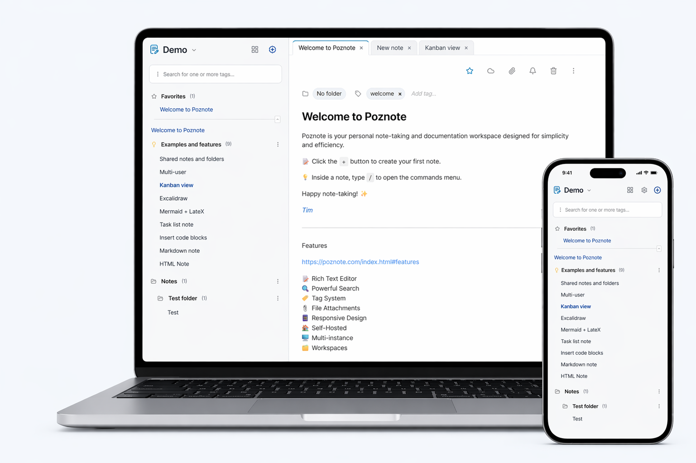
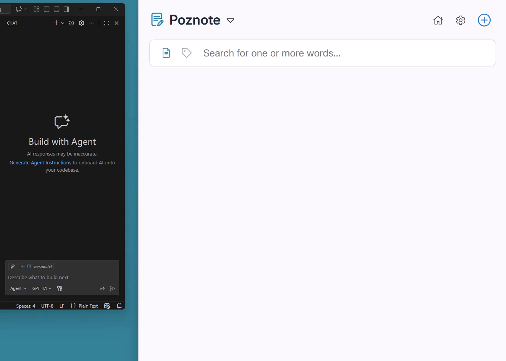
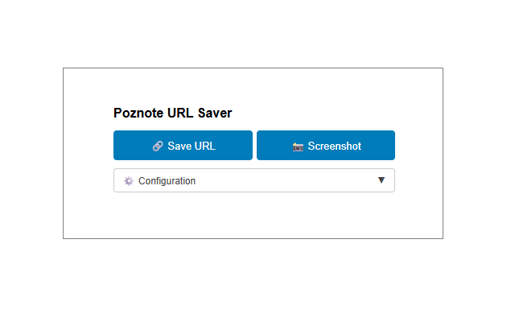

<p align="center">
  
</p>

<h3 align="center">
Powerful note-taking without the hassle.
</h3>

<br>
<p align="center">
  
</p>

### Features

Discover all the features [here](https://poznote.com/selfhosting.html).

### Screenshots

See all the screenshots [here](https://poznote.com/screenshots.html).

### Demo

https://demo.poznote.com

**Login**: poznote<br>
**Password**: poznote

### They talk about Poznote

https://poznote.com/index.html#press

## Table of content

- [Install](#install)
- [Access](#access)
- [Change Settings](#change-settings)
- [Update application](#update-application)
- [Authentication](#authentication)
- [Note types](#note-types)
- [Personalization](#personalization)
- [Multi-users](#multi-users)
- [Activity Log](#activity-log)
- [Webhooks](#webhooks)
- [Git Synchronization](#git-synchronization)
- [S3 Attachment Storage](#s3-attachment-storage)
- [S3 Backups](#s3-backups)
- [Backup / Export](#backup--export)
- [Restore / Import](#restore--import)
- [Offline View](#offline-view)
- [Multiple Instances](#multiple-instances)
- [AI Assistant](#ai-assistant)
- [MCP Server](#mcp-server)
- [Chrome Extension](#chrome-extension)
- [Share to Poznote on Android](#share-to-poznote-on-android)
- [API Documentation](#api-documentation)
- [Tech Stack](#tech-stack)

## Install

> The official image is multi-arch (linux/amd64, linux/arm64) and supports Windows/macOS via Docker Desktop, as well as ARM64 devices like Raspberry Pi, NAS systems etc.

Choose your preferred installation method below:

<a id="windows"></a>
<details>
<summary><strong>🖥️ Windows</strong></summary>

#### Step 1: Prerequisite

Install and start [Docker Desktop](https://docs.docker.com/desktop/setup/install/windows-install/)

#### Step 2: Deploy Poznote

Create a new directory:

```powershell
mkdir poznote
```

Navigate to the Poznote directory:
```powershell
cd poznote
```

Create the environment file:

```powershell
curl -o .env https://raw.githubusercontent.com/timothepoznanski/poznote/main/.env.template
```

Edit the `.env` file:

```powershell
notepad .env
```

Download the Docker Compose configuration file:

```powershell
curl -o docker-compose.yml https://raw.githubusercontent.com/timothepoznanski/poznote/main/docker-compose.yml
```

Download the latest Poznote Webserver and Poznote MCP images :
```powershell
docker compose pull
```

Start Poznote containers:
```powershell
docker compose up -d
```

</details>

<a id="linux"></a>
<details>
<summary><strong>🐧 Linux</strong></summary>

#### Step 1: Prerequisite

1. Install [Docker engine](https://docs.docker.com/engine/install/)
2. Install [Docker Compose](https://docs.docker.com/compose/install/linux)

#### Step 2: Install Poznote

Create a new directory:
```bash
mkdir poznote
```

Navigate to the Poznote directory:
```bash
cd poznote
```

Create the environment file:
```bash
curl -o .env https://raw.githubusercontent.com/timothepoznanski/poznote/main/.env.template
```

Edit the `.env` file:
```bash
vi .env
```

Download the Docker Compose configuration file:
```bash
curl -o docker-compose.yml https://raw.githubusercontent.com/timothepoznanski/poznote/main/docker-compose.yml
```

Download the latest Poznote Webserver and Poznote MCP images:
```bash
docker compose pull
```

Start Poznote containers:
```bash
docker compose up -d
```

</details>

<a id="macos"></a>
<details>
<summary><strong>🍎 macOS</strong></summary>

#### Step 1: Prerequisite

Install and start [Docker Desktop](https://docs.docker.com/desktop/setup/install/mac-install/)

#### Step 2: Deploy Poznote

Create a new directory:
```bash
mkdir poznote
```

Navigate to the Poznote directory:
```bash
cd poznote
```

Download the environment file:
```bash
curl -o .env https://raw.githubusercontent.com/timothepoznanski/poznote/main/.env.template
```

Edit the `.env` file:
```bash
vi .env
```

Download the Docker Compose configuration file:
```bash
curl -o docker-compose.yml https://raw.githubusercontent.com/timothepoznanski/poznote/main/docker-compose.yml
```

Download the latest Poznote Webserver and Poznote MCP images:
```bash
docker compose pull
```

Start Poznote containers:
```bash
docker compose up -d
```

</details>

<a id="poznote-cloud"></a>
<details>
<summary><strong>☁️ Poznote Cloud</strong></summary><br>

Use Poznote without installing or maintaining anything: we host it for you. [Get started with Poznote Cloud](https://poznote.com/index.html#cloud)

</details>

<a id="kubernetes"></a>
<details>
<summary><strong>☸️ Kubernetes with Helm</strong></summary>

#### Step 1: Prerequisite

Install [Helm](https://helm.sh/docs/intro/install/) and make sure your Kubernetes context points to the cluster where you want to deploy Poznote.

#### Step 2: Deploy Poznote

Add the HelmForge chart repository:

```bash
helm repo add helmforge https://repo.helmforge.dev
```

Update your local chart index:

```bash
helm repo update
```

Install Poznote:

```bash
helm install poznote helmforge/poznote --namespace poznote --create-namespace
```

The Poznote Helm chart is maintained by the HelmForge community as a Kubernetes-native installation option. See the [HelmForge Poznote chart documentation](https://helmforge.dev/docs/charts/poznote) for values, persistence, service exposure, probes, security contexts, and other production-oriented settings.

</details>

<a id="rootless"></a>
<details>
<summary><strong>🔒 Rootless</strong></summary><br>

Poznote also ships a rootless image variant that runs entirely as an unprivileged user (uid/gid `1000`) instead of root — for environments that forbid root inside containers (Kubernetes restricted `PodSecurityStandard`, rootless Podman, `docker run --user`, etc). It works exactly like the default image; the only differences are that it listens internally on port `8080` and cannot fix the ownership of your data directory at startup.

#### Step 1: Prerequisite

1. Install [Docker engine](https://docs.docker.com/engine/install/)
2. Install [Docker Compose](https://docs.docker.com/compose/install/linux)

#### Step 2: Deploy Poznote

Create a new directory:
```bash
mkdir poznote
```

Navigate to the Poznote directory:
```bash
cd poznote
```

Create the data directory and make it owned by uid/gid `1000` (**required**: unlike the default image, the rootless container cannot fix this ownership itself at startup):
```bash
mkdir -p data
sudo chown -R 1000:1000 data
```

`sudo` is often not needed here: if your user already has uid `1000` the `chown` can be skipped, and on rootless Podman/Docker it can run without root, see [Running rootless](docs/TROUBLESHOOTING.md#running-rootless).

Create the environment file:
```bash
curl -o .env https://raw.githubusercontent.com/timothepoznanski/poznote/main/.env.template
```

Edit the `.env` file:
```bash
vi .env
```

Download the rootless Docker Compose configuration file:
```bash
curl -o docker-compose.rootless.yml https://raw.githubusercontent.com/timothepoznanski/poznote/main/docker-compose.rootless.yml
```

Download the latest Poznote rootless Webserver and Poznote MCP images:
```bash
docker compose -f docker-compose.rootless.yml pull
```

Start Poznote containers:
```bash
docker compose -f docker-compose.rootless.yml up -d
```

To migrate an existing Poznote instance to the rootless variant, or for more details, see [Running rootless](docs/TROUBLESHOOTING.md#running-rootless) in the Troubleshooting Guide.

</details>

<a id="railway"></a>
<details>
<summary><strong>🚂 Railway</strong></summary><br>

Deploy Poznote in the cloud without managing a server, using the official Railway template.

#### Step 1: Prerequisite

Create a [Railway](https://railway.com) account.

#### Step 2: Deploy Poznote

Click the button below and follow the instructions:

[](https://railway.com/deploy/poznote)

The template runs the official Poznote image with a persistent volume mounted at `/var/www/html/data`, so your notes, attachments and database survive redeploys and updates.

Once deployed, open the public domain generated by Railway and log in with the default account (see [Authentication](#authentication)).

</details>

> If you encounter installation issues, see the [Troubleshooting Guide](docs/TROUBLESHOOTING.md).

## Access

After installation, access Poznote in your web browser:

[http://localhost:8040](http://localhost:8040)


- Username: `admin_change_me`
- Password: `admin`
- Port: `8040`

Rename the default administrator account and change the default password after the first login.

## Change Settings

Most day-to-day settings are changed from the Poznote interface. Use the `.env` file only for deployment/runtime values that are read when containers start.

Use the `.env` file for:

- `HTTP_WEB_PORT`
- `POZNOTE_OIDC_CLIENT_ID`
- `POZNOTE_OIDC_CLIENT_SECRET`
- `POZNOTE_OIDC_DISABLE_NORMAL_LOGIN`
- Optional runtime overrides such as `POZNOTE_MCP_PORT` and `POZNOTE_DEBUG`

Use the UI for:

- Admin/global settings such as OIDC provider settings, Git Sync enablement, import limits, and custom CSS upload
- User/profile settings such as local account passwords, theme, font sizes, note sorting, workspace background, and hidden UI elements


### Modify System Settings (`.env`)

Navigate to your Poznote directory:
```bash
cd poznote
```

Stop the running Poznote containers:
```bash
docker compose down
```

Edit your `.env` file with your preferred text editor (e.g., `nano .env` or `notepad .env`).

Save the file and start the containers again to apply changes:
```bash
docker compose up -d
```

## Update application

Navigate to your Poznote directory:
```bash
cd poznote
```

Stop the running containers before updating:
```bash
docker compose down
```

Download the latest Docker Compose configuration:
```bash
curl -o docker-compose.yml https://raw.githubusercontent.com/timothepoznanski/poznote/main/docker-compose.yml
```

Download the latest `.env.template`:
```bash
curl -o .env.template https://raw.githubusercontent.com/timothepoznanski/poznote/main/.env.template
```

Use sdiff to review `.env.template` and add any new variables to your `.env` file if needed:
```bash
sdiff .env .env.template
```

Download the latest Poznote Webserver and Poznote MCP images:
```bash
docker compose pull
```

Start the updated containers:
```bash
docker compose up -d
```

Your data is preserved in the `./data` directory and will not be affected by the update.

## Authentication

Poznote supports multiple authentication methods including local accounts and external identity providers.

<details>
<summary><strong>Local Accounts Authentication</strong></summary>
<br>

Poznote authenticates users against their profile using a username or email address and a password.


#### Default account

On a fresh installation, Poznote creates one active administrator profile:

- Username: `admin_change_me`
- Password: `admin`

Change the default password and rename the account after the first login.

#### Password management

Passwords are managed through the Poznote web interface, not through `.env`:

- Users can change their own password from **Settings > Change Password**.
- Administrators can set a custom password for any user or reset it to the default from **Settings > User Management**.
- The **Remember me** option keeps the session for 30 days.
- Changing a password invalidates existing remember-me cookies for that user.

#### Default passwords

- Administrator accounts: `admin`
- Standard user accounts: `user`

When a user has not yet changed their password, the default value above is used. Once a password is changed through the interface, a secure bcrypt hash is stored in the database and takes priority.

</details>

<a id="oidc"></a>
<details>
<summary><strong>OIDC / SSO Authentication (Optional)</strong></summary>
<br>

Poznote supports OpenID Connect (authorization code + PKCE) for single sign-on integration. This allows users to log in using external identity providers such as Auth0, Keycloak, Azure AD, or Google Identity.

#### How it works

1. The login page displays a `Continue with [Provider Name]` button when OIDC is enabled.
2. Users authenticate with the OIDC authorization code flow secured by PKCE.
3. Access can be restricted with allowed groups and, if needed, a legacy allowed users list.
4. After authentication, Poznote links the identity in this order: `sub` (`oidc_subject`), then `preferred_username`, then `email`.
5. If auto-create users is enabled and no profile matches, Poznote creates one automatically. Such a profile has **no password at all**: it never went through the initial-credential handover an admin does when creating an account, so it does not answer to the default password. Sign-in goes through the provider, or an admin sets an explicit password from **Settings > Admin Tools > Users**.
6. If `POZNOTE_OIDC_DISABLE_NORMAL_LOGIN=true`, the username/password form is hidden and the login page becomes SSO-only.
7. REST API clients can authenticate with `Authorization: Bearer <OIDC JWT>` when OIDC is enabled; Poznote validates the provider JWKS, issuer, expiration, audience, and configured access controls.

#### Configuration

OIDC is configured from the **admin UI**: go to **Settings > Admin Tools > OIDC / SSO**.

Most settings (enabled, issuer, provider name, scopes, access control, allowed groups/users, auto-create users, HTTP Basic Auth behavior, etc.) are managed from this page and stored in the database.

For REST API Bearer JWT authentication, configure **API JWT audience** if your provider issues access tokens for a dedicated API audience. When it is empty, Poznote accepts the configured OIDC Client ID as the JWT audience.

The following settings remain in the `.env` file:

```bash
POZNOTE_OIDC_CLIENT_ID=your_client_id
POZNOTE_OIDC_CLIENT_SECRET=your_client_secret
POZNOTE_OIDC_DISABLE_NORMAL_LOGIN=false
```

Use `POZNOTE_OIDC_DISABLE_NORMAL_LOGIN=true` if you want to hide the local username/password form and force SSO-only login. This is the only switch that blocks password authentication: it removes the form, rejects password POSTs server-side, and hides the "Change Password" setting.

> **Recovering from an identity provider outage.** SSO-only means exactly that: while `POZNOTE_OIDC_DISABLE_NORMAL_LOGIN=true`, nobody can sign in with a password, admins included, so there is no in-browser escape hatch. This is deliberate, since an attacker who compromised an admin account cannot re-enable password login to give themselves a persistent way in. Recovery needs server access: set `POZNOTE_OIDC_DISABLE_NORMAL_LOGIN=false` in `.env`, restart the container, and sign in with a local password. Before enabling SSO-only, make sure at least one admin account has an explicit password set (**Settings > Admin Tools > Users**), otherwise flipping the flag back will not help. Note that an admin profile auto-provisioned by OIDC has no password until one is set.

> **Breaking change:** previous OIDC settings in `.env` are no longer read, except `POZNOTE_OIDC_CLIENT_ID`, `POZNOTE_OIDC_CLIENT_SECRET`, and `POZNOTE_OIDC_DISABLE_NORMAL_LOGIN`. After upgrading, re-enter the other OIDC settings from the admin page.

#### Access Control Example (Groups + Auto-Provision)

From the OIDC admin page, configure:
- **Groups claim:** `groups`
- **Allowed groups:** `poznote`
- **Auto-create users:** enabled

If auto-provisioning is enabled, Poznote generates a username from the OIDC claims (`preferred_username`, `nickname`, email local part, `name`, then `sub`) and stores the OIDC subject on the created profile.

</details>

## Note types

Poznote supports two primary note formats, each tailored for different workflows.

<details>
<summary><strong>HTML Notes</strong></summary>
&nbsp;

*   **Editor:** Direct WYSIWYG (What You See Is What You Get) editing.
*   **Storage:** Saved as `.html` files in the user data directory. Since they are standard HTML, they can be opened directly in any web browser.
*   **Exclusive Features:**
    *   **Rich Formatting:** Native support for text colors, highlighting, and standard HTML elements.
    *   **Interactive UI:** Direct manipulation of elements in the editor.
</details>

<details>
<summary><strong>Markdown Notes</strong></summary>
&nbsp;

*   **Editor:** Markdown syntax editor with real-time preview.
*   **Storage:** Saved as `.md` files in the user data directory.
*   **Exclusive Features:**
    *   **Mermaid Diagrams:** </strong> Native support for generating diagrams (flowcharts, sequence, etc.) via ` ```mermaid ` code blocks.
    *   **Math Equations:** Robust LaTeX support for mathematical formulas using `$ inline $` and `$$ block $$` syntax.
    *   **Portability:** Standard Markdown format compatible with any external editor or static site generator.
</details>

<details>
<summary><strong>Task Lists</strong></summary>
&nbsp;

*   **Usage:** Manage tasks and projects with interactive checklists.
*   **Workflow:** Track progress with checkboxes that can be toggled directly in the editor or the notes list. A progress bar shows the completion of each list.
*   **Task Options:** Each task can have a due date with an optional time, a reminder notification that fires at the due time, and an important flag, and can be moved to another list.
*   **Tasks Page:** A dedicated Tasks page, accessible from the dashboard, gathers every task from all your task lists in one place, with status filters (to do, important, overdue, with due date, completed), a text filter, and a quick "Add task" button.
*   **Public Collaboration:** Task lists can be shared via a public URL. If edit permissions are granted, external collaborators can check items off the list without needing a Poznote account.
</details>

<details>
<summary><strong>Shortcuts</strong></summary>
&nbsp;

*   **Functionality:** Create a reference to an existing note in another location.
*   **Use Case:** Allows a note to be referenced in two different places simultaneously. For example, a note can live in a classification folder while its shortcut appears on a Kanban board for active tracking.
</details>

<details>
<summary><strong>Templates</strong></summary>
&nbsp;

*   **Functionality:** Create pre-filled notes to standardize your documentation.
*   **Usage:** Notes marked as templates can be duplicated to create new notes with the same structure, tags, and content, saving time on repetitive tasks.
</details>

<details>
<summary><strong>Daily Notes (Diary)</strong></summary>
&nbsp;

*   **Usage:** Write one note per day, journal-style, from a dedicated Diary board.
*   **Workflow:** The "Today's entry" button opens today's note, creating it if needed, titled with the current date and stored automatically in a `Diary/YYYY/MM` folder structure.
*   **Board View:** Entries are displayed as cards grouped by month, newest first, with a filter to quickly find past entries.
*   **Format:** New entries are created as HTML or Markdown notes, depending on the "Diary entry format" setting under **Settings > Display**.
</details>

## Personalization

Poznote offers several built-in personalization options directly from the application, without requiring any configuration file changes.

<details>
<summary><strong>Display Settings</strong></summary>
<br>

Under **Settings > Display**, you can configure:

- **Theme:** switch between light and dark mode
- **Font size:** adjust text size for notes, sidebar, and code blocks
- **Note sorting:** choose how notes are ordered in the list
- **Task list insert order:** control where new tasks are inserted
- **Show creation date:** toggle the creation date badge on notes
- **Show folder note counts:** display the number of notes in each folder
- **Show notes after folders:** list notes without folders below the folder list
- **Index icon scaling:** resize icons in the note index
- **Note content width:** control the max width of the note editor area
- **Code block word wrap:** enable or disable word wrap in code blocks

</details>

<details>
<summary><strong>Workspace Background Image</strong></summary>
<br>

You can set a background image per workspace — upload a custom image and adjust its opacity from the Display settings to give each workspace its own visual identity.

</details>

<details>
<summary><strong>Element Visibility</strong></summary>
<br>

Poznote allows you to declutter the interface by hiding elements you don't use.

Configure it in **Settings > Appearance > UI Customization**.

- **Granular Control:** Toggle visibility for home cards, toolbar actions, slash menu items, and more.
- **Per-User:** Each user can have their own unique interface layout.
- **Searchable:** Easily find the element you want to hide using the filter in the configuration modal.

</details>

<details>
<summary><strong>Custom CSS Overrides</strong></summary>
<br>

If you want to adjust fonts, spacing, or other visual details beyond the built-in options, you can upload an extra stylesheet that is applied to every HTML page for all users.

Configure it in **Settings > Appearance > Custom CSS**.

Notes:

- Click **Upload CSS file** to select a `.css` file from your computer.
- The file is uploaded and stored in `data/css/` (your Docker volume), so it survives image updates.
- Click **Remove** to delete the file and disable the custom stylesheet.
- Poznote appends a cache-busting `v=` parameter automatically.
- The stylesheet is injected near the end of `<head>`, so it can override the default application styles.
- Only administrators can upload or remove the custom CSS file.

</details>

## Multi-users

> Not to be confused with the [Multiple Instances](#multiple-instances) feature.

Poznote features a multi-user architecture with isolated data spaces for each profile while still allowing controlled collaboration on the same instance.

- **Data isolation**: Each profile has its own notes, workspaces, tags, folders, attachments, and user settings.
- **Per-profile authentication**: Users sign in with their own username or email address and password. Until a password is changed in the UI, built-in defaults are used (`admin` for administrators, `user` for standard users).
- **User management**: Administrators can create, disable, and manage profiles from **Settings > Admin Tools > Users**.
- **Delegated account access**: Administrators can grant one user access to another user's account. When a user can open multiple accounts, Poznote asks which account to use after login and clearly indicates when the session is **acting as** another user.
- **Owner/admin safeguards**: Opening another user's account does not transfer ownership. Sensitive actions such as password changes, backup/restore, Git Sync configuration, and global admin settings remain restricted to the appropriate owner or administrator.
- **Read-only sharing**: Notes, folders, and entire workspaces can be shared in **Read-only** mode with other users of the same instance or publicly through dedicated links.
- **Single-editor locking**: When several users can access the same note, Poznote allows only one active editor at a time. Other users can still open the note in read-only mode, see who currently holds the lock, and take over editing after reopening the note once the lock is released or expires.
- **Tenant isolation (SaaS mode)**: Administrators can block selected capabilities for non-admin users, such as discovering the other accounts of the instance and sharing with them, or registering personal webhooks. Administrators are never affected. Leave everything unchecked for a family or team instance.


### Architecture & Structure

Poznote uses a master database (`data/master.db`) for shared coordination data, and separate per-user databases and files for actual note content.

```
data/
├── master.db                    # Profiles, global settings, shared links, account access, edit locks
└── users/
    ├── 1/                       # User ID 1 (default admin)
    │   ├── database/poznote.db  # User's notes database
    │   ├── entries/             # User's note files (HTML/MD)
    │   └── attachments/         # User's attachments
    ├── 2/                       # User ID 2
    └── ...
```

## Activity Log

Poznote keeps a history of the sensitive operations performed on the instance, so administrators can see what happened, when, and by whom. It is available from **Settings > Admin Tools > Activity log** and is restricted to administrators.

Each entry records the date and time, the account concerned, the action, and a short summary such as the name of the deleted workspace or the number of notes removed. Hover the help icon at the top of the page for the full list of recorded operations, which covers:

- **Sessions**: logins and logouts.
- **Accounts**: profile changes (username, email, name), quota changes, activation and deactivation, admin role granted or revoked, account deletion, and delegated account access granted or revoked.
- **Workspaces**: creation, deletion, sharing and unsharing.
- **Data**: backup creation and restore, trash emptying, and permanent note deletion.

Routine activity is deliberately left out: writing or moving a note to the trash is not recorded, and neither are API calls authenticated on each request, which would otherwise turn the log into a traffic dump.

The log records that an operation happened, not the data it touched. **Note content is never written to it**, and neither are tags, folders, or attachments. A deletion entry identifies the note by its title and workspace so the event can be recognised, nothing more.

> **No password is ever written to the log**, in any form. Where a password is relevant, for example on a protected shared workspace, only the fact that one is set is recorded.

Entries are kept for 90 days by default. The retention period can be changed to 30, 90 or 365 days, or set to unlimited, and the log can be cleared manually from the same page.

## Webhooks

Poznote can notify external services when something happens on the instance, by sending outgoing webhooks (HTTP POST requests with a JSON payload) to the endpoints you register. This makes it easy to plug Poznote into automation tools such as n8n, Zapier, or your own scripts. Poznote only emits webhooks: what the receiving endpoint does with them (send an email, trigger a workflow, ...) is up to you.

There are two levels of webhooks:

- **Admin Webhooks** (**Settings > Admin Tools > Admin Webhooks**, administrators only): instance events such as `user.created`, `user.updated`, `user.activated`, `user.deactivated`, `user.deleted`, `settings.language_changed`, `signup.cap_reached`, `quota.notes_reached`, and `quota.storage_reached`.
- **User Webhooks** (**Settings > User Webhooks**): each account can register its own endpoints for events about its own content: `note.created`, `note.shared`, and reminder events. These events are only ever delivered to the endpoints registered by the account that produced them, never to another user's.

Deliveries are JSON POST requests signed with HMAC-SHA256 when the webhook has a secret (same scheme as GitHub webhooks). Note content is never sent, payloads carry only metadata, and reminder events come in three variants so you choose how much data leaves the instance.

For the complete reference, covering every event, the exact payload fields (`data.user`, `data.note`, ...), signature verification with code examples, delivery guarantees, and the Instance URL configuration for direct note links, see the **[Webhooks documentation](docs/WEBHOOKS.md)**.

## Git Synchronization

Poznote supports automatic and manual synchronization with **GitHub** or **Forgejo**. Each user configures their own repository independently. There is no shared global repository.

<details>
<summary><strong>How to configure Git Sync</strong></summary>
<br>

**Step 1 — Enable the feature (admin, in Settings > Advanced Settings)**

Toggle **Git Sync** to enabled in the **Advanced Settings** section of the Settings page. This enables Git Sync globally and makes the user-level **Git Sync** card/configuration available from **Settings**.

---

**Step 2 — Each user configures their own repo (Settings > Git Sync)**

| Field | Description |
|---|---|
| Provider | `GitHub` or `Forgejo` |
| API Base URL | GitHub: auto-filled (read-only). Forgejo: your instance URL, e.g. `https://forgejo.example.com/api/v1` |
| Access Token | GitHub PAT (`ghp_...`) or Forgejo token (Settings > Applications) |
| Repository | `owner/repo` format |
| Branch | Default: `main` |
| Author Name / Email | Used for commit metadata |

> 🔒 Access tokens are encrypted at rest using AES-256-GCM. An encryption key is automatically generated and stored in `data/.app_secret`.

---

**Automatic sync**

When enabled by the user, Poznote will automatically:
- **Pull** on login
- **Push** on every note create, update, or delete

Manual push/pull is also available from the **Dashboard** via the **Push** and **Pull** cards.

</details>

## S3 Attachment Storage

By default, note attachments are stored on the local disk. Administrators can instead store them in an S3-compatible object storage (AWS S3, MinIO, Garage, Cloudflare R2, Backblaze B2, ...). The setting applies to all users of the instance.

<details>
<summary><strong>How to configure S3 storage</strong></summary>
<br>

Configure it in **Settings > S3 Attachments** (administrators only).

- **Configuration**: Endpoint URL, region, bucket, access key, secret key, and path-style addressing, with a built-in connection test.
- **Migration**: Move existing attachment files between the local disk and the bucket, in both directions and for every user. Migration runs in batches and can be safely interrupted and resumed.
- **Privacy**: Attachments are stored under `attachments/{user id}/` in the bucket and are always served through Poznote, so the bucket can stay private.
- **Quotas**: A per-user S3 storage quota can be set, and S3 usage appears in the admin storage statistics.
- **Backups**: Zip exports include S3 attachments by default (fetched from the bucket on the fly), whether they are made from the Backup window, through the REST API or by the automatic S3 backups. An option in the Backup window lets you leave them out for a lighter archive. If the bucket cannot be read while an archive is being built, the export fails with an error instead of producing an archive with missing files.

Restoring a backup that is missing some of the attachment files it references is refused while S3 storage is enabled, because a full restore replaces the bucket content and the missing files would be lost. Two ways to restore such a backup:

- **Easiest**: turn off the "Store attachments in S3" switch (keep the credentials), restore the backup, then turn the switch back on. A restore in local mode never touches the bucket, and the attachments still stored there keep being served. This is also the right path on a fresh server when the bucket is intact, since the attachments export of the other option needs an instance that still knows the notes.
- **Rebuild a complete archive**:
  1. Download the **Attachments Export** from the Backup window: it contains every attachment of your account in a `files/` folder.
  2. Unzip the backup, copy the files from `files/` into the backup's `attachments/` folder, and zip it again. Careful when re-zipping: select the backup's contents (`database/`, `entries/`, `attachments/`, ...) and compress that selection, not the folder containing them. The folders must sit at the root of the zip, otherwise the restore reports that `database/poznote_backup.sql` is missing.
  3. Restore the rebuilt zip normally.

> Git Sync ignores attachments while S3 storage is enabled.

</details>

## S3 Backups

Administrators can send complete backup archives (one ZIP per user, identical to the Complete Backup download) to an S3-compatible bucket, manually or automatically on a schedule. The configuration is independent from the S3 Attachment Storage one, so backups can target a different bucket or provider.

<details>
<summary><strong>How to configure S3 backups</strong></summary>
<br>

Configure it in **Settings > S3 Backups** (administrators only).

- **Master switch**: A toggle at the top of the page enables or disables the whole feature. When disabled, automatic backups stop and the S3 backup and restore sections disappear for every user (the self-service actions are refused server-side too).
- **Configuration**: Endpoint URL, region, bucket, access key, secret key, and path-style addressing, with a built-in connection test.
- **User selection**: Checkboxes choose which users are covered by the backups. Everyone is checked by default, and while everyone is checked, new accounts are included automatically.
- **Manual backups**: A "Back up now" button uploads a fresh archive for each selected user, one user at a time, with per-user progress. It works as soon as the connection is configured, even when automatic backups are off.
- **Automatic backups**: When enabled, a background worker backs up the selected users on the chosen frequency (daily, weekly, or monthly). The first run happens within a few minutes of enabling, the next ones after the chosen interval.
- **Retention**: Only the most recent N archives are kept per user, older ones are deleted from the bucket after each backup (0 keeps everything).
- **Browsing**: The page lists the archives currently in the bucket, with download and delete actions.
- **Restore**: Archives are stored under `backups/{user id}/` in the bucket and can be restored with the standard [Restore / Import](#restore--import) page.
- **Self-service**: Once the bucket is configured, every user gets an "S3 Backups" section on their Backup / Export page to upload a fresh archive of their own account, and to download or delete their existing archives. A "Restore from S3" section on the Restore / Import page restores their account directly from one of those archives.
- **Tenant isolation**: Two options ("S3 backups on the Backup page" and "S3 restore on the Restore page") disable these self-service sections for non-admin users. They are enforced server-side, so the blocked actions are refused even when called directly.

When attachments are stored in S3 (S3 Attachment Storage), they are included in the archives by default, fetched from the bucket on the fly. An option lets you leave them out of the backups for lighter archives and faster runs.

</details>

## Backup / Export

Poznote includes built-in Backup / Export functionality accessible through Settings.

<a id="complete-backup"></a>
<details>
<summary><strong>Complete Backup to Poznote zip</strong></summary>
<br>

Single ZIP containing database, all notes, and attachments for all workspaces:

  - Includes an `index.html` at the root for offline browsing
  - Notes are organized by workspace and folder
  - Attachments are accessible via clickable links

#### Per-User vs Complete Backups

Poznote provides flexible backup options:

**Via Web Interface (Settings > Backup/Export):**
- **All users** can backup and restore their own profile
- **Admins** can select which user profile to backup or restore
- Backups contain the user's database, notes, and attachments

**Via API/Script (Administrators only):**
- Automated backups using the `backup-poznote.sh` script
- Programmatic access via REST API v1
- Requires admin credentials

**Backup Scopes:**

1. **Per-User Backups**: Created from Settings or via API. Contains *only* the data belonging to a specific user (their database, notes, and attachments).
2. **Complete System Backup**: Created manually by backing up the entire `/data` directory. This is the only way to backup the master configuration and all users' data at once.

```bash
# Complete system backup via CLI
tar -czvf poznote-full-backup.tar.gz data/
```

</details>

<a id="export-individual-notes"></a>
<details>
<summary><strong>Export Individual Notes</strong></summary>
<br>

Export individual notes using the **Export** button in the note toolbar:

  - **HTML notes:** Export to HTML or PDF format
  - **Markdown notes:** Export to HTML, Markdown or PDF format

</details>

<a id="automated-backups-with-bash-script"></a>
<details>
<summary><strong>Automated Backups with Bash Script</strong></summary>
<br>

For automated scheduled backups via API, you can use the included `backup-poznote.sh` script.

**IMPORTANT:** Only administrators can create backups via the API.
Use the current password of the admin profile you authenticate with. On a fresh installation, that is the default admin password (`admin`) until it is changed in Poznote. Once a custom password is set, that custom password is required for API calls.

**Script location:** `backup-poznote.sh` in the `tools` folder of the Poznote repository

**Administrator Usage:**

Admins can backup any user profile - **no need to know user IDs**, just the username:

```bash
# Backup your own profile
bash backup-poznote.sh 'https://poznote.example.com' 'admin' 'admin_password' 'admin' '/backups' '30'

# Backup another user's profile (Nina)
bash backup-poznote.sh 'https://poznote.example.com' 'admin' 'admin_password' 'Nina' '/backups' '30'
```

**Usage:**
```bash
bash backup-poznote.sh '<poznote_url>' '<admin_username>' '<admin_password>' '<target_username>' '<backup_directory>' '<retention_count>'
```

**Example with crontab (admin backing up Nina):**

```bash
# Add to crontab for automated backups twice daily
0 0,12 * * * bash /root/backup-poznote.sh 'https://poznote.example.com' 'admin' 'admin_password' 'Nina' '/root/backups' '30'
```

**Parameters explained:**
- `'https://poznote.example.com'` - Your Poznote instance URL
- `'admin'` - Admin username for authentication (must be an admin)
- `'admin_password'` - Current admin password for the API profile (default `admin` until changed, then the custom password)
- `'Nina'` - Target username to backup
- `'/root/backups'` - Parent directory where backups will be stored (creates `backups-poznote-<username>` folder)
- `'30'` - Number of backups to keep (older ones are automatically deleted)

**How the backup process works:**

1. The script authenticates with admin credentials
2. Automatically looks up the user ID from the username
3. Creates a backup via the API
4. Calls the Poznote REST API v1 (`POST /api/v1/backups` with `X-User-ID` header)
5. Downloads the backup ZIP locally to `backups-poznote-<username>/`
6. Automatically manages retention (keeps only the specified number of recent backups)

**Note:** Each user's backups are stored in separate folders (`backups-poznote-Nina`, `backups-poznote-Tim`, etc.)

</details>


## Restore / Import

Poznote provides flexible restoration options through the web interface (**Settings > Restore/Import**) or programmatically via the REST API for administrators. Users can restore their own profile data from a full ZIP backup or import individual files, while administrators can manage restorations across the entire system.

<a id="complete-restore"></a>
<details>
<summary><strong>Complete Restore from Poznote zip backup</strong></summary>
<br>

Upload the complete backup ZIP to restore everything:

  - Replaces database, restores all notes, and attachments
  - Works for all workspaces at once

</details>

<a id="import-individual-notes"></a>
<details>
<summary><strong>Import Individual files</strong></summary>
<br>

Import one or more HTML, Markdown or text notes directly:

  - Support `.html`, `.md`, `.markdown` or `.txt` files types
  - Up to 50 files can be selected at once, configurable in Settings > Advanced Settings > Import Limits

</details>

<a id="import-zip-notes"></a>
<details>
<summary><strong>Import ZIP file</strong></summary>
<br>

Import a ZIP archive containing multiple notes:

  - Support `.html`, `.md`, `.markdown` or `.txt` files types
  - ZIP archives can contain up to 300 files, configurable in Settings > Advanced Settings > Import Limits
  - When importing a ZIP archive, Poznote automatically detects and recreates the folder structure

</details>

<a id="import-obsidian-notes"></a>
<details>
<summary><strong>Import Obsidian Notes</strong></summary>
<br>

Import a ZIP archive containing multiple notes from Obsidian:

  - ZIP archives can contain up to 300 files, configurable in Settings > Advanced Settings > Import Limits
  - Poznote automatically detects and recreates the folder structure
  - Poznote automatically detects existing tags to create
  - Poznote automatically imports images if they are at the zip file root

</details>

<details>
<summary><strong>Markdown Front Matter Support</strong></summary>
<br>

Markdown files can include YAML front matter to specify note metadata. The following keys are supported:

  - `title` — Override the note title (default: filename without extension)
  - `folder` — Override the target folder selection (folder must exist in the workspace)
  - `tags` — Array of tags to apply to the note. Supports both inline `[tag1, tag2]` and multi-line syntax
  - `favorite` — Mark note as favorite (`true`/`false` or `1`/`0`)
  - `created` — Set custom creation date (format: `YYYY-MM-DD HH:MM:SS`)
  - `updated` — Set custom update date (format: `YYYY-MM-DD HH:MM:SS`)

Example with inline array syntax:
```yaml
---
title: My Important Note
folder: Projects
tags: [important, work]
favorite: true
created: 2024-01-15 10:30:00
updated: 2024-01-20 15:45:00
---
```

Example with multi-line syntax:
```yaml
---
title: My Important Note
folder: Projects
tags:
  - important
  - work
favorite: true
created: 2024-01-15 10:30:00
updated: 2024-01-20 15:45:00
---
```

</details>


## Offline View

The **📦 Complete Backup** creates a standalone offline version of your notes. Simply extract the ZIP and open `index.html` in any web browser. This allows you to read your notes offline, but without the full Poznote functionality, it's a read-only export.

## Multiple Instances

> Not to be confused with the [Multi-users](#multi-users) feature.

You can run multiple isolated Poznote instances on the same server. Each instance has its own data, port, and credentials.

Perfect for:
- Hosting for different users on the same server, each with their own separate instance and account
- Testing new features without affecting your production instance

Simply repeat the installation steps in different directories with different ports.

### Example: Tom and Alice instances on the same server

```
Server: my-server.com
├── Poznote-Tom
│   ├── Port: 8040
│   ├── URL: http://my-server.com:8040
│   ├── Container: poznote-tom-webserver-1
│   └── Data: ./poznote-tom/data/
│
└── Poznote-Alice
  ├── Port: YOUR_POZNOTE_API_PORT
  ├── URL: http://my-server.com:YOUR_POZNOTE_API_PORT
    ├── Container: poznote-alice-webserver-1
    └── Data: ./poznote-alice/data/
```

## AI Assistant

Poznote includes an integrated AI chat that connects to any OpenAI-compatible server, a local [Ollama](https://ollama.com) or [LM Studio](https://lmstudio.ai) instance, or a cloud provider like [Anthropic (Claude)](https://www.anthropic.com) or OpenAI. Once configured, an **AI** button appears in the dashboard toolbar and opens the chat panel right there.

The assistant is global, MCP-style: it has tools to **search and read all your notes**, and uses them on its own to answer questions, like "what do my notes say about X?", cross-note summaries, finding that note you half remember. When you explicitly ask for it, it can also **create a note, rename one, or rewrite its content** (there is deliberately no delete tool). Answers are streamed and rendered as Markdown.

To enable it, go to **Settings → Admin Tools → AI Assistant** (administrator only), pick a provider and use **Test connection** to verify the server and choose a model. The configuration applies to the whole instance: once enabled by the administrator, every user profile gets the chat.

For the full configuration guide, covering providers, choosing a model, and how to connect a local Ollama/LM Studio server from the Poznote container (finding the right URL, `OLLAMA_HOST`, Docker networking), see the [AI Assistant documentation](docs/AI-ASSISTANT.md).

The AI server is called from the Poznote server, never from your browser. With a local Ollama instance, your notes and conversations never leave your machine. To let an external AI assistant (VS Code Copilot, Claude CLI...) manage your notes instead, see the [MCP Server](#mcp-server) below.

## MCP Server

Poznote includes a Model Context Protocol (MCP) server that enables AI assistants like GitHub Copilot to interact with your notes using natural language. For example:

- "Create a new note titled 'Meeting Notes' with the content..."
- "Search for notes about 'Docker'"
- "List all notes in my Poznote workspace"
- "Update note 42 with new information"

<p align="center">
  
</p>

For setup and usage instructions, see the [MCP Server documentation](docs/MCP-SERVER.md).

The MCP server uses default settings (port `8045`, debug off). To override:

```bash
POZNOTE_MCP_PORT=9000 POZNOTE_DEBUG=true docker compose up -d --force-recreate mcp-server
```

These are container/runtime overrides, not Poznote UI settings. You can pass them inline as shown above or place them in `.env` before recreating the `mcp-server` container.

Only the exact lowercase values `true` and `false` are recognized for `POZNOTE_DEBUG`. After changing settings, recreate the container; a simple restart does not reload environment variables.

## Chrome Extension

The **Poznote URL Saver** is a browser extension that allows you to quickly save the URL or even a full-page screenshot of the current page to your Poznote instance with a single click.

<p align="center">
  
</p>

Install the extension directly from the Chrome Web Store → [Install extension](https://chromewebstore.google.com/detail/bmjclfamahegmgillaghhmnbkjebipbh?utm_source=item-share-cb)

## Share to Poznote on Android

On Android, Poznote appears in the system **Share** menu once the PWA is installed. Share a page from Chrome (or a link/text from any app), pick Poznote, and a new note is created with the page title and a clickable link — no extension needed.

To use it:

1. Open your Poznote instance in Chrome on Android and install it as an app (menu → **Add to Home screen** → **Install**).
2. In any app, tap **Share**, then choose **Poznote**.

> If Poznote does not appear in the share menu right away, make sure the app is installed (not just a bookmark). If you installed the PWA before this feature was released, Chrome picks up the new capability automatically after a few days, or immediately if you reinstall the app.

## API Documentation

Poznote provides a comprehensive RESTful API v1 for programmatic access to notes, folders, workspaces, tags, attachments, backups, settings, and more.

For the complete API reference with all endpoints, parameters, and curl examples, see the **[REST API Documentation](docs/API-REST.md)**.

### Quick Start

```bash
# List all notes for user ID 1
curl -u 'username:password' -H "X-User-ID: 1" \
  http://YOUR_SERVER/api/v1/notes

# Create a note
curl -X POST -u 'username:password' -H "X-User-ID: 1" \
  -H "Content-Type: application/json" \
  -d '{"heading": "My Note", "content": "Hello!", "type": "markdown"}' \
  http://YOUR_SERVER/api/v1/notes
```

### Interactive Documentation (Swagger)

Access the **Swagger UI** directly from Poznote at `Settings > API Documentation` to browse all endpoints, view request/response schemas, and test API calls interactively.

## Tech Stack

Poznote prioritizes simplicity and portability - no complex frameworks, no heavy dependencies. Just straightforward, reliable web technologies that ensure your notes remain accessible and under your control.

**Privacy-First Architecture:** Poznote operates entirely locally with no external connections required for functionality. All libraries (Excalidraw, Mermaid, KaTeX) are bundled and served from your own instance. The only outbound connection is a daily update check.

<details>
<summary>If you are interested in the tech stack on which Poznote is built, <strong>have a look here.</strong></summary>

### Backend
- **PHP 8.x** - Server-side scripting language
- **SQLite 3** - Lightweight, file-based relational database

### Frontend
- **HTML5** - Markup and structure
- **CSS3** - Styling and responsive design
- **JavaScript (Vanilla)** - Interactive features and dynamic content
- **React + Vite** - Build toolchain for Excalidraw component (bundled as IIFE)
- **AJAX** - Asynchronous data loading

### Libraries
- **CodeMirror 6** - Extensible code and text editor for the Markdown editing experience
- **Excalidraw** - Virtual whiteboard for sketching diagrams and drawings
- **Mermaid** - Client-side JavaScript library for diagram and flowchart generation from text
- **KaTeX** - Client-side JavaScript library for fast math typesetting and rendering mathematical equations
- **Sortable.js** - JavaScript library for drag-and-drop sorting
- **highlight.js** - Syntax highlighting for code blocks
- **Swagger UI** - Interactive API documentation and testing interface

### Storage
- **HTML/Markdown files** - Notes are stored as plain HTML or Markdown files in the filesystem
- **SQLite database** - Metadata, tags, relationships, and user data
- **File attachments** - Stored on the local filesystem, or optionally in an S3-compatible object storage

### Infrastructure
- **Nginx + PHP-FPM** - High-performance web server with FastCGI Process Manager
- **Alpine Linux** - Secure, lightweight base image
- **Docker** - Containerization for easy deployment and portability
- **Python 3.12 (Alpine)** - MCP server runtime with httpx, uvicorn, fastmcp, and mcp libraries for AI assistant integration
</details>
