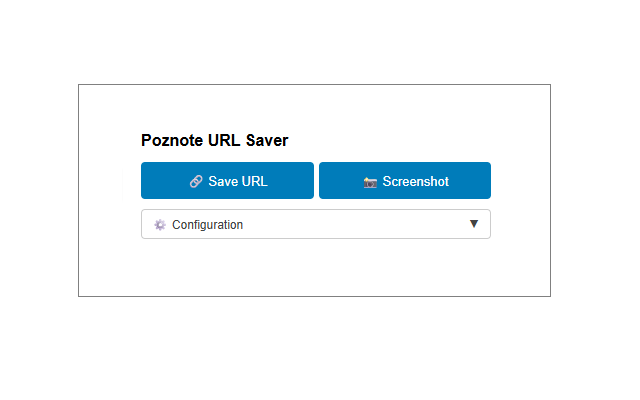

<!-- lang-selector -->

  <a href="CHROME-EXTENSION.md">English</a> ·
  <a href="CHROME-EXTENSION.fr.md">Français</a> ·
  <a href="CHROME-EXTENSION.de.md">Deutsch</a> ·
  <a href="CHROME-EXTENSION.es.md">Español</a> ·
  <a href="CHROME-EXTENSION.pt.md">Português</a> ·
  <a href="CHROME-EXTENSION.ru.md">Русский</a> ·
  <a href="CHROME-EXTENSION.zh-cn.md">简体中文</a> ·
  <b>한국어</b>

<!-- /lang-selector -->

# Poznote Chrome 확장 프로그램

**Poznote URL Saver**는 현재 페이지의 URL이나 전체 페이지 스크린샷을 한 번의 클릭으로 Poznote 인스턴스에 저장하는 브라우저 확장 프로그램입니다.

  

Chrome 웹 스토어에서 바로 설치하세요: [확장 프로그램 설치](https://chromewebstore.google.com/detail/bmjclfamahegmgillaghhmnbkjebipbh?utm_source=item-share-cb)

## 인스턴스 연결

1. Poznote의 **설정 > 앱 비밀번호**에서 확장 프로그램 이름으로 앱 비밀번호를 만들고 표시된 비밀번호를 복사하세요. 한 번만 표시됩니다.
2. 확장 프로그램을 열고 다음을 입력하세요.
   - **App URL:** 인스턴스 주소(예: `https://notes.example.com/`)
   - **Username:** Poznote 사용자 이름
   - **Password:** 방금 복사한 앱 비밀번호
   - **Workspace:** 저장할 작업 공간. 필요하면 **Folder**도 지정하세요.
3. 저장하세요. 확장 프로그램이 프로필을 자동으로 확인하며 바로 사용할 수 있습니다.

계정 비밀번호도 사용할 수 있지만 확장 프로그램에는 앱 비밀번호를 권장합니다. API에만 접근할 수 있고 웹 화면이나 계정 설정에는 접근하지 못하며, 본인 프로필로 범위가 제한됩니다. Poznote에서 앱 비밀번호를 폐기하면 다른 설정을 바꾸지 않고 연결을 끊을 수 있습니다. 전체 제한 사항은 [앱 비밀번호](README.ko.md#앱-비밀번호)를 확인하세요.

> **SSO 전용 인스턴스에서는** 앱 비밀번호로만 확장 프로그램을 연결할 수 있습니다. 확장 프로그램에 필요한 로그인 양식이 계정에 없기 때문입니다. 위 설명대로 **설정 > 앱 비밀번호**에서 생성하세요.
