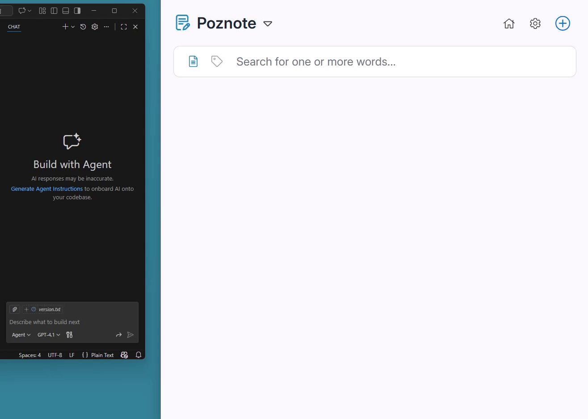

<!-- lang-selector -->
<p align="center">
  <a href="MCP-SERVER.md">English</a> ·
  <a href="MCP-SERVER.fr.md">Français</a> ·
  <a href="MCP-SERVER.de.md">Deutsch</a> ·
  <a href="MCP-SERVER.es.md">Español</a> ·
  <a href="MCP-SERVER.pt.md">Português</a> ·
  <a href="MCP-SERVER.ru.md">Русский</a> ·
  <a href="MCP-SERVER.zh-cn.md">简体中文</a> ·
  <b>한국어</b>
</p>
<!-- /lang-selector -->

# Poznote MCP 서버

Poznote용 MCP(Model Context Protocol) 서버입니다. 자연어로 AI를 통해 노트를 관리할 수 있습니다.

이 서버는 **HTTP 전송만** 지원합니다(MCP Streamable HTTP).

> [!TIP]
> Poznote 안에서 Ollama 같은 로컬 모델과 직접 채팅하려면 MCP 서버가 필요하지 않습니다. 내장 [AI 어시스턴트](AI-ASSISTANT.ko.md)를 사용하세요(**설정 → 관리 도구 → AI 어시스턴트**). MCP 서버는 MCP를 지원하는 *외부* 어시스턴트를 노트에 연결하는 용도입니다. Ollama 자체는 모델 실행 환경이며 MCP 클라이언트가 아니므로 직접 연결할 수 없습니다.

<p align="center">
  
</p>

## 빠른 시작

사용할 AI 어시스턴트를 선택하세요.

- **[VS Code Copilot](VSCODE-COPILOT.ko.md):** 편집기에 Poznote 연결
- **[Claude CLI](CLAUDE-CLI.ko.md):** 명령줄에서 Poznote 사용

---

## 동작 방식

MCP 서버는 AI 어시스턴트와 Poznote 인스턴스를 연결합니다.

### 구성 요소

- **`server.py`**: MCP 서버(HTTP / Streamable HTTP)
  - `http://127.0.0.1:8045/mcp`에 MCP 엔드포인트 제공
  - 노트 관리 도구(작업) 정의
  - AI와 Poznote API 사이의 호출 조정

- **`client.py`**: Poznote REST API용 HTTP 클라이언트
  - HTTP 요청 수행(GET, POST, PATCH, DELETE)
  - 공유 MCP 서비스 토큰으로 Poznote API 인증 처리

### 통신 흐름

1. AI 어시스턴트(VS Code Copilot 또는 Claude CLI)가 MCP 서버에 연결
2. MCP 서버가 Poznote REST API 호출
3. 결과를 AI 어시스턴트에 반환

브라우저에 열린 Poznote 탭은 MCP를 통한 변경을 몇 초 안에 반영합니다. 사이드바 트리와 열린 노트가 자동 갱신되며, 저장하지 않은 편집 내용이 있으면 다시 불러오기 안내가 표시됩니다. 단순히 브라우저에 열려 있는 노트는 MCP 쓰기를 막지 않습니다. 같은 계정의 다른 사용자나 공개 공유 링크의 방문자가 편집 중인 노트만 HTTP 423 오류를 반환합니다.

## 기능

### 도구(작업)
- `get_note`: ID로 특정 노트의 전체 본문 조회
- `list_notes`: 작업 공간의 노트를 페이지 단위로 조회(`limit`/`offset`, 결과에 실제 전체 개수인 `total` 포함)
- `search_notes`: 텍스트로 노트 검색. 생성 날짜 범위 지정 가능
- `create_note`: 새 노트 생성. 템플릿, 마감일, 알림 지정 가능
- `update_note`: 기존 노트 수정·이동 및 마감일·알림 설정
- `delete_note`: ID로 노트 삭제
- `get_reminder`: 노트에 설정된 알림 조회
- `set_reminder`: 노트 알림 설정 또는 교체. 반복 간격 지정 가능
- `remove_reminder`: 노트 알림 제거
- `list_reminders`: 이미 발생했으며 아직 확인하지 않은 알림 조회(UI의 종 모양 알림 목록). 예정된 알림은 조회 불가
- `list_tasks`: 할 일 목록 노트의 할 일과 ID·마감일·상태 조회
- `list_all_tasks`: 작업 공간 전체 노트의 미완료 할 일을 급한 순서로 조회. 마감일·중요·완료·노트 내 체크리스트 필터 지원
- `add_task`: 할 일 목록 노트에 할 일 하나 추가. 마감일·알림 지정 가능
- `update_task`: 할 일 하나 수정(내용, 마감일, 알림, 중요 표시)
- `complete_task`: 할 일 완료 또는 완료 취소
- `delete_task`: 할 일 목록 노트에서 할 일 하나 삭제
- `add_subtask`: 할 일 아래에 하위 할 일 추가
- `update_subtask`: 하위 할 일 이름 변경 또는 완료·완료 취소
- `delete_subtask`: 하위 할 일 하나 삭제
- `create_folder`: 이름이나 경로로 폴더 생성(`folder_path="Projects/2026/Q3"`는 전체 경로를 한 번에 생성). `is_diary=true`로 일기 루트 생성 가능
- `list_folders`: 작업 공간의 모든 폴더와 경로·일기 표시 조회
- `list_workspaces`: 사용 가능한 모든 작업 공간 조회
- `list_tags`: 노트에서 사용하는 고유 태그 전체 조회
- `list_templates`: `create_note`의 `from_template_id`로 사용할 템플릿 노트 조회
- `get_trash`: 휴지통의 모든 노트 조회
- `empty_trash`: 휴지통의 모든 노트 영구 삭제
- `delete_trash_note`: 휴지통 전체 대신 노트 하나 영구 삭제
- `restore_note`: 휴지통에서 노트 복원
- `list_snapshots`: AI 또는 MCP 재작성 전에 생성한 편집 보호 스냅샷을 포함해 노트의 이전 버전 조회
- `get_snapshot`: 노트를 변경하지 않고 이전 버전 하나의 내용 읽기
- `restore_snapshot`: 노트를 스냅샷 버전으로 되돌리기(`snapshot_key` 또는 `date` 필요)
- `duplicate_note`: 기존 노트 복제
- `toggle_favorite`: 노트의 즐겨찾기 상태 전환
- `list_attachments`: 특정 노트의 모든 첨부 파일 조회
- `add_attachment`: Base64 내용으로 파일 첨부(이미지, 로그, PDF 등)
- `move_note`: ID를 유지하며 노트를 다른 작업 공간 또는 폴더로 이동
- `move_folder`: 하위 폴더와 노트를 포함해 폴더를 다른 부모 폴더 또는 작업 공간으로 이동
- `move_note_to_folder`: 노트를 특정 폴더로 이동
- `remove_note_from_folder`: 현재 폴더에서 노트를 꺼내 루트로 이동
- `share_note`: 노트 공개 공유 활성화 및 공개 URL 조회
- `unshare_note`: 노트 공개 공유 비활성화
- `get_note_share_status`: 노트의 현재 공유 상태와 공개 URL 조회
- `get_folder_share_status`: 폴더의 현재 공유 상태와 공개 URL 조회
- `list_shared`: 공개 공유된 모든 노트와 폴더 조회
- `get_backlinks`: 특정 노트로 연결되는 모든 노트 조회
- `convert_note`: HTML과 마크다운 간 노트 변환
- `rename_folder`: 기존 폴더 이름 변경
- `delete_folder`: 폴더 삭제 및 포함된 노트를 휴지통으로 이동
- `create_workspace`: 새 작업 공간 생성
- `rename_workspace`: 기존 작업 공간 이름 변경
- `delete_workspace`: 작업 공간 삭제(마지막 작업 공간은 삭제 불가)
- `get_git_sync_status`: 현재 Git 동기화 상태 조회(GitHub/GitLab/Forgejo)
- `git_push`: 설정한 Git 저장소로 로컬 노트 강제 푸시
- `git_pull`: 설정한 Git 저장소에서 노트 강제 가져오기
- `get_system_info`: Poznote 설치 버전 정보 조회
- `list_backups`: 사용 가능한 모든 시스템 백업 조회
- `create_backup`: 새 시스템 백업 생성
- `restore_backup`: 백업 파일 복원(현재 사용자 데이터 교체)
- `delete_backup`: 특정 백업 파일 삭제
- `get_app_setting`: 특정 앱 설정값 조회
- `update_app_setting`: 특정 앱 설정값 변경

**호출의 대상 작업 공간.** `create_note`, `create_folder`, `list_folders`에서는 항상 `workspace`를 지정하세요. 폴더는 작업 공간 하나에 속하므로 이를 지정해야 대상이 확실합니다. 생략하면 서버는 추측하지 않고 정해진 순서로 결정합니다. 존재하는 작업 공간을 가리키는 `mcp_default_workspace` 설정을 먼저 사용하고, 그렇지 않으면 계정에 작업 공간이 하나뿐일 때 그 공간을 사용합니다. 작업 공간이 여러 개이고 기본값이 없으면 호출을 거부하고 목록을 반환합니다. 정렬상 첫 번째 공간에 임의로 저장하지 않습니다. 과거에는 보관 기능이 “Archives”를 처음 만들 때 대상이 바뀌는 일이 있었습니다. `update_app_setting("mcp_default_workspace", "<name>")`으로 기본값을 설정하세요.

**첨부 파일.** `add_attachment(note_id, filename, content_base64)`는 웹 UI에 끌어다 놓는 것과 같은 방식으로 파일을 첨부합니다. 사람이 직접 조작하지 않아도 생성한 차트나 로그를 첨부할 수 있으며 `data:` URI도 지원합니다. 실행 파일 제한이나 저장 공간 한도 등 Poznote의 규칙은 그대로 적용되며, 거부되면 이유가 반환됩니다. 파일 내용이 도구 호출 안에서 Base64로 전달되므로 업로드는 25 MB로 제한됩니다. 더 큰 파일은 웹 UI를 사용하세요.

**이동.** `move_note`와 `move_folder`는 복사가 아닌 이동입니다. ID, 본문, 이력, 노트를 가리키는 링크가 유지됩니다. `update_note`의 `workspace`는 노트를 *찾을 위치*이며 실제 이동 대상은 `target_workspace`입니다. 다른 작업 공간으로 옮기면서 대상 폴더를 지정하지 않으면 새 작업 공간의 루트에 놓입니다. 기존 폴더는 이전 작업 공간 소속이기 때문입니다. 폴더를 옮기면 하위 폴더와 포함된 모든 노트도 함께 이동합니다.

**폴더.** 폴더를 받는 모든 도구는 이름 또는 슬래시로 구분된 경로를 받습니다. `create_note(folder="Diary/2026/08")`는 경로 중 없는 폴더를 생성하고, `create_folder(folder_path=…)`도 같습니다. `list_notes(folder_id=…)`는 서버에서 폴더 하나로 범위를 제한하며 `total`도 해당 폴더만 셉니다. 같은 이름의 폴더가 작업 공간에 하나뿐이면 깊이에 관계없이 기존 폴더를 사용합니다. 루트에 중복 생성하지 않습니다. 여러 폴더가 같은 이름을 쓰면 호출을 거부하고 목록을 반환하므로 전체 경로나 ID를 지정하세요.

**일기.** 일기는 이름만 Diary인 폴더가 아니라 `is_diary` 표시가 있는 루트 폴더입니다. UI의 “새 일기 작성” 버튼은 해당 루트에 날짜별 노트를 저장합니다. `create_folder(folder_name="Journal", is_diary=true)`로 만들고 `list_folders`로 일기 폴더를 확인할 수 있습니다. 기존 루트 폴더 이름을 전달하면 노트를 유지하며 해당 폴더를 일기로 바꿉니다. 일기 항목은 일반 노트이므로 `create_note(folder="Journal/2026/09")`로 저장하세요.

**템플릿.** 템플릿은 `Templates` 폴더(모든 하위 경로 포함) 또는 같은 이름의 작업 공간에 보관한 일반 노트입니다. 각 지원 언어의 이름도 인식하므로 `Modèles` 폴더도 사용할 수 있습니다. `list_templates`는 ID를 포함해 템플릿을 반환합니다. `create_note(from_template_id=…)`는 템플릿 형식으로 새 노트를 시작합니다. `note_type="markdown"`을 지정하면 편집기의 `/template` 명령처럼 HTML 템플릿을 변환합니다. 템플릿으로 할 일 목록이나 그림을 시작할 수는 없습니다. `content`도 전달하면 템플릿 본문 뒤에 추가됩니다.

**알림과 할 일.** `create_note`/`update_note`와 `set_reminder`의 `reminder_at`은 `2026-09-01T09:00:00+02:00` 같은 ISO 날짜·시간입니다. 오프셋을 포함하지 않으면 UTC로 해석합니다. 할 일 마감일인 `due_at`은 다릅니다. 오프셋 없는 `YYYY-MM-DD` 또는 `YYYY-MM-DDTHH:MM` 형태의 현지 시간으로 사용자 시간대에 따라 해석합니다. 시간 없는 날짜는 09:00에 알립니다. 반복 간격은 `<count><unit>` 형식이며 단위는 `i`/`h`/`d`/`w`/`m`/`y`입니다(예: `30i`, `1d`, `2w`).

할 일 도구는 한 번에 하나를 다룹니다. `list_tasks`로 ID를 조회한 뒤 `add_task`, `update_task`, `complete_task`, `delete_task`를 호출하세요. 클라이언트가 전체 목록을 읽어 새 배열로 보내지 않으므로 서로 다른 할 일을 편집하는 두 호출이 상대 작업을 덮어쓰지 않습니다. 서버는 노트의 할 일을 하나의 JSON 배열로 저장하고 매 호출마다 다시 쓰므로 목록이 길수록 호출당 작업량은 늘어납니다. 알림은 자동으로 동기화되며 할 일을 완료하거나 삭제하면 대기 중인 알림도 제거됩니다. 하위 할 일은 한 단계만 지원합니다. `list_tasks`는 각 ID를 가진 `subtasks` 배열을 반환하며 `add_subtask`, `update_subtask`, `delete_subtask`로 하나씩 변경합니다. 하위 할 일에는 내용과 완료 표시만 있고, 완료해도 상위 할 일이 자동 완료되지 않습니다.

**버전 이력과 실행 취소.** AI 어시스턴트나 MCP 서버가 노트를 다시 작성하기 직전에 편집 보호 스냅샷을 만들므로 잘못된 `update_note`를 되돌릴 수 있습니다. `list_snapshots`는 각 스냅샷의 출처인 `origin`을 반환하며 보호 사본은 `ai` 또는 `mcp`로 식별됩니다. `get_snapshot`은 노트를 변경하지 않고 내용을 읽으며 `restore_snapshot`은 내용을 복원합니다. `restore_snapshot`은 현재 내용을 덮어쓰므로 오늘의 스냅샷을 임의로 고르지 않으며 `snapshot_key` 또는 `date`를 요구합니다. 덮어쓰기 전에 현재 내용을 저장하지 않으므로 이미 스냅샷에 보관되어 있지 않다면 덮어쓴 내용은 사라집니다. Poznote 화면에서는 스냅샷을 수정 이력이라고 부르며 **수정 이력** 페이지에서 조회·비교할 수 있습니다. 따라서 수정 이력이나 버전 이력에 관한 요청은 이 도구에 대응합니다.

**여러 노트 조회.** `list_all_tasks`는 작업 공간 전체에서 “남은 할 일”을 조회하고 `list_tasks`는 노트 하나만 다룹니다. 반환 항목은 `source`로 구분합니다. 할 일 목록 노트의 항목 ID는 `update_task`와 `delete_task`에 사용할 수 있지만, 일반 노트의 체크박스 ID는 노트 안의 위치일 뿐이므로 같은 방식으로 변경할 수 없습니다. `list_reminders`는 발생했지만 아직 해제하지 않은 알림을 API 한도인 50개까지 반환합니다. 앞으로 발생할 알림을 보여주는 기능이 아닙니다. 예정된 알림의 목록 엔드포인트는 없으며 `get_reminder`로 노트별 조회해야 합니다.

대부분의 도구는 선택적 `user_id`로 특정 사용자 프로필을 지정합니다. 지정하면 해당 요청에 `X-User-ID` 헤더를 보내며 MCP의 전역 환경을 변경하지 않고 다른 프로필의 노트를 생성·조회할 수 있습니다. 시스템 도구인 `get_system_info`, `list_backups`, `create_backup`, `delete_backup`에는 `user_id`가 없습니다. 생략 시 기본 프로필 변경은 [기본 사용자 프로필](#기본-사용자-프로필)을 참고하세요.

---

## 서버 설치

MCP 서버는 공식 Poznote `docker-compose.yml`에 포함되어 자동으로 실행됩니다.

### 설정

MCP 서버는 `docker-compose.yml`의 기본값을 사용합니다.

```bash
# MCP 서버 기본 포트: 8045
# 디버그 로그 기본값: false
```

Poznote는 `data/.mcp_token`에 MCP 서비스 토큰을 자동 생성합니다. `mcp-server` 컨테이너는 공유 볼륨 `./data:/var/www/html/data:ro`에서 읽으므로 `.env`에 비밀번호를 보관할 필요가 없습니다.

한 번의 실행에서 포트와 디버그 설정을 변경하려면 환경 변수를 명령에 지정해 MCP 컨테이너를 재생성하세요.

```bash
POZNOTE_MCP_PORT=9000 POZNOTE_DEBUG=true docker compose up -d --force-recreate mcp-server
```

`docker compose restart mcp-server`만으로는 변경된 환경 변수를 다시 읽지 않습니다.

#### 기본 사용자 프로필

기본적으로 사용자 프로필 `1`(첫 관리자)로 동작합니다. 다른 프로필을 기본값으로 쓰려면 컨테이너 시작 시 `POZNOTE_USER_ID`를 설정하세요.

```bash
POZNOTE_USER_ID=2 docker compose up -d --force-recreate mcp-server
```

명시적 `user_id`가 없는 도구 호출은 모두 해당 프로필에 적용됩니다. 요청에 `user_id`가 있으면 그 값이 우선합니다. 기본값은 숫자 프로필 ID여야 하며 다른 값은 MCP 로그에 경고를 남기고 무시되어 `1`을 사용합니다.

#### 수신 연결 인증 토큰

기본적으로 MCP 엔드포인트는 접근 가능한 모든 클라이언트를 허용합니다. 포트가 `127.0.0.1`에만 공개되어 있어 안전합니다. 리버스 프록시, LAN, 직접 설치 등으로 접근 범위를 넓히면 `POZNOTE_MCP_AUTH_TOKEN`을 설정하세요. 모든 요청에 `Authorization: Bearer <token>` 헤더를 요구하며 없으면 `401 Unauthorized`를 반환합니다.

```bash
# 강력한 토큰을 한 번 생성
openssl rand -hex 32

# .env에 입력
POZNOTE_MCP_AUTH_TOKEN=paste-the-token-here

# 새 환경 설정을 적용하도록 MCP 컨테이너 재생성
docker compose up -d --force-recreate mcp-server
```

클라이언트 설정에도 동일한 헤더를 추가하세요. [VS Code Copilot](VSCODE-COPILOT.ko.md#인증-토큰-사용)과 [Claude CLI](CLAUDE-CLI.ko.md#인증-토큰-사용)를 참고하세요. 앞뒤 공백은 무시하므로 비밀 파일에서 읽은 토큰에 끝 줄바꿈이 있어도 작동합니다. 빈 값이면 엔드포인트를 개방 상태로 둡니다. 시작 로그에 현재 모드가 표시됩니다.

이 토큰은 `data/.mcp_token`과 별개입니다. 파일의 토큰은 MCP 서버가 *Poznote API에* 접속할 때 사용하며, 이 설정값은 *AI 어시스턴트*가 MCP 서버에 제시하는 토큰입니다.

#### 디버그 모드

시작 명령에 `POZNOTE_DEBUG=true`를 지정하면 로그 수준이 `INFO`에서 `DEBUG`로 바뀝니다. 평소에는 `false`로 두세요. 소문자 `true`와 `false`만 인식하며 다른 값은 경고와 함께 `false`로 처리합니다. 웹 서버는 `1`, `on`, `yes`도 허용합니다. Poznote API에 보낸 모든 HTTP 요청, AI 어시스턴트의 도구 호출, 응답이 컨테이너 로그에 상세히 기록됩니다. 연결 및 인증 문제 진단에 사용하세요.

```bash
docker compose logs -f mcp-server
```

평소에는 비활성화하세요. 일상 사용에는 상세 로그가 필요하지 않습니다.

### 서버 시작

```bash
docker-compose up -d
```

### 설치 확인

```bash
# 컨테이너 실행 확인
docker ps | grep mcp

# 엔드포인트 시험
curl http://127.0.0.1:8045/mcp
```

MCP 서버를 끄려면 `docker-compose.yml`의 `mcp-server` 서비스를 주석 처리하세요.

---

## 클라이언트 설정

AI 어시스턴트가 MCP 서버에 연결하도록 설정하세요.

### **VS Code Copilot**
전체 설정 안내: **[VSCODE-COPILOT.md](VSCODE-COPILOT.ko.md)**

### **Claude CLI**
전체 설정 안내: **[CLAUDE-CLI.md](CLAUDE-CLI.ko.md)**

---

## 보안

MCP 엔드포인트에 접근할 수 있는 사람은 모든 프로필의 노트를 읽고 생성·수정·삭제할 수 있습니다(도구의 `user_id` 인수). 백업, 복원, 설정 변경도 가능합니다. 두 단계로 접근을 제한합니다.

1. **네트워크 접근 범위.** 기본적으로 로컬 컴퓨터에서만 접속할 수 있습니다.
2. **수신 Bearer 토큰(선택 사항).** `POZNOTE_MCP_AUTH_TOKEN`을 설정하면 모든 요청에 `Authorization: Bearer <token>`이 필요합니다.

기본 `docker-compose.yml`에서는 첫 단계만으로 충분합니다. 완전히 통제하지 못하는 위치에서도 포트에 접근할 수 있다면 두 번째 단계도 적용하세요.

### 127.0.0.1에만 공개하는 이유

Docker 포트 매핑을 위해 컨테이너 *내부*에서는 `0.0.0.0`으로 접속을 받지만, 호스트에서는 공개 인터페이스가 아닌 **`127.0.0.1`에만** 포트를 공개합니다.

```yaml
ports:
  - "127.0.0.1:${POZNOTE_MCP_PORT:-8045}:8045"
```

의도된 올바른 구성입니다. 같은 컴퓨터의 프로세스나 명시적으로 설정한 SSH 터널만 연결할 수 있습니다. 기본 구성에서는 추가 공개를 걱정할 필요가 없습니다.

### Docker 없이 MCP 서버 실행

`pip`로 설치해 `poznote-mcp serve`를 직접 실행한다면(systemd, Proxmox LXC 등) Docker 포트 매핑이 없으므로 바인딩 주소가 중요합니다.

- `poznote-mcp serve`는 **기본적으로 `127.0.0.1`**에 바인딩합니다. 다른 주소가 필요한 이유를 알지 못하면 기본값을 유지하세요.
- 다른 호스트의 프록시나 VPN 인터페이스 때문에 `0.0.0.0`이 필요하다면 `POZNOTE_MCP_AUTH_TOKEN`도 설정하세요. 루프백 이외의 주소에서 토큰 없이 접속을 받으면 시작 시 경고가 기록됩니다.
- 이전 버전은 기본적으로 `0.0.0.0`에 바인딩했습니다. `--host=127.0.0.1`을 명시하세요(`serve` 하위 명령 없이 실행하면 `MCP_HOST=127.0.0.1` 설정).

### 원격 접속

원격 서버에서 Poznote를 실행하고 작업용 컴퓨터에서 연결하려면 SSH 포트 전달을 사용하세요. 포트를 외부에 공개하지 **마세요**.

```bash
ssh -L 8045:127.0.0.1:8045 user@your-server
```

이후 평소처럼 AI 어시스턴트에 `http://127.0.0.1:8045/mcp`를 설정하세요.

### 운영 환경

MCP 서버에 네트워크로 접근해야 한다면 다음으로 보호하세요.
- `POZNOTE_MCP_AUTH_TOKEN`([수신 연결 인증 토큰](#수신-연결-인증-토큰) 참고)과 토큰 평문 전송을 막는 HTTPS
- VPN(Tailscale, WireGuard)
- 추가 보호를 위한 자체 인증 또는 IP 허용 목록이 있는 리버스 프록시(nginx, Caddy, 선택 사항)

### MCP 서버의 Poznote 인증 방식

MCP 서버는 `data/.mcp_token`의 내부 Bearer 토큰으로 Poznote REST API에 연결합니다. Poznote가 자동 생성하며 Docker Compose가 `./data`를 MCP 컨테이너에 읽기 전용으로 마운트하므로 `.env`에 보관할 필요가 없습니다.

이 토큰이 MCP 서버임을 식별하므로 토큰을 가진 요청이 노트 본문이나 할 일을 변경하기 직전에 스냅샷을 생성합니다(`update_note`, `add_task`, `update_task`, `complete_task`, `delete_task`, `add_subtask`, `update_subtask`, `delete_subtask`). 노트의 **수정 이력** 페이지에 “MCP 편집 전”으로 표시되어 AI 재작성으로 누락된 내용을 복원할 수 있습니다. 최신 스냅샷과 본문이 같으면 건너뛰며 노트별로 최근 편집 보호 스냅샷(AI 편집 전 및 MCP 편집 전) 20개를 보관합니다. 편집량이 많다면 **설정 → 수정 이력**에서 최대 200개로 늘릴 수 있습니다.

---

## 사용 예시

설정 후 자연어로 Poznote를 사용하세요.

```
'Poznote' 작업 공간의 노트를 모두 보여줘
'MCP'에 관한 노트를 찾아줘
토론 내용으로 'Meeting Notes' 노트를 만들어줘
123번 노트에 새 내용을 넣어줘
456번 노트를 'Projects' 폴더로 옮겨줘
```

자세한 사용 예시와 문제 해결:
- VS Code Copilot: [VSCODE-COPILOT.md](VSCODE-COPILOT.ko.md#사용-예시)
- Claude CLI: [CLAUDE-CLI.md](CLAUDE-CLI.ko.md#사용-예시)

---

## 지원 및 참고 자료

- **[VS Code Copilot 설정 →](VSCODE-COPILOT.ko.md)**
- **[Claude CLI 설정 →](CLAUDE-CLI.ko.md)**

문제가 발생하면:
- MCP 서버 로그 확인: `docker compose logs mcp-server`
- Poznote API 접근 가능 여부 확인
- 클라이언트별 문제 해결 문서 확인
