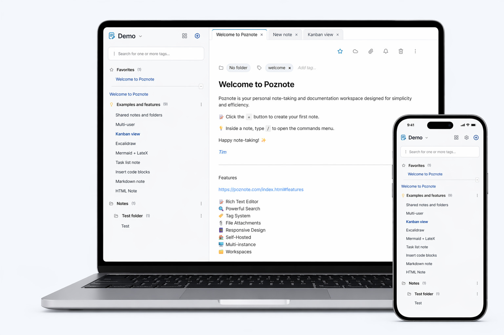

<!-- lang-selector -->
<p align="center">
  <a href="../README.md">English</a> ·
  <a href="README.fr.md">Français</a> ·
  <a href="README.de.md">Deutsch</a> ·
  <a href="README.es.md">Español</a> ·
  <a href="README.pt.md">Português</a> ·
  <a href="README.ru.md">Русский</a> ·
  <a href="README.zh-cn.md">简体中文</a> ·
  <b>한국어</b>
</p>
<!-- /lang-selector -->


<p align="center">
  
</p>

<h2 align="center">
번거로운 설정 없이 강력한 노트 작성.
</h2>

<h3 align="center">
Notion, Obsidian, Evernote, OneNote를 대신할 무료 셀프 호스팅 오픈 소스 앱입니다.
</h3>

<p align="center">
  
</p>

### 기능

모든 기능은 [여기](https://poznote.com/#features)에서 확인하세요.

### 스크린샷

전체 스크린샷은 [여기](https://poznote.com/screenshots.html)에서 확인하세요.

### 데모

https://demo.poznote.com

**아이디**: poznote<br>
**비밀번호**: poznote

### Poznote 소개 기사

https://poznote.com/press.html

### Discord

커뮤니티에서 질문하고 의견을 나누거나 개발 소식을 확인하세요.

https://discord.gg/fuEV6uqf4N

## 목차

- [설치](#설치)
- [접속](#접속)
- [설정 변경](#설정-변경)
- [앱 업데이트](#앱-업데이트)
- [인증](#인증)
- [앱 비밀번호](#앱-비밀번호)
- [노트 유형](#노트-유형)
- [수정 이력](#수정-이력)
- [개인화](#개인화)
- [다중 사용자](#다중-사용자)
- [활동 로그](#활동-로그)
- [웹훅](#웹훅)
- [Git 동기화](#git-동기화)
- [S3 첨부 파일 저장](#s3-첨부-파일-저장)
- [S3 백업](#s3-백업)
- [백업 / 내보내기](#백업--내보내기)
- [복원 / 가져오기](#복원--가져오기)
- [오프라인](#오프라인)
- [여러 인스턴스](#여러-인스턴스)
- [AI 어시스턴트](#ai-어시스턴트)
- [음성 텍스트 변환](#음성-텍스트-변환)
- [MCP 서버](#mcp-서버)
- [앱](#앱)
- [Chrome 확장 프로그램](#chrome-확장-프로그램)
- [Android에서 Poznote로 공유](#android에서-poznote로-공유)
- [API 문서](#api-문서)
- [기술 구성](#기술-구성)

## 설치

> 공식 이미지는 linux/amd64와 linux/arm64를 지원합니다. Docker Desktop의 Windows/macOS와 Raspberry Pi, NAS 등 ARM64 기기에서도 사용할 수 있습니다.

아래에서 설치 방법을 선택하세요.

<a id="windows"></a>
<details>
<summary><strong>🖥️ Windows</strong></summary>

#### 1단계: 사전 준비

[Docker Desktop](https://docs.docker.com/desktop/setup/install/windows-install/)을 설치하고 실행하세요.

#### 2단계: Poznote 배포

새 디렉터리를 만드세요.

```powershell
mkdir poznote
```

Poznote 디렉터리로 이동하세요.
```powershell
cd poznote
```

환경 파일을 만드세요.

```powershell
curl -o .env https://raw.githubusercontent.com/timothepoznanski/poznote/main/.env.template
```

`.env` 파일을 편집하세요.

```powershell
notepad .env
```

Docker Compose 설정 파일을 내려받으세요.

```powershell
curl -o docker-compose.yml https://raw.githubusercontent.com/timothepoznanski/poznote/main/docker-compose.yml
```

최신 Poznote 웹 서버와 MCP 이미지를 내려받으세요.
```powershell
docker compose pull
```

Poznote 컨테이너를 시작하세요.
```powershell
docker compose up -d
```

</details>

<a id="linux"></a>
<details>
<summary><strong>🐧 Linux</strong></summary>

#### 1단계: 사전 준비

1. [Docker 엔진](https://docs.docker.com/engine/install/) 설치
2. [Docker Compose](https://docs.docker.com/compose/install/linux) 설치

#### 2단계: Poznote 설치

새 디렉터리를 만드세요.
```bash
mkdir poznote
```

Poznote 디렉터리로 이동하세요.
```bash
cd poznote
```

환경 파일을 만드세요.
```bash
curl -o .env https://raw.githubusercontent.com/timothepoznanski/poznote/main/.env.template
```

`.env` 파일을 편집하세요.
```bash
vi .env
```

Docker Compose 설정 파일을 내려받으세요.
```bash
curl -o docker-compose.yml https://raw.githubusercontent.com/timothepoznanski/poznote/main/docker-compose.yml
```

최신 Poznote 웹 서버와 MCP 이미지를 내려받으세요.
```bash
docker compose pull
```

Poznote 컨테이너를 시작하세요.
```bash
docker compose up -d
```

</details>

<a id="macos"></a>
<details>
<summary><strong>🍎 macOS</strong></summary>

#### 1단계: 사전 준비

[Docker Desktop](https://docs.docker.com/desktop/setup/install/mac-install/)을 설치하고 실행하세요.

#### 2단계: Poznote 배포

새 디렉터리를 만드세요.
```bash
mkdir poznote
```

Poznote 디렉터리로 이동하세요.
```bash
cd poznote
```

환경 파일을 내려받으세요.
```bash
curl -o .env https://raw.githubusercontent.com/timothepoznanski/poznote/main/.env.template
```

`.env` 파일을 편집하세요.
```bash
vi .env
```

Docker Compose 설정 파일을 내려받으세요.
```bash
curl -o docker-compose.yml https://raw.githubusercontent.com/timothepoznanski/poznote/main/docker-compose.yml
```

최신 Poznote 웹 서버와 MCP 이미지를 내려받으세요.
```bash
docker compose pull
```

Poznote 컨테이너를 시작하세요.
```bash
docker compose up -d
```

</details>

<a id="cloud"></a>
<details>
<summary><strong>☁️ 클라우드</strong></summary><br>

서버를 직접 관리하고 싶지 않다면 호스팅 업체에 Poznote 운영을 맡길 수 있습니다. 지원 업체와 선택 방법은 [여기](https://poznote.com/hosting.html)를 참고하세요.

</details>

<a id="proxmox"></a>
<details>
<summary><strong>🗄️ Proxmox VE</strong></summary><br>

Proxmox VE Community Scripts는 Docker 없이 명령 하나로 Poznote 전용 컨테이너를 설치합니다. 기본 1 vCPU, RAM 512 MB, 디스크 4 GB인 비특권 Debian 13 LXC를 생성하고 내부 nginx와 PHP로 제공합니다.

Proxmox 호스트 셸에서 실행하세요.

```bash
bash -c "$(curl -fsSL https://raw.githubusercontent.com/community-scripts/ProxmoxVE/main/ct/poznote.sh)"
```

설치 후 `http://<container-ip>:8040`에 접속하며 기본 로그인 정보는 다른 설치와 같습니다. 업데이트하려면 컨테이너 콘솔에서 `update`를 실행하세요.

이 스크립트는 Poznote가 아닌 커뮤니티가 작성·관리합니다. 옵션과 참고 사항은 [Poznote 스크립트 페이지](https://community-scripts.org/scripts/poznote)를 확인하세요.

</details>

<a id="kubernetes"></a>
<details>
<summary><strong>☸️ Helm으로 Kubernetes에 설치</strong></summary>

#### 1단계: 사전 준비

[Helm](https://helm.sh/docs/intro/install/)을 설치하고 Kubernetes 컨텍스트가 배포할 클러스터를 가리키는지 확인하세요.

#### 2단계: Poznote 배포

HelmForge 차트 저장소를 추가하세요.

```bash
helm repo add helmforge https://repo.helmforge.dev
```

로컬 차트 목록을 갱신하세요.

```bash
helm repo update
```

Poznote를 설치하세요.

```bash
helm install poznote helmforge/poznote --namespace poznote --create-namespace
```

Poznote Helm 차트는 HelmForge 커뮤니티가 관리하는 Kubernetes 설치 옵션입니다. 값, 영구 저장, 서비스 공개, 상태 검사, 보안 컨텍스트, 운영 설정은 [HelmForge Poznote 차트 문서](https://helmforge.dev/docs/charts/poznote)를 참고하세요.

</details>

<a id="rootless"></a>
<details>
<summary><strong>🔒 Rootless</strong></summary><br>

Poznote는 root 대신 일반 사용자(uid/gid `1000`)로 실행되는 rootless 이미지도 제공합니다. Kubernetes 제한 `PodSecurityStandard`, rootless Podman, `docker run --user` 등 root가 금지된 환경용입니다. 기본 이미지와 같지만 내부 포트가 `8080`이고 시작 시 데이터 디렉터리의 소유권을 수정하지 못합니다.

#### 1단계: 사전 준비

1. [Docker 엔진](https://docs.docker.com/engine/install/) 설치
2. [Docker Compose](https://docs.docker.com/compose/install/linux) 설치

#### 2단계: Poznote 배포

새 디렉터리를 만드세요.
```bash
mkdir poznote
```

Poznote 디렉터리로 이동하세요.
```bash
cd poznote
```

데이터 디렉터리를 만들고 uid/gid `1000`의 소유로 설정하세요. **필수:** rootless 컨테이너는 기본 이미지와 달리 시작 시 이를 자동 수정하지 못합니다.
```bash
mkdir -p data
sudo chown -R 1000:1000 data
```

대개 `sudo`는 필요하지 않습니다. 사용자 uid가 `1000`이면 `chown`을 생략할 수 있으며 rootless Podman/Docker에서는 root 없이 수행할 수 있습니다. [rootless 실행](TROUBLESHOOTING.ko.md#running-rootless)을 참고하세요.

환경 파일을 만드세요.
```bash
curl -o .env https://raw.githubusercontent.com/timothepoznanski/poznote/main/.env.template
```

`.env` 파일을 편집하세요.
```bash
vi .env
```

rootless Docker Compose 설정 파일을 내려받으세요.
```bash
curl -o docker-compose.rootless.yml https://raw.githubusercontent.com/timothepoznanski/poznote/main/docker-compose.rootless.yml
```

최신 rootless Poznote 웹 서버와 MCP 이미지를 내려받으세요.
```bash
docker compose -f docker-compose.rootless.yml pull
```

Poznote 컨테이너를 시작하세요.
```bash
docker compose -f docker-compose.rootless.yml up -d
```

기존 인스턴스의 전환 및 상세 설명은 문제 해결 문서의 [rootless 실행](TROUBLESHOOTING.ko.md#running-rootless)을 참고하세요.

</details>

<br>

> 설치에 문제가 있으면 [문제 해결 문서](TROUBLESHOOTING.ko.md)를 참고하세요.

## 접속

설치 후 브라우저에서 Poznote에 접속하세요.

[http://localhost:8040](http://localhost:8040)


- 사용자 이름: `admin_change_me`
- 비밀번호: `admin`
- 포트: `8040`

첫 로그인 후 기본 관리자 이름과 비밀번호를 변경하세요.

## 설정 변경

일상 설정은 대부분 Poznote 화면에서 변경합니다. `.env`는 컨테이너 시작 시 읽는 배포·실행 설정에만 사용하세요.

<details>
<summary><strong><code>.env</code> 파일에서 설정할 항목</strong></summary>
<br>

- `HTTP_WEB_PORT`
- `POZNOTE_OIDC_CLIENT_ID`
- `POZNOTE_OIDC_CLIENT_SECRET`
- `POZNOTE_OIDC_DISABLE_NORMAL_LOGIN`
- `POZNOTE_MCP_PORT`, `POZNOTE_DEBUG` 등 선택적 실행 설정
- `POZNOTE_PHP_FPM_MAX_CHILDREN`: 동시 PHP 요청 수 변경(기본 10). [문제 해결](TROUBLESHOOTING.ko.md#the-app-stops-answering-under-load) 참고
- `POZNOTE_PHP_MEMORY_LIMIT`: 요청당 PHP 메모리 상한, MB 단위(기본 512). [문제 해결](TROUBLESHOOTING.ko.md#a-request-runs-out-of-memory) 참고
- `POZNOTE_LISTEN_PORT`: 컨테이너 내부 웹 서버 포트(기본 80). `network_mode: host`에서 필요. [문제 해결](TROUBLESHOOTING.ko.md#running-with-host-network) 참고
- `POZNOTE_SETTINGS_PASSWORD`: 설정 페이지를 열기 전에 추가 비밀번호 요청. 기본은 빈 값
- `POZNOTE_MCP_AUTH_TOKEN`: MCP 클라이언트에 Bearer 토큰 요구. [MCP 서버](#mcp-서버) 참고

</details>

<details>
<summary><strong>화면에서 설정할 항목</strong></summary>
<br>

- 관리자·전역 설정: OIDC 제공업체, Git 동기화 활성화, 가져오기 한도, 사용자 CSS 업로드 등
- 사용자·프로필 설정: 계정 비밀번호, 테마, 글꼴 크기, 노트 정렬, 작업 공간 배경, UI 요소 숨김 등

</details>


### 시스템 설정 변경(`.env`)

Poznote 디렉터리로 이동하세요.
```bash
cd poznote
```

실행 중인 Poznote 컨테이너를 중지하세요.
```bash
docker compose down
```

원하는 편집기로 `.env`를 수정하세요(예: `nano .env`, `notepad .env`).

저장 후 컨테이너를 다시 시작해 적용하세요.
```bash
docker compose up -d
```

## 앱 업데이트

Poznote 디렉터리로 이동하세요.
```bash
cd poznote
```

업데이트 전에 실행 중인 컨테이너를 중지하세요.
```bash
docker compose down
```

최신 Docker Compose 설정을 내려받으세요.
```bash
curl -o docker-compose.yml https://raw.githubusercontent.com/timothepoznanski/poznote/main/docker-compose.yml
```

최신 `.env.template`를 내려받으세요.
```bash
curl -o .env.template https://raw.githubusercontent.com/timothepoznanski/poznote/main/.env.template
```

sdiff로 `.env.template`를 비교하고 필요하면 새 변수를 `.env`에 추가하세요.
```bash
sdiff .env .env.template
```

최신 Poznote 웹 서버와 MCP 이미지를 내려받으세요.
```bash
docker compose pull
```

업데이트한 컨테이너를 시작하세요.
```bash
docker compose up -d
```

데이터는 `./data`에 보존되며 업데이트의 영향을 받지 않습니다.

### 베타 버전

베타는 안정판 전에 새 기능을 제공하며 [릴리스 페이지](https://github.com/timothepoznanski/poznote/releases)의 사전 릴리스로 표시됩니다. `latest-and-beta` 태그는 베타·안정판 중 가장 최신 버전을 가리킵니다.

사용하려면 `docker-compose.yml`의 두 `image` 행을 바꾸고 나머지는 유지하세요.
```yaml
services:
  webserver:
    image: ghcr.io/timothepoznanski/poznote:latest-and-beta
    ...
  mcp-server:
    image: ghcr.io/timothepoznanski/poznote-mcp:latest-and-beta
    ...
```

[rootless](#rootless)에서는 `docker-compose.rootless.yml`의 웹 서버 이미지가 `poznote:latest-and-beta-rootless`이며 MCP는 동일한 `poznote-mcp:latest-and-beta`입니다.

이미지를 내려받고 컨테이너를 다시 시작하세요.
```bash
docker compose pull
docker compose up -d
```

*   **전환 전:** 베타에는 버그가 있을 수 있으므로 먼저 [백업](#백업--내보내기)하세요. 문제는 [GitHub 이슈](https://github.com/timothepoznanski/poznote/issues)나 [Discord](https://discord.gg/fuEV6uqf4N)로 제보할 수 있습니다.
*   **업데이트:** `docker compose pull`은 최신 베타 또는 출시된 안정판을 받습니다. 위 업데이트 절차는 안정판 태그의 새 `docker-compose.yml`을 받으므로 이후 두 `image` 행을 다시 바꿔야 합니다.
*   **안정판 복귀:** 베타가 DB를 변경하면 이전 안정판으로 돌아가지 못할 수 있습니다. 베타 변경을 포함한 다음 안정판을 기다린 뒤 위 절차로 업데이트하세요.

## 인증

로컬 계정과 외부 인증 제공업체 등 여러 인증 방법을 지원합니다. REST API를 사용하는 앱과 확장 프로그램에는 다음 절의 별도 인증 정보인 [앱 비밀번호](#앱-비밀번호)를 사용합니다.

<details>
<summary><strong>로컬 계정 인증</strong></summary>
<br>

프로필의 사용자 이름 또는 이메일과 비밀번호로 인증합니다.


#### 기본 계정

새 설치에서는 활성 관리자 프로필 하나를 생성합니다.

- 사용자 이름: `admin_change_me`
- 비밀번호: `admin`

첫 로그인 후 기본 비밀번호와 계정 이름을 변경하세요.

#### 비밀번호 관리

비밀번호는 `.env`가 아닌 Poznote 웹 화면에서 관리합니다.

- 사용자는 **설정 > 비밀번호 변경**에서 본인 비밀번호 변경
- 관리자는 **설정 > 관리자 도구 > 사용자 관리**에서 비밀번호 지정 또는 기본값으로 초기화
- **로그인 유지**는 30일 동안 유지
- 비밀번호 변경 시 기존 로그인 유지 쿠키 무효화

#### 2단계 인증

각 사용자는 **설정 > 2단계 인증**에서 TOTP를 켤 수 있습니다. 비밀번호 입력 후 인증 앱(Aegis, Google Authenticator, 1Password, Bitwarden 등)의 6자리 코드를 요청합니다.

- 설정 시 브라우저에서 생성한 QR 코드와 휴대폰 분실에 대비한 일회용 복구 코드 10개 제공
- 비밀번호 로그인 보호. SSO 로그인은 제공업체 자체의 2단계 인증 사용
- 활성화하면 REST API는 계정 비밀번호만으로 인증하지 않음. 클라이언트에 [앱 비밀번호](#앱-비밀번호)를 주거나 `X-Poznote-OTP` 헤더로 현재 코드 전달
- 기기와 복구 코드를 모두 분실하면 관리자가 **설정 > 관리자 도구 > 사용자 관리**의 비밀번호 창에서 해제 가능
- 활성화 또는 해제 시 기존 로그인 유지 쿠키 무효화

#### 기본 비밀번호

- 관리자 계정: `admin`
- 일반 사용자 계정: `user`

변경 전에는 위 기본값을 사용합니다. 화면에서 변경하면 안전한 bcrypt 해시를 DB에 저장하고 우선 사용합니다.

</details>

<a id="oidc"></a>
<details>
<summary><strong>OIDC / SSO 인증(선택 사항)</strong></summary>
<br>

OpenID Connect(인증 코드 + PKCE)로 통합 로그인을 지원합니다. Auth0, Keycloak, Azure AD, Google Identity 등 외부 제공업체를 사용할 수 있습니다.

#### 동작 방식

1. OIDC를 활성화하면 `Continue with [Provider Name]` 버튼 표시
2. PKCE로 보호된 OIDC 인증 코드 흐름으로 사용자 인증
3. 허용 그룹 및 필요 시 기존 허용 사용자 목록으로 접근 제한
4. 인증 후 `sub`(`oidc_subject`), `preferred_username`, `email` 순서로 계정 연결
5. 자동 사용자 생성이 켜져 있고 일치하는 프로필이 없으면 새 프로필 생성. 이 프로필은 **비밀번호가 전혀 없습니다**. 관리자가 계정을 만들 때의 초기 인증 정보 전달 절차가 없으므로 기본 비밀번호도 작동하지 않습니다. 제공업체로 로그인하거나 관리자가 **설정 > 관리자 도구 > 사용자 관리**에서 명시적으로 비밀번호를 설정해야 합니다.
6. `POZNOTE_OIDC_DISABLE_NORMAL_LOGIN=true`이면 비밀번호 양식을 숨기고 SSO 전용으로 전환
7. OIDC 활성화 시 REST API에서 `Authorization: Bearer <OIDC JWT>` 인증 가능. JWKS, 발급자, 만료, 대상, 접근 제어 검증
8. OIDC 흐름을 지원하지 않는 확장 프로그램·모바일 앱·스크립트는 각 사용자 설정에서 만든 [앱 비밀번호](#앱-비밀번호) 사용
9. [2단계 인증](#2단계-인증)은 비밀번호 양식만 보호합니다. SSO는 Poznote 코드를 요구하지 않으므로 제공업체에서 2단계 인증을 적용하세요. 비밀번호와 SSO가 모두 있으면 두 경로를 사용할 수 있으며 SSO의 보안 수준은 제공업체 정책에 따릅니다.

#### 설정

**관리자 화면**의 **설정 > 관리자 도구 > OIDC / SSO**에서 설정합니다.

활성화, 발급자, 제공업체 이름, 범위, 접근 제어, 허용 그룹·사용자, 자동 생성, HTTP Basic Auth 동작 등은 여기서 관리하고 DB에 저장합니다.

제공업체가 전용 API 대상의 액세스 토큰을 발급한다면 **API JWT audience**를 설정하세요. 비우면 설정한 OIDC Client ID를 JWT 대상으로 허용합니다.

다음 설정은 `.env`에 남아 있습니다.

```bash
POZNOTE_OIDC_CLIENT_ID=your_client_id
POZNOTE_OIDC_CLIENT_SECRET=your_client_secret
POZNOTE_OIDC_DISABLE_NORMAL_LOGIN=false
```

로컬 비밀번호 양식을 숨기고 SSO만 강제하려면 `POZNOTE_OIDC_DISABLE_NORMAL_LOGIN=true`를 사용하세요. 비밀번호 인증을 차단하는 유일한 스위치로 양식을 제거하고 서버의 비밀번호 POST를 거부하며 “비밀번호 변경” 설정도 숨깁니다.

> **인증 제공업체 장애 복구.** `POZNOTE_OIDC_DISABLE_NORMAL_LOGIN=true`이면 관리자도 비밀번호로 로그인할 수 없으며 브라우저의 우회 경로가 없습니다. 침해된 관리자 계정이 비밀번호 로그인을 다시 켜 지속적인 접근을 확보하지 못하도록 의도된 동작입니다. 복구에는 서버 접근이 필요합니다. `.env`에서 `POZNOTE_OIDC_DISABLE_NORMAL_LOGIN=false`로 바꾸고 컨테이너를 다시 시작한 뒤 로컬 비밀번호로 로그인하세요. 활성화 전에 최소 관리자 한 명에게 **설정 > 관리자 도구 > 사용자 관리**에서 비밀번호를 명시적으로 설정하세요. OIDC가 자동 생성한 관리자는 설정 전 비밀번호가 없습니다.

> **호환성 변경:** `.env`의 기존 OIDC 설정은 `POZNOTE_OIDC_CLIENT_ID`, `POZNOTE_OIDC_CLIENT_SECRET`, `POZNOTE_OIDC_DISABLE_NORMAL_LOGIN` 외에는 읽지 않습니다. 업데이트 후 나머지는 관리자 페이지에서 다시 입력하세요.

#### 인증 제공업체에 등록할 URL

인증 제공업체에서 애플리케이션(클라이언트)을 만들 때 아래 첫 번째 URL을 리디렉션 URI(콜백 URL)로 등록하고, 제공업체가 요구하면 두 번째 URL을 로그아웃 후 리디렉션 URI로 등록하세요.

```text
https://YOUR_SERVER/oidc_callback.php
https://YOUR_SERVER/login.php
```

Poznote는 요청이 들어온 호스트 이름으로 두 URL을 만들며 항상 `https://`를 사용합니다. 제공업체에 다른 값이 필요하면 OIDC 관리 페이지의 고급 섹션에서 **리디렉션 URI** 또는 **로그아웃 후 리디렉션 URI**를 설정하고 정확히 그 값을 등록하세요.

디스커버리 URL은 보통 입력할 필요가 없습니다. Poznote가 **발급자 URL** 뒤에 `/.well-known/openid-configuration`을 붙입니다. 예를 들어 Authentik의 발급자는 `https://AUTHENTIK_HOST/application/o/APPLICATION_SLUG/`입니다. 제공업체가 이 문서를 다른 위치에 게시할 때만 **디스커버리 URL**을 설정하세요.

#### 접근 제어 예시(그룹 + 자동 생성)

OIDC 관리자 페이지에서 다음을 설정하세요.
- **그룹 클레임:** `groups`
- **허용 그룹:** `poznote`
- **사용자 자동 생성:** 활성화

자동 생성 시 OIDC 클레임(`preferred_username`, `nickname`, 이메일의 @ 앞부분, `name`, `sub` 순)으로 이름을 만들고 프로필에 OIDC subject를 저장합니다.

</details>

## 앱 비밀번호

앱은 브라우저처럼 인증 제공업체에 로그인할 수 없습니다. **앱 비밀번호**는 확장 프로그램·휴대폰·스크립트 등 클라이언트 하나를 위한 별도 인증 정보이며 언제든 폐기할 수 있어 계정 비밀번호를 공유할 필요가 없습니다.

**설정 > 앱 비밀번호**에서 이름과 선택적 만료일을 지정하고 생성한 비밀번호를 복사하세요. 한 번만 표시됩니다. 클라이언트에는 평소 사용자 이름과 이 비밀번호를 입력하세요. 일반 HTTP Basic Auth로 전달하므로 기존 클라이언트를 그대로 사용할 수 있습니다.

```bash
curl -u 'username:pzn_2f7c…' https://YOUR_SERVER/api/v1/notes
```

앱 비밀번호는 본인 프로필의 REST API에만 접근합니다. 관리자 계정이라도 웹 화면, 관리자 엔드포인트, 비밀번호 변경, 계정 관리에는 사용할 수 없습니다. 유출되면 본인 노트가 노출될 수 있지만 폐기로 접근을 차단할 수 있습니다. 비밀번호가 없는 OIDC 계정의 SSO 전용 인스턴스에서는 Basic Auth에 사용할 수 있는 유일한 인증 정보입니다.

전체 제한 및 관리 엔드포인트는 [REST API 문서](API-REST.md#authentication)를 참고하세요.

## 노트 유형

용도에 맞는 두 가지 주요 노트 형식을 지원합니다.

<details>
<summary><strong>서식 있는 텍스트 노트</strong></summary>
&nbsp;

*   **편집기:** 결과를 바로 보며 편집하는 WYSIWYG 방식
*   **저장:** 사용자 데이터 디렉터리의 `.html` 파일. 표준 HTML이므로 웹 브라우저로 직접 열 수 있음
*   **전용 기능:**
    *   **세부 서식:** 글자색, 강조, 표준 HTML 요소 지원
    *   **직접 조작:** 편집기에서 요소를 바로 조작
</details>

<details>
<summary><strong>마크다운 노트</strong></summary>
&nbsp;

*   **편집기:** 실시간 미리보기가 있는 마크다운 문법 편집기
*   **저장:** 사용자 데이터 디렉터리의 `.md` 파일
*   **전용 기능:**
    *   **Mermaid 다이어그램:** ` ```mermaid ` 코드 블록으로 흐름도, 시퀀스 등 생성
    *   **수식:** `$ inline $`, `$$ block $$` 문법의 LaTeX 수식 지원
    *   **호환성:** 외부 편집기와 정적 사이트 생성기에 호환되는 표준 마크다운
</details>

<details>
<summary><strong>할 일 목록</strong></summary>
&nbsp;

*   **용도:** 대화형 체크리스트로 할 일과 프로젝트 관리
*   **진행 관리:** 편집기나 노트 목록에서 체크박스를 직접 선택·해제하며 목록마다 진행률 표시
*   **할 일 옵션:** 날짜와 선택적 시간, 마감 시 알림, 중요 표시 설정 및 다른 목록으로 이동
*   **할 일 페이지:** 왼쪽 아이콘 모음에서 열며 할 일 목록과 선택적으로 일반 노트의 체크박스를 모아 보여줍니다. 상태(미완료, 중요, 기한 지남, 마감일 있음, 완료)·텍스트 필터와 날짜가 있는 항목의 달력을 지원합니다. 제목의 눈 버튼으로 목록을 숨기고 **숨긴 목록 표시**로 다시 보일 수 있습니다. 설정은 계정에 저장되어 기기 간 유지됩니다.
*   **공개 협업:** 공개 URL로 공유하고 편집 권한을 주면 Poznote 계정 없이도 외부 사용자가 완료 표시 가능
</details>

<details>
<summary><strong>바로가기</strong></summary>
&nbsp;

*   **기능:** 다른 위치에 기존 노트의 참조 생성
*   **용도:** 한 노트를 두 위치에서 동시에 참조합니다. 분류 폴더에 보관하면서 칸반 보드에 바로가기를 두고 진행 상황을 관리할 수 있습니다.
</details>

<details>
<summary><strong>템플릿</strong></summary>
&nbsp;

*   **기능:** 전체 노트부터 짧은 문구까지 미리 작성한 내용을 재사용해 문서 형식 통일
*   **설정:** `Templates` 폴더나 하위 폴더에 재사용할 노트를 넣으세요. `Templates`라는 이름의 작업 공간도 지원하며 모든 공간에서 사용할 수 있습니다. UI 언어별 이름도 인식합니다(`Modèles`, `Vorlagen`, `Plantillas`, `Modelos`, `Шаблоны`, `模板`).
*   **노트에 삽입:** 서식 있는 텍스트나 마크다운 노트에 `/template` 또는 `/` 뒤 템플릿 제목을 입력하고 선택하세요. 커서에 붙여 넣으며 형식이 다르면 변환합니다.
*   **템플릿으로 새 노트:** 템플릿 노트를 복제하거나 `Templates` 폴더 전체를 복제해 준비된 구조로 프로젝트 시작
</details>

<details>
<summary><strong>날짜별 노트(일기)</strong></summary>
&nbsp;

*   **용도:** 전용 일기 보드에서 하루 한 노트 작성
*   **작성 방식:** “오늘 일기 작성”은 현재 날짜 제목의 노트를 `Diary/YYYY/MM` 구조에 자동 저장합니다. 이미 있으면 “오늘 일기로 이동”으로 바뀝니다.
*   **보드 보기:** 월별 카드로 최신순 표시하며 필터로 과거 항목 검색
*   **일기 보기:** 보기 설정 옆 스크롤 버튼으로 본문 전체를 한 열에 최신순 표시합니다. 스크롤하며 추가 항목을 불러오고 필터도 적용됩니다. 항목이나 연필을 누르면 즉시 편집하며 입력 중 자동 저장됩니다. 연필 옆 태그 버튼을 누르면 노트를 열지 않고도 항목의 태그를 추가하거나 제거할 수 있습니다.
*   **형식:** **설정 > 일기**의 “일기 항목 형식”에 따라 서식 있는 텍스트 또는 마크다운으로 생성
</details>

## 수정 이력

노트의 이전 본문과 제목, 태그를 보관하여 현재 노트와 비교하고 이전 상태로 되돌릴 수 있습니다. 노트 도구 모음의 이력 아이콘을 누르면 **수정 이력** 페이지가 열립니다.

<details>
<summary><strong>수정 이력 페이지</strong></summary>
<br>

*   **이력:** 왼쪽 열에는 수정 이력이 날짜별로 묶여 표시되며, 각 항목에 자동, 수동, AI 편집 전 또는 MCP 편집 전이라는 표시가 붙습니다. 현재 노트와 동일한 이력에는 “현재와 같음”, 바로 이전 이력과 동일한 이력에는 “변경 없음” 배지가 표시됩니다. 두 배지는 본문뿐 아니라 제목과 태그도 같아야 표시됩니다.
*   **본문:** 페이지를 열면 선택한 수정 이력을 렌더링한 본문 탭이 표시됩니다. Markdown 노트는 탭 옆의 미리 보기/원본 전환 버튼을 사용할 수 있습니다.
*   **변경 사항:** 두 번째 탭에서는 현재 버전, 이전 수정 이력 또는 다른 수정 이력과 줄 단위로 비교하고 변경된 단어를 강조합니다. 한 화면에서 비교하거나 나란히 비교할 수 있습니다. 변경 없는 줄은 접혀 있으며 클릭하면 펼쳐집니다. 이전/다음 변경 사항 버튼으로 이동할 수 있고 추가·삭제된 줄 수도 표시됩니다. Markdown 노트는 원본을, 서식 있는 텍스트 노트는 텍스트를 비교하므로 서식만 바뀐 경우에는 차이가 표시되지 않습니다. 비교 내용 위에는 제목 변경(이전 → 이후)과 두 버전 사이에 추가·제거된 태그가 표시됩니다.
*   **작업:** “작업” 메뉴에는 “이 수정 이력 복원”, “수정 이력 저장”, “본문 복사”, “이 수정 이력 삭제”가 있습니다. “수정 이력 저장”은 현재 본문을 즉시 저장하며 나머지는 선택한 이력에 적용됩니다.
*   **복원:** 해당 이력의 본문, 제목, 태그로 노트를 되돌립니다. 덮어쓰는 현재 상태는 저장되지 않으므로 보관하려면 먼저 작업 메뉴의 “수정 이력 저장”이나 **Ctrl + Alt + S**를 사용하세요. 복원된 제목에도 이름 변경 규칙이 적용되어 같은 폴더에 동일한 제목이 있으면 “(1)”과 같은 접미사가 붙습니다. 태그 기록 기능이 추가되기 전에 저장한 이력에는 태그가 없으며, 이를 복원해도 현재 태그는 유지됩니다.

</details>

<details>
<summary><strong>수정 이력 동작 방식</strong></summary>
<br>

*   **자동:** 노트를 열 때가 아니라 수정할 때 저장합니다. 본문·제목·태그 변경을 저장할 때마다(편집기의 자동 저장, 할 일 체크, 그림 저장, REST API, 공개 공유 링크에서의 편집) 변경 직전의 상태를 먼저 보관합니다. 단, 같은 노트의 이력을 지난 10분 안에 저장했다면 건너뜁니다. 따라서 편집 중에는 10분마다 최대 하나의 자동 이력이 생성되며 항상 변경 전의 상태를 담습니다. 열거나 읽기만 해서는 생성되지 않습니다. 빈 노트이거나 최신 이력의 본문·제목·태그가 현재 상태와 정확히 같으면 저장하지 않아 중복을 방지합니다. 이력에는 “자동”으로 표시되며, 이전 Poznote 버전에서 노트를 열 때 생성한 이력에도 같은 규칙이 적용됩니다.
*   **예시:** 9:00부터 9:35까지 편집하면 약 9:00(편집 시작 전 상태), 9:10, 9:20, 9:30의 이력이 생깁니다. 14:00에 돌아와 단어 하나를 바꾸면 14:00 이력은 9:35에 마친 상태를 보관합니다.
*   **되돌릴 수 있는 상태:** 편집을 마친 상태는 당시 노트 자체에 있으므로 그 순간 별도 이력으로 저장되지 않습니다. 다음 편집이 시작될 때, 시간이 얼마나 지났든 첫 변경이 그 상태를 보관합니다. 따라서 오늘 편집을 시작하기 전의 상태와 긴 편집 중 약 10분 이하 간격의 상태로 돌아갈 수 있습니다. 최신 상태는 항상 노트 자체이며, 이력을 “현재 버전”과 비교하면 이후 변경 내용을 볼 수 있습니다.
*   **자동 이력 보관 기간:** 최근 24시간의 자동 이력은 모두 보관합니다. 24시간이 지나면 날짜별로 가장 최근의 자동 이력 하나만 남기며 기본 30일 동안 보관합니다. **설정 > 작업 > 수정 이력**에서 보관 일수를 1~30일로 변경할 수 있습니다. 이전 버전에서 보관 개수를 바꿨다면 값은 유지되지만 이제는 일수를 의미합니다.
*   **수동:** “수정 이력 저장”이나 열린 노트에서 **Ctrl + Alt + S**(Mac은 Cmd + Alt + S)로 언제든 저장할 수 있습니다. 수동 이력에는 개수 제한이 없고 하루 하나로 줄이지 않습니다. 30일 후 만료될 때만 삭제됩니다.
*   **AI 편집 전:** [AI 어시스턴트](#ai-어시스턴트)나 [MCP 서버](#mcp-서버)가 본문을 변경하기 직전에 저장합니다. 자동 이력이 10분 이내에 생성되었더라도 저장하므로 잘못된 재작성을 쉽게 복원할 수 있습니다. “AI 편집 전” 또는 “MCP 편집 전”으로 표시되며 최신 이력의 본문·제목·태그가 같으면 건너뜁니다.
*   **편집 보호 이력:** “AI 편집 전”과 “MCP 편집 전” 이력은 같은 한도를 공유하며 노트당 최근 20개를 보관합니다. AI나 MCP를 통한 편집이 많으면 **설정 > 작업 > 수정 이력**에서 1~200개로 변경할 수 있습니다.
*   **만료:** 종류와 관계없이 저장한 지 30일이 지나면 삭제됩니다. 수정 이력 페이지에서 직접 삭제할 수도 있습니다.
*   **첨부 파일과 이미지:** 본문·제목·태그만 저장하며 파일은 복사하지 않습니다. 여러 이력이 참조해도 디스크에는 파일 하나만 있습니다. 노트에서 제거한 파일은 이를 포함한 이력이 남아 있는 동안 숨긴 상태로 보관하므로 해당 이력을 복원하면 다시 나타납니다. 마지막 참조 이력이 만료·삭제되거나 노트가 영구 삭제되면 파일도 영구 삭제됩니다. 이력을 더 보관해도 파일은 복제되지 않으며 제거된 파일을 최대 30일 동안 더 보관할 뿐입니다.
*   **API와 MCP:** [REST API](API-REST.md#snapshots)와 [MCP 서버](#mcp-서버) 도구에서는 수정 이력을 여전히 “snapshots”라고 부릅니다(`/notes/{id}/snapshots`, `list_snapshots`, `get_snapshot`, `restore_snapshot`).

</details>

## 개인화

설정 파일 수정 없이 앱에서 여러 개인화 옵션을 사용할 수 있습니다.

<details>
<summary><strong>화면 표시·사이드바·노트 내용·마크다운 설정</strong></summary>
<br>

**설정 > 화면 표시**의 항목:

- **앱 글꼴:** UI 전체 글꼴 선택
- **글꼴 크기:** 노트·사이드바·코드 블록·설정 페이지의 크기 조절
- **인덱스 아이콘 크기 조정:** 노트 목록의 아이콘 크기 조절
- **아이콘 사이드바 아이콘 크기:** 왼쪽 아이콘 사이드바의 아이콘 크기 조절
- **노트 색상:** 노트에 사용할 색상표 선택
- **로그인 페이지 제목:** 표시 제목 변경 (관리자 전용)

**설정 > 사이드바**의 항목:

- **현재 폴더 트리 강조 표시:** 작업 중인 폴더 계층 밖의 노트·폴더를 흐리게 표시
- **아이콘 사이드바 레이아웃:** 왼쪽 버튼 순서와 색상 변경 (오른쪽 클릭으로 색상 선택 가능)
- **노트 날짜 필터:** 지정한 일수 안에 갱신된 노트만 표시
- **폴더 뒤에 노트 표시:** 폴더 없는 노트를 폴더 목록 아래에 표시
- **폴더 아이콘으로 칸반 보기 열기:** 폴더 아이콘 클릭 시 아이콘 선택기 대신 칸반 보기 열기
- **오프라인 점 표시:** 오프라인으로 사용 가능한 노트 옆에 작은 점 표시

**설정 > 노트 내용**의 항목:

- **노트 내용 폭:** 편집 영역 최대 너비 지정
- **노트 아래 여백:** 텍스트 끝을 화면 중앙까지 스크롤할 수 있게 마지막 줄 아래 여백 추가
- **백링크를 하단에 표시:** 노트 상단 대신 하단에 백링크 표시
- **기본 이미지 테두리:** 추가 여백 없이 삽입 이미지에 테두리 표시
- **맞춤법 검사:** 서식 있는 텍스트 노트에서 브라우저 맞춤법 검사 활성화
- **명령 메뉴 바로가기(컴퓨터):** 컴퓨터에서 슬래시(/) 명령 메뉴를 여는 키보드 입력 방식 설정
- **명령 메뉴 바로가기(모바일):** 모바일에서 명령 메뉴를 여는 키보드 입력 방식 설정. 설정과 관계없이 키보드 위 도구 모음의 + 버튼으로도 열 수 있음
- **서식 도구 모음:** 텍스트 선택 시 서식 버튼이 표시될 위치(노트 도구 모음 또는 선택 영역 위 플로팅 메뉴) 선택
- **할 일 추가 위치:** 새 할 일을 넣을 위치(맨 위 또는 맨 아래)
- **첨부 파일을 하단에 표시:** 첨부 파일을 노트 본문 아래에 표시
- **첨부 파일 미리보기:** 노트 안에서 미리보기 표시
- **코드 블록 단어 줄 바꿈:** 자동 줄 바꿈 활성화·해제
- **코드 블록 줄 번호:** 코드 블록에 줄 번호 표시

**설정 > 마크다운**에서 기본 보기 모드, 마크다운 편집기 글꼴, 마크다운 영역 테두리, 왼쪽에서 미리보기, 마크다운 구문 색상 표시를 설정할 수 있습니다.

**기타 설정 구역:**

- **설정 > 내 계정:** UI 언어, 시간대, 날짜 및 시간 형식
- **설정 > 작업:** 수정 이력(자동 보관 일수 및 편집 보호 개수), 오프라인 노트
- **설정 > 일기:** 일기 항목 형식(서식 있는 텍스트 또는 마크다운), 일기 입력 날짜 형식
- **설정 > 화면 요소 표시:** 쓰지 않는 UI 요소 숨김 (아래 화면 요소 표시 참고)

*(참고: 노트 정렬은 설정이 아닌 사이드바 제목 행의 정렬 버튼에서 전체 트리의 정렬 방식을 변경합니다.)*

테마는 별도 카드가 아닙니다. 왼쪽 아이콘 모음 맨 아래 버튼으로 순환하며 관리자는 **설정 > 관리자 도구 > 테마 목록**에서 제공할 테마를 고릅니다.

</details>

<details>
<summary><strong>작업 공간 배경 이미지</strong></summary>
<br>

**설정 > 작업 공간**의 **배경** 작업에서 이미지를 올리고 불투명도를 조절하면 작업 공간마다 다른 배경을 사용할 수 있습니다.

</details>

<details>
<summary><strong>화면 요소 표시</strong></summary>
<br>

쓰지 않는 요소를 숨겨 화면을 간결하게 만들 수 있습니다.

**설정 > 화면 요소 표시**에서 설정하세요.

- **세부 제어:** 홈 카드, 도구 모음, 슬래시 메뉴 등을 숨깁니다. **생성일 표시**와 **폴더별 노트 수 표시**도 여기서 조절합니다.
- **사용자별 설정:** 각자 다른 화면 구성을 사용 가능
- **관리자:** “나” 옆에 “사용자” 열이 표시되어 관리자 외 모든 사용자에게 요소 숨김 적용 가능
- **검색:** 설정 창 필터로 숨길 요소 검색

</details>

<details>
<summary><strong>사용자 지정 글꼴</strong></summary>
<br>

Poznote에는 기본 글꼴로 Inter가 포함되어 있으며 기기에 설치된 글꼴도 사용할 수 있습니다. Google Fonts에서 내려받은 글꼴처럼 다른 글꼴을 사용하려면 관리자가 글꼴 파일을 한 번 업로드하면 되며, 이후 모든 사용자가 해당 글꼴을 선택할 수 있습니다.

**설정 > 관리자 도구 > 사용자 지정 글꼴**에서 업로드한 뒤 **설정 > 화면 표시 > 앱 글꼴** 또는 **설정 > 마크다운 > 마크다운 편집기 글꼴**에서 글꼴을 선택하세요.

참고 사항:

- 지원 형식은 WOFF2, WOFF, TTF, OTF이며 파일당 최대 10MB
- 글꼴은 여러 스타일 파일(일반체, 굵은체, 이탤릭체 등) 또는 가변 글꼴 파일 하나로 구성됩니다. 같은 글꼴에 속한 파일을 한 번에 모두 선택해 업로드하면 글꼴 이름으로 묶입니다.
- 글꼴은 사용 중인 인스턴스에서 직접 제공하며 Google 등 제3자에서 불러오는 것은 없습니다. 먼저 [Google Fonts](https://fonts.google.com)(**Get font > Download all**) 또는 [google-webfonts-helper](https://gwfh.mranftl.com/fonts)에서 글꼴 파일을 내려받으세요.
- 굵은체 파일이 없는 글꼴은 굵은 텍스트와 제목에 기본 글꼴을 유지하므로 굵은체 파일도 함께 업로드하세요.
- 파일은 Docker 볼륨의 `data/fonts/`에 저장되어 이미지 업데이트 후에도 유지됩니다. 직접 복사해 넣은 파일은 **사용자 지정 글꼴** 창을 열 때 인식됩니다.
- 글꼴은 사용자마다 따로 선택합니다. 등록된 글꼴을 삭제하면 그 글꼴을 선택했던 사용자는 기본 글꼴로 돌아갑니다.
- 업로드와 삭제는 관리자만 가능

</details>

<details>
<summary><strong>사용자 CSS 적용</strong></summary>
<br>

기본 옵션 이외의 글꼴·간격·모양을 바꾸려면 모든 사용자의 HTML 페이지에 적용할 스타일시트를 업로드할 수 있습니다.

**설정 > 관리자 도구 > 사용자 지정 CSS 경로**에서 설정하세요.

참고 사항:

- **CSS 파일 업로드**로 컴퓨터의 `.css` 선택
- 업로드 파일을 모두 보관하므로 여러 테마를 다시 올리지 않고 전환 가능
- 목록에서 전체 사용자에게 적용할 파일 또는 **사용자 CSS 없음**을 선택한 뒤 **저장**
- 같은 이름의 파일을 올리면 기존 테마 교체
- Docker 볼륨의 `data/css/`에 저장되어 이미지 업데이트 후에도 유지
- 테마 옆 휴지통으로 볼륨의 파일 삭제
- 캐시 갱신용 `v=` 매개변수 자동 추가
- `<head>` 끝부분에 넣어 기본 스타일을 덮어쓸 수 있음
- 업로드·적용·삭제는 관리자만 가능

### 테마 목록

**설정 > 관리자 도구 > 테마 목록**은 아이콘 모음 맨 아래 테마 버튼의 순환 순서를 정합니다. 한 번 누를 때 다음 테마로 이동합니다.

- 사용할 기본 테마만 선택
- 저장한 CSS를 선택하면 색상표 아이콘과 파일명으로 별도 테마 제공
- 화살표로 순서 변경
- 사용자 테마는 밝은·어두운 기본 테마 위에 적용합니다. CSS 자체로 판단할 수 없으므로 파일 옆에서 선택하세요. 이 값이 `data-theme`가 되며 다크 모드 CSS는 **다크**를 선택해야 합니다.
- 목록은 전역 설정이지만 적용할 테마는 사용자마다 선택
- 목록에서 제거한 테마를 쓰던 사용자는 첫 테마로 즉시 전환
- 사용자 테마를 선택하면 인스턴스 전체 CSS 대신 본인에게만 해당 파일 적용
- CSS를 삭제하면 목록에서도 제거
- 테마가 하나뿐이면 관리자에게 목록을 열고 다른 사용자에게는 아무 동작도 하지 않음

**CSS 작성 전** 기본 테마가 원하는 기능을 제공하는지 확인하세요. 버튼으로 밝게, 어둡게, 검정, 라벤더, 세피아, 터미널을 순환합니다.

### 예시

색상, 간격, 모서리, 글꼴 두께는 디자인 토큰이므로 대부분 선택자 수정 대신 변수 몇 개를 덮어쓰면 됩니다. 전체 목록은 `src/public/css/tokens.css`에 있습니다.

**강조 색상 변경**

```css
:root {
    --pz-accent: #d6336c;
    --pz-accent-hover: #a61e4d;
    --pz-accent-rgb: 214, 51, 108;   /* same colour, channels only, used for tints */
}
html[data-theme='dark'] {
    --pz-accent-text: #f783ac;       /* lighter, because it sits on a dark ground */
}
```

채우기와 글자색은 같을 수 없어 두 토큰을 사용합니다. `--pz-accent`는 버튼 배경, `--pz-accent-text`는 글자·아이콘·외곽선입니다. 밝은 테마는 자동으로 `--pz-accent`를 따르지만 어두운 배경은 더 밝은 값이 필요합니다. 테마마다 `--pz-*` 이름은 같고 값만 달라집니다. 이전 `--dm-*` 이름도 계속 작동합니다.

**노트 도구 모음 아이콘 색상 변경**

```css
.note-edit-toolbar .toolbar-btn i,
.note-edit-toolbar .toolbar-btn [class*="lucide-"],
.note-edit-toolbar .toolbar-btn:hover i,
.note-edit-toolbar .toolbar-btn:hover [class*="lucide-"] {
    color: #e5322d !important;
}
```

아이콘은 `background-color: currentColor`인 CSS 마스크라 `color`만 설정하면 됩니다. 즐겨찾기 별, 공개 공유, 첨부 파일 클립처럼 상태에 따른 자체 색상이 있어 여기에는 `!important`가 필요합니다.

아이콘 하나의 색상은 CSS 없이 도구 모음이나 사이드바에서 오른쪽 클릭으로 변경할 수 있습니다. 사용자별로 저장되며 위 상태 색상은 유지됩니다.

**화면 전체에 따뜻한 색감 적용**

```css
:root {
    --pz-bg: #f6ecd8;          /* page and note background */
    --pz-surface: #efe0c4;     /* panels, cards, menus */
    --pz-text: #3b2c1a;
    --pz-border: #d4bd94;
}
```

**전체 테마 작성**

밝은 테마는 `:root`, 어두운 테마는 `:root[data-theme='dark']`의 토큰만 덮어쓰세요. `src/public/css/README.md`에 전체 설명과 예시가 있습니다. `src/public/css/tokens.css`의 라벤더·세피아·터미널도 같은 방식입니다.

</details>

## 다중 사용자

> [여러 인스턴스](#여러-인스턴스) 기능과 구분하세요.

각 프로필은 노트, 작업 공간, 태그, 폴더, 첨부 파일, 설정을 따로 가지며 본인 이름 또는 이메일과 비밀번호로 로그인합니다.

- **사용자 관리:** 관리자는 **설정 > 관리자 도구 > 사용자 관리**에서 생성·비활성화·관리하고 소유권 이전 없이 다른 사용자 계정 접근을 허용할 수 있습니다.
- **공유:** 노트·폴더는 내부 사용자에게 읽기 전용 또는 편집 가능으로 공유하거나 공개 링크로 공유합니다. 작업 공간 전체도 공유하면 사용자 메뉴에 나타나 함께 편집합니다. SMTP가 있으면 **설정 > 작업 공간 > 공유 작업 공간 알림 이메일**에서 다른 사람의 생성·수정·삭제 목록을 변경 후 몇 분 뒤, 매일 오전 8시 또는 월요일 오전 8시에 본인 시간대로 받을 수 있습니다. 같은 노트는 한 명씩 편집하며 나머지는 잠금 소유자를 확인합니다.
- **같은 노트 편집:** 한 번에 한 명이 편집합니다. 읽기 전용 안내에서 **편집 권한 가져오기**를 선택하면 이전 편집기는 읽기 전용이 되고 미저장 내용은 브라우저에 남아 잠금 해제 후 다시 제공됩니다. 다른 곳의 변경은 몇 초 안에 반영됩니다. 양쪽에 미저장 내용이 있는 **마크다운** 노트는 다른 줄의 변경을 자동 병합하고 겹치면 선택 안내를 표시합니다. 서식 있는 텍스트는 병합하지 않고 버전을 선택합니다. 스크립트와 코드는 코드 블록(```` ``` ````)에 넣으세요. 외부의 원시 HTML은 저장 시 정리되어 충돌처럼 보일 수 있습니다.
- **사용자 기능 제한(SaaS 모드):** 일반 사용자의 다른 계정 조회, 공유, 개인 웹훅 등록을 제한할 수 있습니다. 가족·팀 인스턴스는 모두 해제하세요.

<details>
<summary><strong>디스크의 데이터 구조</strong></summary>
<br>

공유 관리 정보는 마스터 DB `data/master.db`, 실제 노트는 사용자별 DB와 파일에 저장합니다.

```
data/
├── master.db                    # Profiles, global settings, shared links, account access, edit locks
├── css/                         # Custom CSS files uploaded by an administrator
├── fonts/                       # Custom fonts uploaded by an administrator
└── users/
    ├── 1/                       # User ID 1 (default admin)
    │   ├── database/poznote.db  # User's notes database
    │   ├── entries/             # User's note files (HTML/MD)
    │   ├── attachments/         # User's attachments
    │   ├── snapshots/           # Earlier versions of the user's notes (revisions)
    │   ├── backgrounds/         # Workspace background images
    │   └── backups/             # Backup archives prepared for download
    ├── 2/                       # User ID 2
    └── ...
```

</details>

## 활동 로그

로그인·로그아웃, 계정·한도 변경, 작업 공간 생성·공유, 백업·복원, 휴지통 비우기·영구 삭제, 앱 비밀번호 등 중요한 작업 이력을 기록합니다. 관리자는 **설정 > 관리자 도구 > 활동 로그**에서 언제·누가·무엇을 했는지 확인합니다. 페이지 도움말 아이콘은 기록되는 모든 작업을 보여줍니다.

작업 발생 사실만 기록하며 노트 본문과 비밀번호는 기록하지 않습니다. 일반 노트 작성·휴지통 이동도 제외합니다. 기본 보관은 90일이며 30·90·365일 또는 무제한을 선택할 수 있습니다. 같은 페이지에서 로그를 지울 수 있습니다.

## 웹훅

등록한 엔드포인트로 JSON HTTP POST 웹훅을 보내 n8n, Zapier, 자체 스크립트에 연결할 수 있습니다. 관리자는 **설정 > 관리자 도구 > 관리자 웹훅**에서 계정·한도·가입 이벤트를, 각 사용자는 **설정 > 작업 > 사용자 웹훅**에서 본인 노트와 알림을 등록합니다.

비밀 키가 있으면 HMAC-SHA256으로 서명하며 노트 본문은 보내지 않습니다. 이벤트, 필드, 서명 검증, 전송 보장은 **[웹훅 문서](WEBHOOKS.ko.md)**를 참고하세요.

## Git 동기화

**GitHub**, **GitLab**(gitlab.com 또는 자체 호스팅), **Forgejo**와 수동·자동 동기화합니다. 사용자가 각각 저장소를 설정하며 전역 공유 저장소는 없습니다.

제공업체 REST API에 HTTPS로 접속하므로 인증은 항상 토큰 기반이며 SSH 키는 사용하지 않습니다.

<details>
<summary><strong>Git 동기화 설정 방법</strong></summary>
<br>

**1단계: 관리자 활성화(설정 > 관리자 도구)**

설정의 **관리자 도구**에서 **Git 동기화**를 켜면 전역으로 활성화되고 각 사용자 설정에 카드가 나타납니다.

---

**2단계: 사용자별 저장소 설정(설정 > 작업 > Git 동기화)**

| 필드 | 설명 |
|---|---|
| 제공업체 | `GitHub`, `GitLab`, `Forgejo` |
| API 기본 URL | GitHub: 자동 입력·읽기 전용. GitLab: `https://gitlab.com/api/v4` 또는 자체 주소(예: `https://gitlab.example.com/api/v4`). Forgejo: 자체 주소(예: `https://forgejo.example.com/api/v1`) |
| 액세스 토큰 | GitHub PAT(`ghp_...`), `api` 범위의 GitLab 개인·프로젝트 토큰(`glpat-...`), Forgejo 토큰(Settings > Applications) |
| 저장소 | `owner/repo` 형식. GitLab은 하위 그룹을 포함한 전체 경로(예: `group/subgroup/project`) |
| 브랜치 | 기본: `main` |
| 작성자 이름 / 이메일 | 커밋 메타데이터에 사용 |

> 🔒 토큰은 AES-256-GCM으로 암호화해 저장합니다. 암호화 키는 `data/.app_secret`에 자동 생성합니다.

---

**자동 동기화**

사용자가 켜면 자동으로 다음을 수행합니다.
- 로그인 시 **가져오기(풀)**
- 노트 생성·수정·삭제 시 **푸시(보내기)**

왼쪽 아이콘 모음의 **푸시**·**가져오기** 버튼으로 수동 실행도 가능합니다.

---

**동기화할 작업 공간**

기본적으로 모든 공간을 동기화합니다. 사용자는 **설정 > 작업 > Git 동기화**에서 일부 공간만 선택할 수 있습니다.

- 선택한 공간의 노트와 첨부 파일만 보내고 가져옴
- 가져오기는 다른 공간의 노트를 변경하지 않음
- 보내기는 선택 범위 밖의 파일을 저장소에서 제거하여 정확히 선택한 데이터만 반영
- 동기화 대상 공간에서만 사이드바 버튼, 자동 보내기, 가져오기 안내 표시

</details>

## S3 첨부 파일 저장

첨부 파일은 기본적으로 로컬 디스크에 저장합니다. 관리자는 AWS S3, MinIO, Garage, Cloudflare R2, Backblaze B2 등 S3 호환 저장소로 바꿀 수 있습니다. 전체 사용자에게 적용됩니다.

<details>
<summary><strong>S3 저장소 설정 방법</strong></summary>
<br>

관리자 전용 **설정 > 관리자 도구 > S3 첨부 파일**에서 설정하세요.

- **설정:** 엔드포인트 URL, 리전, 버킷, 액세스 키, 비밀 키, 경로 방식 주소 지정 및 연결 시험
- **이동:** 모든 사용자의 첨부 파일을 로컬과 버킷 사이에서 양방향 이동. 일괄 처리하며 중단·재개 가능
- **개인정보:** 버킷의 `attachments/{user id}/`에 저장하고 항상 Poznote를 통해 제공하므로 버킷은 비공개 유지 가능
- **사용 한도:** 사용자별 S3 한도와 관리자 저장 공간 통계 지원
- **백업:** 백업 창, REST API, 자동 S3 백업의 ZIP은 기본적으로 S3 첨부를 즉시 가져와 포함합니다. 백업 창에서 제외해 크기를 줄일 수 있습니다. 생성 중 버킷을 읽지 못하면 파일이 빠진 백업 대신 오류로 실패합니다.

S3가 켜져 있으면 참조된 첨부 파일 일부가 없는 백업의 복원을 거부합니다. 전체 복원이 버킷 내용을 교체해 누락 파일을 잃을 수 있기 때문입니다. 다음 중 하나로 복원하세요.

- **간단한 방법:** 인증 정보는 유지하고 “S3에 첨부 파일 저장”을 끈 뒤 복원하고 다시 켜세요. 로컬 복원은 버킷을 건드리지 않으며 기존 S3 파일도 계속 제공합니다. 버킷이 정상인 새 서버에서도 적합합니다. 다음 방법의 첨부 내보내기는 노트 정보를 가진 인스턴스가 필요합니다.
- **완전한 백업 다시 구성:**
  1. 백업 창에서 **첨부 파일 내보내기** 다운로드. 계정의 모든 첨부를 `files/`에 포함합니다.
  2. 백업을 풀고 `files/` 내용을 `attachments/`에 복사한 뒤 다시 ZIP으로 만드세요. 상위 폴더 대신 내부 내용(`database/`, `entries/`, `attachments/`, ...)을 선택해 압축해야 합니다. ZIP 루트에 해당 폴더가 없으면 `database/poznote_backup.sql` 누락 오류가 발생합니다.
  3. 새 ZIP을 일반 방식으로 복원하세요.

> S3 저장이 켜져 있으면 Git 동기화는 첨부 파일을 제외합니다.

</details>

## S3 백업

관리자는 전체 백업 다운로드와 같은 사용자별 ZIP을 S3 호환 버킷에 수동 또는 예약으로 보낼 수 있습니다. 첨부 저장과 독립된 설정이라 다른 버킷·제공업체를 사용할 수 있습니다.

<details>
<summary><strong>S3 백업 설정 방법</strong></summary>
<br>

관리자 전용 **설정 > 관리자 도구 > S3 백업**에서 설정하세요.

- **전체 스위치:** 끄면 자동 백업이 중지되고 모든 사용자에게 S3 백업·복원 영역이 사라집니다. 서버도 직접 요청을 거부합니다.
- **설정:** 엔드포인트 URL, 리전, 버킷, 액세스 키, 비밀 키, 경로 방식 주소 지정 및 연결 시험
- **사용자 선택:** 기본은 전체 선택이며 전체 선택 상태에서는 새 계정도 자동 포함
- **수동 백업:** “지금 백업”으로 선택한 사용자별 새 백업을 순서대로 올리고 진행률 표시. 연결만 설정되면 자동 백업이 꺼져 있어도 사용 가능
- **자동 백업:** 백그라운드 작업자가 일·주·월 간격으로 실행. 최초는 활성화 후 몇 분 안에, 이후는 선택한 간격마다 실행
- **보관:** 사용자별 최근 N개만 유지하고 매 백업 후 오래된 파일 삭제. 0은 모두 유지
- **목록:** 버킷의 백업 조회·다운로드·삭제
- **복원:** `backups/{user id}/`에 저장하며 일반 [복원 / 가져오기](#복원--가져오기) 페이지에서 복원
- **사용자 직접 관리:** 버킷 설정 후 각 사용자의 백업 페이지에 “S3 백업”이 나타나 본인 계정의 생성·다운로드·삭제가 가능합니다. 복원 페이지의 “S3에서 복원”은 해당 파일에서 직접 복원합니다.
- **사용자 기능 제한:** “백업 페이지의 S3 백업”과 “복원 페이지의 S3 복원”으로 일반 사용자 기능을 차단합니다. 직접 호출도 서버에서 거부합니다.

첨부가 S3에 있으면 기본적으로 백업에 포함합니다. 제외 옵션으로 크기를 줄이고 실행을 빠르게 할 수 있습니다.

</details>

## 백업 / 내보내기

설정에서 내장 백업·내보내기를 사용할 수 있습니다.

<a id="complete-backup"></a>
<details>
<summary><strong>Poznote ZIP 전체 백업</strong></summary>
<br>

해당 계정의 모든 작업 공간 DB, 노트, 첨부 파일을 ZIP 하나에 포함합니다.

  - 루트의 `index.html`로 오프라인 탐색
  - 작업 공간과 폴더별 노트 정리
  - 링크로 첨부 파일 접근

요청 중이 아닌 백그라운드 작업자가 생성하므로 큰 계정도 브라우저·프록시 시간 제한에 걸리지 않습니다. 페이지에서 진행률을 표시하며 준비되면 자동 다운로드합니다. 페이지를 떠나도 계속되며 돌아와 확인할 수 있습니다. 완성 파일은 24시간 보관하고 버튼으로 즉시 지울 수도 있습니다.

#### 사용자별 백업과 시스템 전체 백업

여러 백업 방법을 제공합니다.

**웹 화면(설정 > 작업 > 백업/내보내기):**
- **모든 사용자:** 본인 프로필 백업·복원
- **관리자:** 백업·복원할 프로필 선택
- 사용자 DB, 노트, 첨부 파일 포함

**API·스크립트(관리자 전용):**
- `backup-poznote.sh`로 자동 백업
- REST API v1로 프로그래밍 접근
- 관리자 인증 필요

**백업 범위:**

1. **사용자별 백업:** 설정 또는 API에서 생성하며 특정 사용자의 DB·노트·첨부 파일*만* 포함
2. **시스템 전체 백업:** `/data` 전체를 직접 백업해야 합니다. 마스터 설정과 모든 사용자 데이터를 한 번에 보관하는 유일한 방법입니다.

```bash
# CLI로 시스템 전체 백업
tar -czvf poznote-full-backup.tar.gz data/
```

</details>

<a id="export-individual-notes"></a>
<details>
<summary><strong>개별 노트 내보내기</strong></summary>
<br>

노트 도구 모음의 **내보내기**를 사용하세요.

  - **서식 있는 텍스트:** HTML 또는 이미지를 내장한 단일 HTML
  - **마크다운:** 마크다운, HTML, 이미지 내장 단일 HTML
  - **할 일 목록:** 같은 형식과 원본 JSON

</details>

<a id="automated-backups-with-bash-script"></a>
<details>
<summary><strong>Bash 스크립트 자동 백업</strong></summary>
<br>

API 예약 백업에는 포함된 `backup-poznote.sh`를 사용할 수 있습니다.

**중요:** API 백업 생성은 관리자만 가능합니다.
인증할 관리자 프로필의 현재 비밀번호를 사용하세요. 새 설치는 변경 전 `admin`이며 변경 후에는 지정한 비밀번호가 필요합니다.

**위치:** 저장소 `tools` 폴더의 `backup-poznote.sh`

**관리자 사용 방법:**

관리자는 사용자 ID를 몰라도 **사용자 이름만으로** 모든 프로필을 백업할 수 있습니다.

```bash
# 본인 프로필 백업
bash backup-poznote.sh 'https://poznote.example.com' 'admin' 'admin_password' 'admin' '/backups' '30'

# 다른 사용자 프로필(Nina) 백업
bash backup-poznote.sh 'https://poznote.example.com' 'admin' 'admin_password' 'Nina' '/backups' '30'
```

**사용법:**
```bash
bash backup-poznote.sh '<poznote_url>' '<admin_username>' '<admin_password>' '<target_username>' '<backup_directory>' '<retention_count>'
```

**crontab 예시(관리자가 Nina 백업):**

```bash
# 하루 두 번 자동 백업하도록 crontab에 추가
0 0,12 * * * bash /root/backup-poznote.sh 'https://poznote.example.com' 'admin' 'admin_password' 'Nina' '/root/backups' '30'
```

**매개변수:**
- `'https://poznote.example.com'`: 인스턴스 URL
- `'admin'`: 관리자 사용자 이름
- `'admin_password'`: 현재 관리자 비밀번호. 변경 전 `admin`, 이후 지정한 값
- `'Nina'`: 백업할 사용자 이름
- `'/root/backups'`: 백업 상위 경로. `backups-poznote-<username>` 폴더 생성
- `'30'`: 유지할 개수. 오래된 백업 자동 삭제

**처리 순서:**

1. 관리자 인증
2. 사용자 이름으로 ID 자동 조회
3. API로 백업 생성
4. `X-User-ID` 헤더를 포함해 REST API v1의 `POST /api/v1/backups` 호출
5. 로컬 `backups-poznote-<username>/`에 ZIP 다운로드
6. 지정한 최근 개수만 유지하도록 자동 관리

**참고:** 사용자별 별도 폴더에 저장합니다(`backups-poznote-Nina`, `backups-poznote-Tim` 등).

</details>


## 복원 / 가져오기

웹 화면(**설정 > 작업 > 복원/가져오기**)이나 관리자용 REST API에서 복원합니다. 사용자는 전체 ZIP으로 본인 데이터를 복원하거나 개별 파일을 가져올 수 있고 관리자는 다른 프로필의 복원도 관리할 수 있습니다.

<a id="complete-restore"></a>
<details>
<summary><strong>Poznote ZIP 백업 전체 복원</strong></summary>
<br>

전체 백업 ZIP을 올려 복원하세요.

  - DB 교체 및 모든 노트·첨부 파일 복원
  - 모든 작업 공간을 한 번에 처리

실질적인 크기 제한은 없습니다. 조각 업로드 중 실패한 조각만 재시도하며 서버에서 합친 뒤 백그라운드 작업자가 압축 해제·복원합니다. 브라우저나 앞단 프록시의 요청 시간 제한에 복원이 중단되지 않습니다. 업로드·압축 해제·DB·노트·첨부 파일 전체 진행률을 표시하고 완료 후 열 작업 공간을 묻습니다.

[S3 백업](#s3-백업)의 버킷 복원도 같은 백그라운드 방식이라 큰 파일을 받거나 복원할 때 단일 요청 유지에 의존하지 않습니다.

업로드가 전혀 안 되면 직접 복사를 사용할 수 있습니다. SSH로 컨테이너의 정확한 경로 `/tmp/backup_restore.zip`에 복사하고 페이지를 다시 불러와 복원하세요.

</details>

<a id="import-individual-notes"></a>
<details>
<summary><strong>개별 파일 가져오기</strong></summary>
<br>

HTML·마크다운·텍스트 노트를 하나 이상 직접 가져오세요.

  - `.html`, `.md`, `.markdown`, `.txt`, `.json` 지원
  - 한 번에 기본 50개. 설정 > 관리자 도구 > 가져오기 제한에서 변경 가능

</details>

<a id="import-zip-notes"></a>
<details>
<summary><strong>ZIP 가져오기</strong></summary>
<br>

여러 노트가 담긴 ZIP을 가져오세요.

  - `.html`, `.md`, `.markdown`, `.txt` 지원
  - 기본 300개까지. 설정 > 관리자 도구 > 가져오기 제한에서 변경 가능
  - 폴더 구조 자동 감지·재생성

실질적인 ZIP 크기 제한은 없습니다. 전체 복원처럼 조각 업로드·실패 조각 재시도·서버 병합 후 백그라운드 처리하므로 브라우저나 프록시 시간 제한으로 중단되지 않습니다. 업로드·이미지와 첨부·노트 처리의 전체 진행률을 표시합니다.

</details>

<a id="import-obsidian-notes"></a>
<details>
<summary><strong>Obsidian 보관함 가져오기</strong></summary>
<br>

Obsidian 보관함은 마크다운 파일 폴더이므로 ZIP 하나로 그대로 가져올 수 있습니다.

**순서**

1. 보관함 폴더를 ZIP으로 압축하세요. `.obsidian`, `.trash` 같은 숨긴 폴더는 무시하므로 먼저 정리할 필요가 없습니다.
2. **설정 > 작업 > 복원/가져오기**의 파일·ZIP 가져오기에서 대상 작업 공간을 선택하고 ZIP을 가져오세요. 새 빈 공간이면 결과 확인이 쉽습니다. 기본 페이지의 노트 목록에 ZIP을 끌어다 놓아도 같습니다.
3. 완료 요약에서 노트·폴더·이미지·PDF 개수와 가져오지 못한 파일 이름을 확인하세요.

ZIP에는 기본 300개 노트를 포함할 수 있습니다(이미지·PDF 제외). 관리자는 설정 > 관리자 도구 > 가져오기 제한에서 늘릴 수 있습니다. 크기 제한은 없습니다. [ZIP 가져오기](#import-zip-notes)를 참고하세요.

**가져오는 항목**

  - 노트: `.md`마다 파일명 또는 front matter의 `title`을 제목으로 마크다운 노트 생성
  - 폴더: 하위 폴더까지 구조 재생성. ZIP의 최상위 폴더 하나에 모두 들어 있으면 해당 폴더는 생략
  - 태그: front matter의 `tags` 및 노트 맨 위 `#tags` 행. 태그 공백은 밑줄로 변경
  - Front matter: `title`, `folder`, `tags`, `favorite`, `created`, `updated`. [마크다운 Front Matter](#markdown-front-matter) 참고
  - 노트 간 링크: `[[Note title]]`를 제목으로 연결하고 내부 링크·백링크·그래프에 반영
  - 이미지: `![[image.png]]`, `![[image.png|caption]]`, ``를 첨부하고 원래 위치에 표시. 노트 옆·하위 폴더·`attachments` 등 저장 위치 무관
  - PDF: `![[file.pdf]]`, `[[file.pdf]]`, 마크다운 링크로 참조하면 해당 노트에 첨부하고 링크를 변경합니다. 노트 옆이나 `attachments` 폴더의 나머지 PDF는 파일명 제목의 새 노트를 보관함의 대응 폴더에 생성하고 첨부합니다.

**가져오지 않는 항목**

  - 별칭·제목 링크(`[[Note|alias]]`, `[[Note#Heading]]`)는 텍스트에 남지만 연결되지 않음
  - 노트 임베드(`![[Other note]]`)와 플러그인 콘텐츠: Dataview 쿼리, `.canvas`, Obsidian Excalidraw 그림
  - 본문 중간 태그는 일반 텍스트 유지
  - 노트 옆 오디오·동영상·Office 문서 등은 무시. 가져온 뒤 직접 첨부

이미지와 PDF는 경로가 아닌 파일명으로 찾습니다. 이름이 같은 파일이 둘이면 먼저 하나를 바꾸세요.

</details>

<a id="markdown-front-matter"></a>
<details>
<summary><strong>마크다운 Front Matter 지원</strong></summary>
<br>

마크다운에 YAML front matter로 메타데이터를 지정할 수 있습니다. 지원 키:

  - `title`: 제목 변경. 기본은 확장자 없는 파일명
  - `folder`: 대상 폴더 변경. 단일 이름은 기존 폴더와 일치해야 하며 `Projects/2026` 같은 경로는 필요한 폴더 생성
  - `tags`: 태그 배열. `[tag1, tag2]` 및 여러 줄 문법 지원
  - `favorite`: 즐겨찾기 표시(`true` 또는 `false`)
  - `created`: 생성 시각(`YYYY-MM-DD HH:MM:SS`)
  - `updated`: 수정 시각(`YYYY-MM-DD HH:MM:SS`)

한 줄 배열 예시:
```yaml
---
title: My Important Note
folder: Projects
tags: [important, work]
favorite: true
created: 2024-01-15 10:30:00
updated: 2024-01-20 15:45:00
---
```

여러 줄 예시:
```yaml
---
title: My Important Note
folder: Projects
tags:
  - important
  - work
favorite: true
created: 2024-01-15 10:30:00
updated: 2024-01-20 15:45:00
---
```

</details>


## 오프라인

두 방식으로 네트워크 없이 사용할 수 있습니다. 최근 수정·즐겨찾기·직접 보관한 노트와 폴더는 브라우저에서 읽고 편집할 수 있으며, 전체 백업은 어디서나 읽기 전용으로 열 수 있습니다.

<details>
<summary><strong>오프라인 노트</strong></summary>
<br>

최근 5일간 수정한 노트가 사용하는 브라우저마다 보관되고 저장할 때마다 갱신됩니다. 교실·기차 등 Wi-Fi가 없는 곳에서도 평소 주소로 접속하면 같은 사이드바·편집기·도구 모음·검색·탭의 오프라인 화면이 열리고 보관한 노트만 표시됩니다. 두 번 클릭이나 가운데 클릭으로 새 탭을 열 수 있으며 온라인에서 열었던 탭도 복원됩니다.

*   **로그인:** 이 브라우저에서 마지막 로그인한 비밀번호를 서버 없이 확인합니다. SSO·자동 로그인 등으로 입력한 적이 없으면 **해당 사용자로 계속** 버튼으로 마지막 계정을 엽니다.
*   **읽기·편집:** 서식 있는 텍스트, 마크다운, 할 일 목록은 일반 편집기로 열며 새 노트도 만들 수 있습니다. `/`와 오른쪽 클릭 메뉴도 작동하지만 업로드·템플릿·그림·다른 노트 링크처럼 서버가 필요한 명령은 제외합니다. 그림 등 다른 유형은 온라인 전용입니다. 변경은 전송 전까지 브라우저에 보관합니다.
*   **오프라인 보관:** 즐겨찾기는 항상 보관합니다. 노트·폴더 메뉴의 **오프라인 보관**은 날짜와 관계없이 하위 폴더와 파일당 25 MB까지 모든 첨부(PDF·오디오·파일)를 보관합니다. 메뉴 및 노트·폴더 페이지에 현재 브라우저의 보관 상태를 표시합니다. 노트 페이지의 일괄 작업으로 여러 노트의 보관을 켜거나 끌 수 있습니다.
*   **오프라인 페이지:** 사이드바의 **오프라인**에서 폴더 트리, 보관 이유(직접·폴더·즐겨찾기·최근 수정), 필터, 보관·해제 버튼을 제공합니다. 아직 이 브라우저에 없는 노트는 경고 아이콘으로 표시합니다.
*   **재연결:** 변경을 자동 전송합니다. 그동안 서버에서도 수정했으면 가능할 때 병합하고, 아니면 오프라인 버전을 “... (offline copy)”라는 별도 노트로 보관합니다. 서버에서 삭제된 노트는 다시 생성합니다.
*   **설정:** **설정 > 작업 > 오프라인 노트**에서 보관 일수(기본 5, 최대 30, 0은 비활성화)와 현재 브라우저 보관 내용을 확인합니다.
*   **한도:** 최근 수정순 최대 300개, 본문 50 MB입니다. 표시 이미지와 즐겨찾기·직접 보관 노트의 모든 첨부는 파일당 25 MB, 최대 400개·200 MB이며 브라우저 여유 공간의 절반을 넘지 않습니다. 큰 파일은 온라인 전용이고 오프라인 열기 시 안내합니다.
*   **요구 사항:** HTTPS 또는 `http://localhost`로 제공하고, 브라우저에서 온라인 로그인 후 한 번 열어 사본을 만들어야 합니다.
*   **개인정보:** 공유받은 계정·공간이 아닌 본인 노트만 보관하며 브라우저에 암호화 없이 저장합니다. 로그아웃하면 미전송 변경까지 경고 후 삭제합니다. 공용 컴퓨터에서는 떠날 때 로그아웃하세요. 오프라인에서도 즉시 사본을 삭제하고 다음 온라인 접속 시 서버 세션도 종료합니다.

</details>

<details>
<summary><strong>오프라인 내보내기</strong></summary>
<br>

**📦 전체 백업**은 독립된 읽기 전용 사본을 만듭니다. ZIP을 풀고 브라우저에서 `index.html`을 여세요. 노트는 읽을 수 있지만 Poznote의 전체 기능이나 편집은 제공하지 않습니다.

</details>

## 여러 인스턴스

> [다중 사용자](#다중-사용자) 기능과 구분하세요.

한 서버에 서로 분리된 여러 인스턴스를 실행할 수 있습니다. 데이터, 포트, 인증 정보가 각각 독립적입니다.

다음 용도에 적합합니다.
- 같은 서버에서 사용자별 독립 인스턴스·계정 제공
- 운영에 영향을 주지 않고 새 기능 시험

다른 디렉터리와 포트로 설치 절차를 반복하세요.

### 예시: 한 서버의 Tom과 Alice 인스턴스

```
Server: my-server.com
├── Poznote-Tom
│   ├── Port: 8040
│   ├── URL: http://my-server.com:8040
│   ├── Container: poznote-tom-webserver-1
│   └── Data: ./poznote-tom/data/
│
└── Poznote-Alice
  ├── Port: YOUR_POZNOTE_API_PORT
  ├── URL: http://my-server.com:YOUR_POZNOTE_API_PORT
    ├── Container: poznote-alice-webserver-1
    └── Data: ./poznote-alice/data/
```

## AI 어시스턴트

내장 AI 채팅을 로컬 [Ollama](https://ollama.com), [LM Studio](https://lmstudio.ai), [Anthropic (Claude)](https://www.anthropic.com), OpenAI 또는 호환 서버에 연결합니다. 채팅을 연 작업 공간에서 질문에 필요한 노트를 검색·조회하고 요청하면 생성·재작성·정리합니다.

관리자가 **설정 > 관리자 도구 > AI 어시스턴트**를 켜면 모든 프로필의 사이드바에 버튼이 나타납니다. 브라우저가 아닌 Poznote 서버에서 호출하므로 로컬 Ollama를 같은 컴퓨터에서 실행하면 노트가 컴퓨터 밖으로 나가지 않습니다.

기능, 제공업체·모델 선택, 개인 API 키, 컨테이너의 로컬 서버 연결은 [AI 어시스턴트 문서](AI-ASSISTANT.ko.md)를 참고하세요. VS Code Copilot, Claude CLI 등 외부 어시스턴트는 아래 [MCP 서버](#mcp-서버)를 참고하세요.

## 음성 텍스트 변환

직접 운영하는 서버로 음성을 노트 텍스트로 바꿉니다. 내장 모델 없이 자체 호스팅 Whisper 등 OpenAI 오디오 API(`POST /v1/audio/transcriptions`)를 제공하는 서버에 연결하므로 같은 컴퓨터 안에서 처리할 수 있습니다.

관리자가 **설정 > 관리자 도구 > 음성 텍스트 변환 (STT)**을 켜면 슬래시 메뉴 **삽입 → 오디오 녹음**에 **오디오 삽입** 옆 **텍스트로 변환** 버튼이 나타납니다. 오디오 첨부 파일에도 변환 버튼이 생깁니다.

서버 구성과 모델 선택 등은 [음성 텍스트 변환 문서](TRANSCRIPTION.ko.md)를 참고하세요.

## MCP 서버

내장 MCP(Model Context Protocol) 서버로 GitHub Copilot, Claude CLI 같은 AI 어시스턴트가 자연어로 노트를 다룰 수 있습니다. 예시:

- “'회의 노트'라는 제목으로 다음 내용의 노트를 만들어줘.”
- “'Docker'에 관한 노트를 찾아줘.”
- “내 Poznote 작업 공간의 노트를 모두 보여줘.”
- “42번 노트에 새 정보를 추가해줘.”

공식 `docker-compose.yml`에 포함되며 `127.0.0.1`에만 공개되어 기본적으로 외부에서 접근할 수 없습니다. 설치, 클라이언트, 포트·디버그 설정, 접근 범위를 넓힐 때의 `POZNOTE_MCP_AUTH_TOKEN` 보호는 [MCP 서버 문서](MCP-SERVER.ko.md)를 참고하세요.

## 앱

Poznote는 모든 브라우저에서 동작하며, 브라우저에서 웹 앱(PWA)으로 설치할 수도 있습니다. 설치하면 네이티브 앱처럼 자체 아이콘과 창을 갖게 됩니다.

*   **Android 및 컴퓨터:** Chrome 또는 Edge에서 Poznote 인스턴스를 열고 브라우저 메뉴에서 **설치**를 선택하세요.
*   **iPhone 및 iPad:** Safari에서 Poznote 인스턴스를 열고 **공유**를 탭한 다음 **홈 화면에 추가**를 선택하세요.

> 웹 앱을 설치하려면 Poznote가 HTTPS로 제공되어야 합니다(`http://localhost`도 가능).

웹사이트의 [앱 페이지](https://poznote.com/apps.html)에서 웹 앱, Chrome 확장 프로그램, 커뮤니티가 만든 모바일 앱을 모두 확인할 수 있습니다.

## Chrome 확장 프로그램

**Poznote URL Saver**는 한 번의 클릭으로 현재 페이지 URL이나 전체 스크린샷을 저장합니다. Chrome 웹 스토어에서 [확장 프로그램 설치](https://chromewebstore.google.com/detail/bmjclfamahegmgillaghhmnbkjebipbh?utm_source=item-share-cb)하세요.

사용자 이름과 [앱 비밀번호](#앱-비밀번호)로 연결합니다. [Chrome 확장 프로그램 문서](CHROME-EXTENSION.ko.md)의 절차를 참고하세요.

## Android에서 Poznote로 공유

Android에 PWA를 설치하면 시스템 **공유** 메뉴에 Poznote가 나타납니다. Chrome 페이지나 다른 앱의 링크·텍스트를 공유하고 Poznote를 선택하면 제목과 링크의 새 노트를 생성합니다. 확장 프로그램은 필요 없습니다.

사용 방법:

1. Android Chrome에서 인스턴스를 열고 앱 설치(메뉴 → **홈 화면에 추가** → **설치**)
2. 앱에서 **공유** 후 **Poznote** 선택

> 나타나지 않으면 단순 북마크가 아닌 앱으로 설치했는지 확인하세요. 기능 출시 전에 설치한 PWA는 며칠 뒤 Chrome이 자동 갱신하거나 재설치하면 즉시 반영됩니다.

## API 문서

노트, 폴더, 작업 공간, 태그, 첨부 파일, 백업, 설정 등을 다루는 RESTful API v1을 제공합니다.

전체 엔드포인트, 매개변수, curl 예시는 **[REST API 문서](API-REST.md)**를 참고하세요.

### 빠른 시작

```bash
# 사용자 ID 1의 모든 노트 조회
curl -u 'username:password' -H "X-User-ID: 1" \
  http://YOUR_SERVER/api/v1/notes

# 설정 > 앱 비밀번호에서 만든 값으로 같은 작업 수행
# (SSO 전용에서도 작동하며 X-User-ID는 자동 적용)
curl -u 'username:pzn_2f7c…' http://YOUR_SERVER/api/v1/notes

# 노트 생성
curl -X POST -u 'username:password' -H "X-User-ID: 1" \
  -H "Content-Type: application/json" \
  -d '{"heading": "My Note", "content": "Hello!", "type": "markdown"}' \
  http://YOUR_SERVER/api/v1/notes
```

### 대화형 문서(Swagger)

Poznote의 `Settings > About > API REST`에서 **Swagger UI**를 열어 엔드포인트와 요청·응답 구조를 조회하고 호출을 시험할 수 있습니다.

## 기술 구성

복잡한 프레임워크나 무거운 의존성보다 단순하고 옮기기 쉬운 구성을 우선합니다. 표준 웹 기술로 노트를 계속 접근 가능하고 직접 관리할 수 있게 합니다.

**개인정보 우선 구조:** 기본 기능은 외부 연결 없이 로컬에서 작동합니다. Excalidraw, Mermaid, KaTeX는 인스턴스에 포함해 직접 제공합니다. 기본 외부 연결은 하루 한 번 업데이트 확인이며, 직접 켜는 Git 동기화·S3·AI·웹훅·SMTP·OIDC만 추가로 연결합니다.

<details>
<summary>Poznote의 기술 구성에 관심이 있다면 <strong>여기를 확인하세요.</strong></summary>

### 백엔드
- **PHP 8.x**: 서버 스크립트 언어
- **SQLite 3**: 가벼운 파일 기반 관계형 DB

### 프런트엔드
- **HTML5**: 문서 구조와 마크업
- **CSS3**: 스타일과 반응형 디자인
- **JavaScript (Vanilla)**: 대화형 기능과 동적 콘텐츠
- **React + Vite**: Excalidraw 빌드 도구(IIFE 번들)
- **AJAX**: 비동기 데이터 로드

### 라이브러리
- **CodeMirror 6**: 마크다운용 확장 가능한 코드·텍스트 편집기
- **Excalidraw**: 다이어그램과 그림을 그리는 화이트보드
- **Mermaid**: 텍스트로 다이어그램·흐름도를 생성하는 브라우저 라이브러리
- **KaTeX**: 빠른 수식 조판·렌더링 라이브러리
- **Sortable.js**: 끌어서 놓기 정렬
- **highlight.js**: 코드 구문 강조
- **Swagger UI**: 대화형 API 문서·시험 화면

### 저장
- **HTML/Markdown 파일**: 파일시스템에 표준 HTML·마크다운으로 노트 저장
- **SQLite DB**: 메타데이터, 태그, 관계, 사용자 데이터
- **첨부 파일**: 로컬 또는 선택적 S3 호환 저장소

### 실행 환경
- **Nginx + PHP-FPM**: FastCGI Process Manager 기반 웹 서버
- **Alpine Linux**: 안전하고 가벼운 기본 이미지
- **Docker**: 배포와 이동을 쉽게 하는 컨테이너
- **Python 3.12 (Alpine)**: httpx, uvicorn, fastmcp를 사용하는 AI 연결용 MCP 서버 실행 환경
</details>
