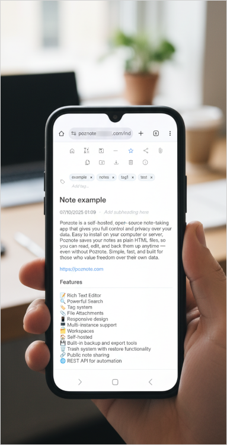

# Poznote

[](https://www.docker.com/)
[](LICENSE)
[](https://www.php.net/)
[](https://www.sqlite.org/)

## Table of Contents

- [Introduction](#introduction)
- [Features](#features)
- [Try Poznote](#try-poznote)
- [Tech Stack](#tech-stack)
- [Installation](#installation)
- [Multiple Instances](#multiple-instances)
- [Backup and Restore](#backup-and-restore)
- [Offline View](#offline-view)
- [API Documentation](#api-documentation)

## Introduction

Poznote is a lightweight, self-hosted note-taking application. Deploying Poznote gives you complete control over your data with zero vendor lock-in. Notes are stored as plain HTML files, making them readable even without the application. The platform requires minimal resources while offering powerful features like rich text editing, tagging, workspaces, file attachments, and a full REST API. Perfect for individuals who value privacy and data ownership.




## Features

- 📝 Rich Text Editor
- 🔍 Powerful Search
- 🏷️ Tag system
- 📎 File Attachments
- 📱 Responsive design
- 🖥️ Multi-instance support
- 🗂️ Workspaces
- 🏠 Self-hosted
- 💾 Built-in backup and export tools
- 🗑️ Trash system with restore functionality
- 🔗 Public note sharing
- 🌐 REST API for automation

## Try Poznote

A Poznote demo is available on [poznote-demo.up.railway.app](https://poznote-demo.up.railway.app)

Username: `poznote`
<br>
Password: `poznote`

## Tech Stack

Poznote prioritizes simplicity and portability - no complex frameworks, no heavy dependencies. Just straightforward, reliable web technologies that ensure your notes remain accessible and under your control.

<details>
<summary>If you are interested in the tech stack on which Poznote is built, <strong>have a look here.</strong></summary>

### Backend
- **PHP 8.x** - Server-side scripting language
- **SQLite 3** - Lightweight, file-based relational database

### Frontend
- **HTML5** - Markup and structure
- **CSS3** - Styling and responsive design
- **JavaScript (Vanilla)** - Interactive features and dynamic content
- **AJAX** - Asynchronous data loading

### Storage
- **HTML files** - Notes are stored as plain HTML files in the filesystem
- **SQLite database** - Metadata, tags, relationships, and user data
- **File attachments** - Stored directly in the filesystem

### Infrastructure
- **Apache HTTP Server** - Web server
- **Docker** - Containerization for easy deployment and portability
</details>

## Installation

Choose your deployment method:

### 🖥️ Self-Hosted (Docker)

Deploy Poznote on your own machine or server using Docker. Perfect for:
- ✅ Complete control over your data
- ✅ Local or private server deployment
- ✅ Windows, Linux, or custom cloud providers

**👉 [View Self-Hosted Installation Guide](SELF_HOSTED.md)**

### ☁️ Railway (Cloud)

Deploy Poznote on Railway.com with one click. Perfect for:
- ✅ No server management
- ✅ Automated deployments
- ✅ Access from anywhere

**👉 [View Railway Installation Guide](RAILWAY.md)**

---

Both guides include complete instructions for:
- Installation and setup
- Accessing your instance
- Changing settings (username, password, port)
- Password recovery
- Updating to the latest version

## Multiple Instances

You can run multiple isolated Poznote instances on the same server. Just deploy new instances with different names and ports.

### Example: Tom and Alice instances on the same server

```
Server: my-server.com
├── Poznote-Tom
│   ├── Port: 8040
│   ├── URL: http://my-server.com:8040
│   ├── Container: poznote-tom-webserver-1
│   └── Data: ./poznote-tom/data/
│
└── Poznote-Alice
    ├── Port: 8041
    ├── URL: http://my-server.com:8041
    ├── Container: poznote-alice-webserver-1
    └── Data: ./poznote-alice/data/
```

## Backup and Restore

Poznote includes built-in backup (export) and restoration (import) functionality accessible through Settings.

**Complete Backup**

Single ZIP containing database, all notes, and attachments for all workspaces:

  - Includes an `index.html` at the root for offline browsing
  - Notes are organized by workspace and folder
  - Attachments are accessible via clickable links

**Complete Restore** 

Upload the complete backup ZIP to restore everything:

  - Replaces database, restores all notes, and attachments
  - Works for all workspaces at once

⚠️ Database import completely replaces current data. The database contains metadata (titles, tags, dates) while actual note content is stored in HTML files. 

🔒 Every time you import/restore a database through the web interface, Poznote automatically creates a backup of your current database before proceeding.

- **Location:** `data/database/poznote.db.backup.YYYY-MM-DD_HH-MM-SS`
- **Format:** Timestamped backup files (e.g., `poznote.db.backup.2025-08-15_14-36-19`)
- **Purpose:** Allows recovery if import fails or data needs to be rolled back

## Offline View

The **📦 Complete Backup** creates a standalone offline version of your notes. Simply extract the ZIP and open `index.html` in any web browser.

## API Documentation

Poznote provides a REST API for programmatic access to notes and folders.

### API quick links

 - [List Notes](#list-notes)
 - [Create Note](#create-note)
 - [Create Task List](#create-task-list)
 - [Update Task List](#update-task-list)
 - [Update Note](#update-note)
 - [Create Folder](#create-folder)
 - [Move Note](#move-note)
 - [Delete Note](#delete-note)
 - [Delete Folder](#delete-folder)


### Authentication

All API requests require HTTP Basic authentication:
```bash
curl -u 'username:password' http://localhost:8040/API_ENDPOINT_NAME.php
```

### Base URL

Access the API at your Poznote instance:
```
http://YOUR_SERVER:HTTP_WEB_PORT/
```

### Response Format

**HTTP Status Codes:**
- `200` - Success (updates, deletes)
- `201` - Created  
- `400` - Bad Request
- `401` - Unauthorized
- `404` - Not Found
- `409` - Conflict (duplicate)
- `500` - Server Error

### Endpoints

#### List Notes

```bash
curl -u 'username:password' http://localhost:8040/api_list_notes.php?workspace=MyWorkspace
```

You can pass the workspace as a query parameter (`?workspace=NAME`) or as POST data (`workspace=NAME`). If omitted, the API will return notes from all workspaces.

**Parameters:**
- `workspace` (string) - *Optional* - Filter notes by workspace name

---

#### Create Note

```bash
curl -X POST http://localhost:8040/api_create_note.php \
  -u 'username:password' \
  -H "Content-Type: application/json" \
  -d '{
    "heading": "My New Note",
    "entry": "<p>This is the <strong>HTML content</strong> of the note</p>",
    "entrycontent": "This is the plain text content of the note",
    "tags": "personal,important",
    "folder_name": "Projects",
    "workspace": "MyWorkspace"
  }'
```

**Parameters:**
- `heading` (string) - **Required** - The note title
- `entry` (string) - *Optional* - HTML content that will be saved to the note's HTML file
- `entrycontent` (string) - *Optional* - Plain text content that will be saved to the database
- `tags` (string) - *Optional* - Comma-separated tags
- `folder_name` (string) - *Optional* - Folder name (defaults to "Default")
- `workspace` (string) - *Optional* - Workspace name (defaults to "Poznote")

---

#### Create Task List

```bash
curl -X POST http://localhost:8040/api_create_note.php \
  -u 'username:password' \
  -H "Content-Type: application/json" \
  -d '{
    "heading": "Shopping list",
    "type": "tasklist",
    "entry": "",
    "entrycontent": "[ { \"id\": 1690000000000, \"text\": \"Buy bread\", \"completed\": false, \"important\": false } ]",
    "tags": "shopping,urgent",
    "folder_name": "Home",
    "workspace": "MyWorkspace"
  }'
```

**Parameters:**
- `heading` (string) - **Required** - The note title
- `type` (string) - *Optional* - Set to `tasklist` to create a task list note
- `entry` (string) - *Optional* - HTML content (can be empty for tasklist)
- `entrycontent` (string) - *Optional* - JSON string containing the tasks (see structure below)
- `tags` (string) - *Optional* - Comma-separated tags
- `folder_name` (string) - *Optional* - Folder name (defaults to "Default")
- `workspace` (string) - *Optional* - Workspace name (defaults to "Poznote")

Example `entrycontent` structure (JSON array of tasks):

```
[
  { "id": 1690000000000, "text": "Buy milk", "completed": false, "important": false, "noteId": 123 },
  { "id": 1690000001000, "text": "Prepare meeting", "completed": true, "important": true, "noteId": 123 }
]
```

---

#### Update Task List

```bash
curl -X POST http://localhost:8040/api_update_note.php \
  -u 'username:password' \
  -H "Content-Type: application/json" \
  -d '{
    "id": "123",
    "heading": "Shopping list",
    "entry": "",
    "entrycontent": "[ { \"id\":1690000000000, \"text\":\"Buy bread\", \"completed\":false, \"important\":false } ]",
    "tags": "shopping,urgent",
    "folder": "Home",
    "workspace": "MyWorkspace"
  }'
```

**Parameters:**
- `id` (string|number) - **Required** - The note id to update
- `heading` (string) - **Required** - The note title
- `entry` (string) - *Optional* - HTML content (for compatibility; usually empty for tasklist)
- `entrycontent` (string) - *Required* for tasklist updates - JSON string with the tasks
- `tags` (string) - *Optional* - Comma-separated tags
- `folder` (string) - *Optional* - Folder name
- `workspace` (string) - *Optional* - Workspace name

---

#### Update Note

```bash
curl -X POST http://localhost:8040/api_update_note.php \
  -u 'username:password' \
  -H "Content-Type: application/json" \
  -d '{
    "id": "123",
    "heading": "Meeting Notes",
    "entry": "Discussed the new project timeline and key deliverables.",
    "entrycontent": "Discussed the new project timeline and key deliverables.",
    "tags": "meeting,work,project",
    "folder": "Work",
    "workspace": "MyWorkspace"
  }'
```

**Parameters:**
- `id` (string|number) - **Required** - The note id to update
- `heading` (string) - **Required** - The note title
- `entry` (string) - *Optional* - HTML content that will be saved to the note's HTML file
- `entrycontent` (string) - *Optional* - Plain text content that will be saved to the database
- `tags` (string) - *Optional* - Comma-separated tags
- `folder` (string) - *Optional* - Folder name (if provided, must exist in the workspace or as an existing entry folder)
- `workspace` (string) - *Optional* - Workspace name

#### Create Folder
```bash
curl -X POST http://localhost:8040/api_create_folder.php \
  -u 'username:password' \
  -H "Content-Type: application/json" \
  -d '{"folder_name": "Work Projects", "workspace": "MyWorkspace"}'
```

**Parameters:**
- `folder_name` (string) - **Required** - The folder name
- `workspace` (string) - *Optional* - Workspace name to scope the folder (defaults to "Poznote")

---

#### Move Note
```bash
curl -X POST http://localhost:8040/api_move_note.php \
  -u 'username:password' \
  -H "Content-Type: application/json" \
  -d '{
    "note_id": "123",
    "folder_name": "Work Projects",
    "workspace": "MyWorkspace"
  }'
```

**Parameters:**
- `note_id` (string) - **Required** - The ID of the note to move
- `folder_name` (string) - **Required** - The target folder name
- `workspace` (string) - *Optional* - If provided, moves the note into the specified workspace (handles title conflicts)

---

#### Delete Note
```bash
# Soft delete (to trash)
curl -X DELETE http://localhost:8040/api_delete_note.php \
  -u 'username:password' \
  -H "Content-Type: application/json" \
  -d '{"note_id": "123", "workspace": "MyWorkspace"}'

# Permanent delete
curl -X DELETE http://localhost:8040/api_delete_note.php \
  -u 'username:password' \
  -H "Content-Type: application/json" \
  -d '{
    "note_id": "123",
    "permanent": true,
    "workspace": "MyWorkspace"
  }'
```

**Parameters:**
- `note_id` (string) - **Required** - The ID of the note to delete
- `permanent` (boolean) - *Optional* - If true, permanently delete; otherwise move to trash
- `workspace` (string) - *Optional* - Workspace to scope the operation

---

#### Delete Folder
```bash
curl -X DELETE http://localhost:8040/api_delete_folder.php \
  -u 'username:password' \
  -H "Content-Type: application/json" \
  -d '{"folder_name": "Work Projects", "workspace": "MyWorkspace"}'
```

**Parameters:**
- `folder_name` (string) - **Required** - The folder name to delete
- `workspace` (string) - *Optional* - Workspace to scope the operation (defaults to "Poznote")

**Note:** The default folder cannot be deleted. When a folder is deleted, all its notes are moved to the default folder.
